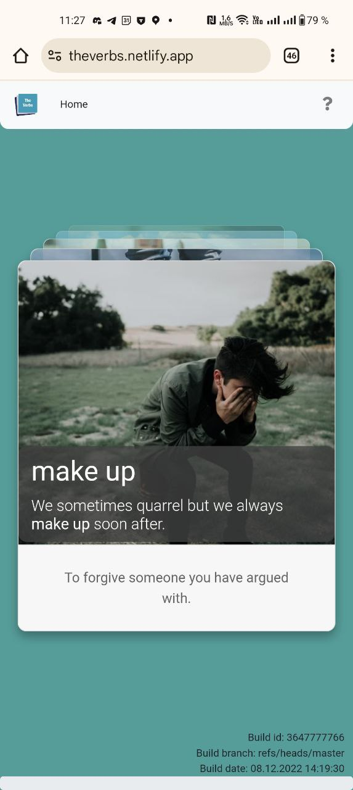

## Мотивация

Нужно было потрогать технологии PWA и заондно проверить флоу публикации приложения в Android PlayMarket.

## Описание

TheVerbs - это прогрессивное веб-приложение (PWA), созданное для изучения английских фразовых глаголов. Приложение разработано с использованием технологии Blazor WebAssembly и предлагает интерактивный способ запоминать фразовые глаголы через систему карточек.

Web app: https://theverbs.netlify.app

Andoid app: https://theverbs.netlify.app

## Краткое описание

TheVerbs — это интерактивное приложение для изучения английских фразовых глаголов. С помощью простой и удобной системы карточек вы можете:

- Изучать фразовые глаголы с определениями и примерами использования
- Проверять свои знания с помощью тестов
- Отслеживать свой прогресс в изучении
- Сохранять любимые фразовые глаголы в избранное для повторения
- Использовать приложение без интернета благодаря поддержке офлайн-режима
- Заниматься на любом устройстве - компьютере, планшете или смартфоне

Приложение работает как в браузере, так и может быть установлено на ваше устройство как обычное приложение, обеспечивая удобный доступ в любой момент. Начните изучать английские фразовые глаголы уже сегодня и улучшите свои навыки владения английским языком!
