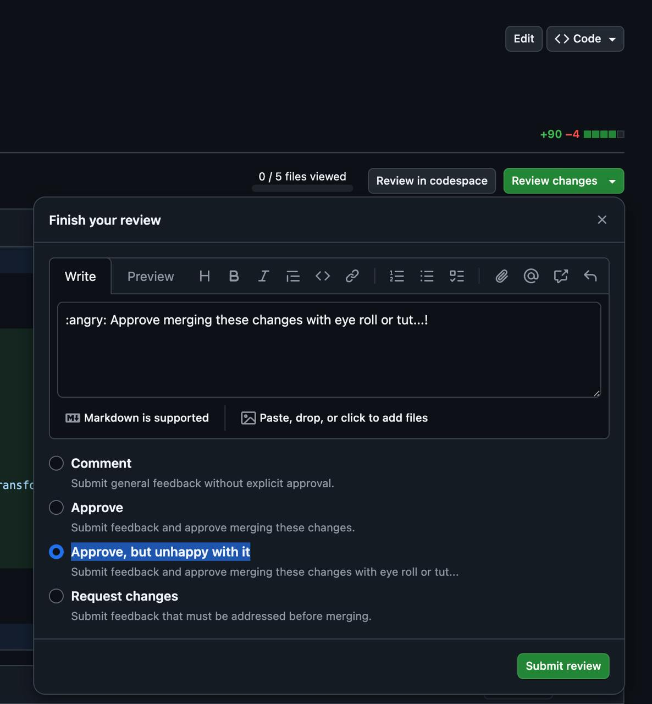

Привет, всем отличной пятницы. Старайтесь сегодня ничего важного не деплоить, а то выходные длинные и хочется хотя бы прожить спокойно и без инцидентов.

Скинули давеча в чатик такой твит:



И я подумал, реально же бывает сидишь такой и смотришь на pull request и понимаешь что это кусок говна. С одной стороны ты никогда бы такое и не апрувнул, а с другой бизнес требует катить быстрее. Вздох - выдох, закатываешь глаза и  ты ставишь апрув. Просто фильм ужасов.

А почему бы не дать такую кнопку? Я написал шуточное дополнение в хром, которое рядом с кнопкой Approve добавляет Approve, but unhappy with it. Работает довольно просто - в настройках расширения прописывайте дефолтный коммент и при клике на Approve, but unhappy with it он будет комментом добавлять в pr этот текст. 

Дополненение:  https://chromewebstore.google.com/detail/github-%E2%80%94-unhappy-approve/jjggjkmjjjmfbhfkpjhmhkgkdiibfddl

Исходники: https://github.com/itcaat/github-unhappy-approve
