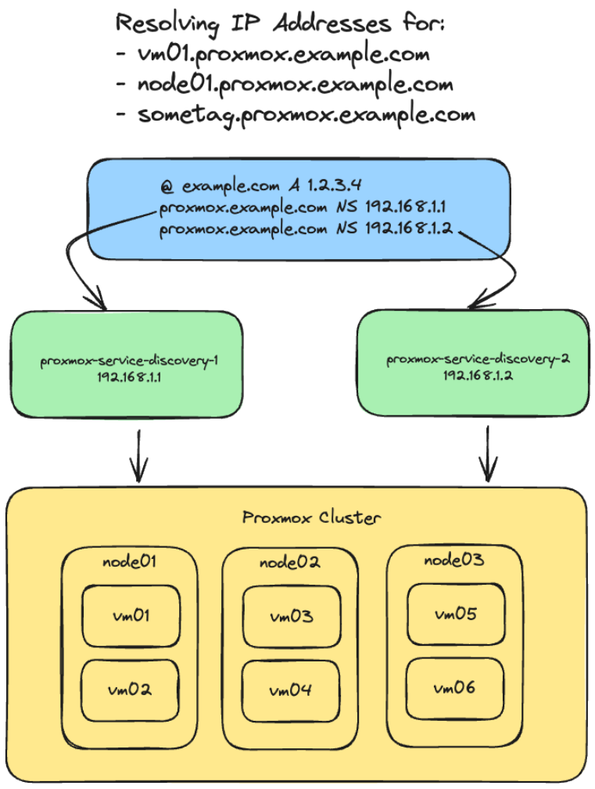

Proxmox Service Discovery - это инструмент для автоматического обнаружения сервисов в кластере Proxmox, работающий на основе DNS. Приложение опрашивает API Proxmox для получения информации о виртуальных машинах и узлах кластера, а затем создает DNS-записи типа `A`, которые позволяют другим сервисам находить виртуальные машины по их именам или тегам.

https://github.com/itcaat/proxmox-service-discovery

## Мотивация

Изучение golang, работа с API Proxmox. Решить проблему отсутствия service discovery в Proxmox Cluster.

## Принцип работы

1. Приложение подключается к API Proxmox с использованием токена аутентификации
2. Каждые N секунд (по умолчанию 60) оно получает:
   - Список всех узлов (нод) в кластере Proxmox
   - Для каждого узла - список виртуальных машин
   - Для каждой виртуальной машины - конфигурацию с именем и IP-адресом
   - Для каждого узла - информацию о сетевых интерфейсах

3. На основе полученных данных создаются DNS-записи:
   - Для каждой виртуальной машины создается запись вида `имя_машины.суффикс` → IP-адрес
   - Если активирована опция `DISCOVERY_VM_TAGS`, то также создаются записи для каждого тега виртуальной машины: `тег.суффикс` → IP-адрес
   - Для каждого узла кластера создается запись вида `имя_узла.суффикс` → IP-адрес (если адрес соответствует указанной в настройках подсети)

4. Приложение запускает DNS-сервер (по умолчанию на порту 2053), который отвечает на запросы, используя созданные записи
   - Если запись не найдена, запрос перенаправляется на внешний DNS-сервер (8.8.8.8)

## Технические детали

- Написано на языке Go (версия 1.18 и выше)
- Использует библиотеку miekg/dns для реализации DNS-сервера
- Для работы с API Proxmox применяется библиотека go-resty/resty
- Настройки загружаются из переменных окружения или файла .env
