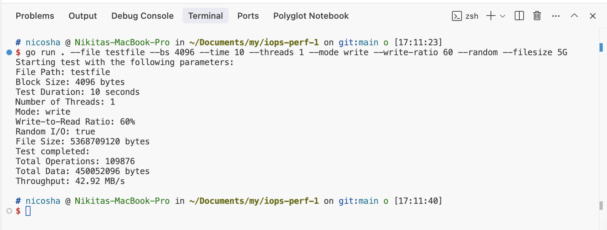

## Мотивация

Хотлось написать аналог тулов для измерения производительности дисковой подсистемы.

## Описание

Эта простая утилита, написанная на языке Go, предназначена для измерения производительности ввода-вывода дисковой подсистемы. Инструмент симулирует различные нагрузки ввода-вывода путем чтения и записи тестового файла.

## Основные возможности

- Поддержка последовательных и случайных паттернов ввода-вывода
- Настраиваемые параметры тестирования:
  - Размер файла
  - Размер блока данных
  - Продолжительность теста
  - Параллелизм (количество потоков)
  - Режим ввода-вывода: чтение, запись или смешанный
  - Соотношение операций записи к чтению в смешанном режиме
- Вывод ключевых метрик производительности:
  - Общее количество операций
  - Общий объем обработанных данных
  - Пропускная способность в МБ/с

## Принцип работы

1. **Подготовка файла**:
   - Создается тестовый файл настраиваемого размера (по умолчанию: 1ГБ)
   - Файл заполняется тестовыми данными для обеспечения реалистичных условий операций ввода-вывода

2. **Потоки выполнения**:
   - Несколько рабочих потоков работают параллельно, выполняя операции ввода-вывода в соответствии с выбранным режимом и параметрами
   - Каждый поток выполняет:
     - Случайный ввод-вывод: операции происходят в случайных смещениях внутри файла
     - Последовательный ввод-вывод: операции выполняются последовательно от начала файла

3. **Режимы работы**:
   - **Запись**: потоки записывают блоки данных в файл
   - **Чтение**: потоки читают блоки данных из файла
   - **Смешанный**: настраиваемое соотношение определяет процент операций записи относительно чтения

4. **Расчет метрик**:
   - Подсчитывается общее количество операций
   - Рассчитывается общий объем обработанных данных
   - Пропускная способность представляется в МБ/с на основе продолжительности теста