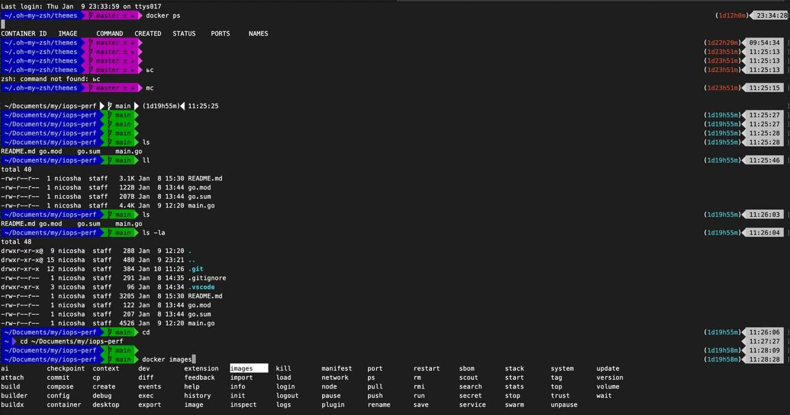

Всем привет, я тут показывал недавно как сделать такую красоту котлеге и сразу записал небольшой гайд. Хотите такой же zsh на стеройдах? Без проблем! 



Будем юзать Oh My Zsh, который позволит нам получить:

✨ Автодополнения команд (например, Docker).
⚡ Алиасы для сокращений (например, gcb – создание ветки).
🎨 Красивую кастомизацию с темами.

```bash
# 1. Устанавливаем oh my zsh
sh -c "$(curl -fsSL https://raw.githubusercontent.com/ohmyzsh/ohmyzsh/master/tools/install.sh)"

# 2. Устанавливаем шрифты
git clone https://github.com/powerline/fonts.git --depth=1
cd fonts
./install.sh
cd ..
rm -rf fonts

# 3. Устанавливаем rvm-prompt, чтобы тема не плевала ошибку
curl -sSL https://get.rvm.io | bash

# 4. Устанавливаем тему
git clone https://github.com/consolemaverick/zsh2000.git
ln -s $(pwd)/zsh2000/zsh2000.zsh-theme ~/.oh-my-zsh/themes/zsh2000.zsh-theme
```

Теперь пропишем нужные плагины. Полный список всех плагинов есть по ссылке https://github.com/ohmyzsh/ohmyzsh/tree/master/plugins c детальным описанием. В любом удобном редакторе открываем ~/.zshrc  и прописываем параметры. 

```bash
ZSH_THEME="zsh2000"

plugins=(
  git
  macos
  docker
  docker-compose
)
```

В настройках терминала выставляем шрифт на Meslo LG M DZ for Powerline, Regular, 11px.  Перезапускаем терминал и радуемся.