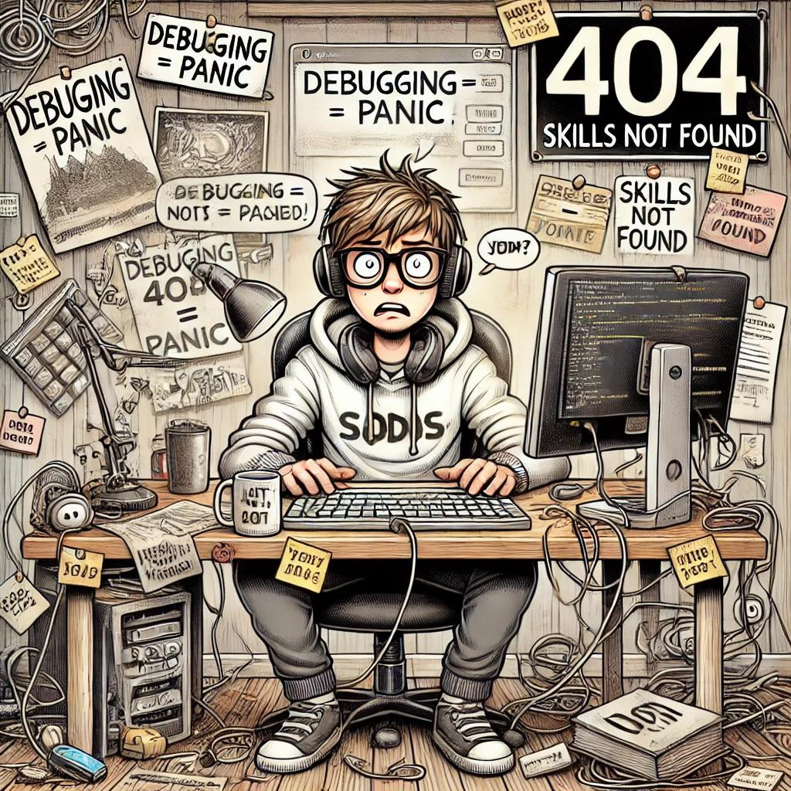

Идея написать вредные советы у меня давно витала в голове. Если вы опытный специалист, то я надеюсь  вам понравится и вы вспомните где то себя. А если вы как раз в начале карьеры, я надеюсь вы сделаете выводы.  

- Не читай документацию. Она только путает и отвлекает от настоящей работы — гугли ответы на форумах и копируй чужие решения с StackOverflow или GPT.
- Никогда не проси помощи у коллег. Покажи всем, что ты «волк-одиночка» и можешь сам во всем разобраться, даже если это будет стоить бизнесу денег.
- Постоянно проси помощи у коллег. Это же в их интересах, чтобы ты сделал задачу побыстрее, поэтому постоянно проси помощи. К тому же, коллегам это очень нравится - они так чувствуют, что они важны в компании. Поверь, они очень любят помогать.
- Специально переусложняй реализацию. Чем запутаннее твое решение, тем более высоко смогут оценить тебя коллеги. Ведь это покажет, что ты можешь реализовать “сложные” решения.
- Комментарии и осмысленные названия переменных не нужны. Тут итак все понятно, зачем тратить время на какую то ерунду. К тому же, тимлид и коллеги явно поопытнее и уж точно разберутся.
- Не трать время на тестирование своего решения. Вообще пусть тестирует тот кто поставил тебе задачу, это же им надо.
- Не используй системы контроля версий. Зачем усложнять себе жизнь Git? Просто сохраняй файлы с названиями project_final_v6_final2 (FINAL).zip. Просто потом их в чат можно скинуть автору задачи, он там сам разберется уже. Зато ничего лишнего не будет в архиве.
- Сразу делай в production окружении. Тестовые и локальные окружения только трата времени. Зачем что-то проверять локально, если можно сделать в проде тем самым быстро пофиксить проблему. Коллеги оценят твою скорость и может даже премию дадут.
- Забудь про резервное копирование. Бэкапы — удел тех, кто не уверен в том что делает. Но ты то совершенно точно все делаешь правильно.
- Пароли храни в текстовом файле. Парольные менеджеры это переусложнение на ровном месте. У тебя же стоит антивирус и ты не ставишь программы с левых сайтов. Так что тебя точно никто и никогда не взломает и вирус ты никакой не поймаешь. А в файле все удобно, все под рукой
- Игнорируй обратную связь. Да что они вообще понимают? Ты итак потратил целых 2 недели на решение, а им еще что-то не нравится. Пусть сами тогда делают. Так и скажи руководителю. Скорее всего тебе пойдут на встречу и доделывать будет уже кто то другой.
- Тратить время на свое обучение больше не нужно. Ты ведь уже итак специалист: закончил курсы, посмотрел пару уроков на YouTube, почитал несколько статей — достаточно. Все остальное на практике доберешь. Лучше все изучать сразу на практике без нудной теории. Вот когда коснется чего то, тогда и изучишь.
- Любые знания, не относящиеся к твоей текущей задаче, бесполезны. Мир меняется очень медленно, чтобы тратить время на расширение кругозора и знаний. Если надо будет что то изучить новое — твой руководитель сразу к тебе придет и скажет. Тогда и поизучаешь.
- Забудь о документировании кода и проектов. Всё держи в голове. Документацию придумали те, кому лень разбираться в чем то. Хороший специалист разберется и так в том, что ты написал.
- Не контролируй сроки. Можно не париться на счет сроков. Пусть повисит в in progress несколько недель без движения — никто не заметит. К тому же когда ты ее закроешь, руководство увидит сколько времени потрачено и поймет, что это сложная задача.
- Никому не говори, если где то увидел проблему в проекте. Поверь, не надо подсвечивать ни свои, ни чужие косяки. Во-первых, вдруг "это не баг" и тогда тебя просто выставят дураком. Во-вторых, могут заставить фиксить.
- И самое главное — скрывай, если накосячил. Никогда, никому не сообщай, что где то серьезно продолбался. Ведь ты явно потеряешь репутацию или (что еще хуже) за это могут сразу уволить. А это явно не входит в твои планы, тем более это может серьезно помешать тебе стать успешным ойтипшником.
