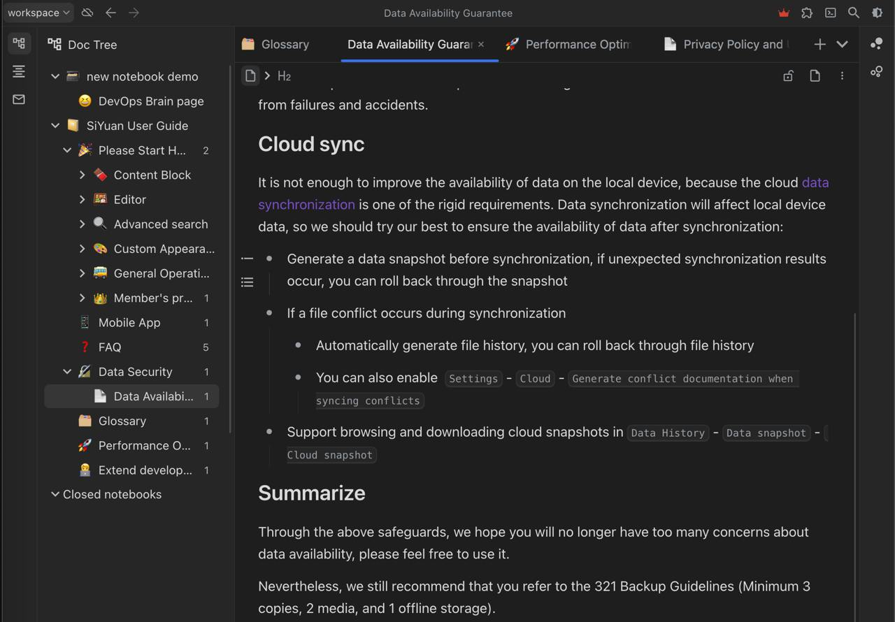
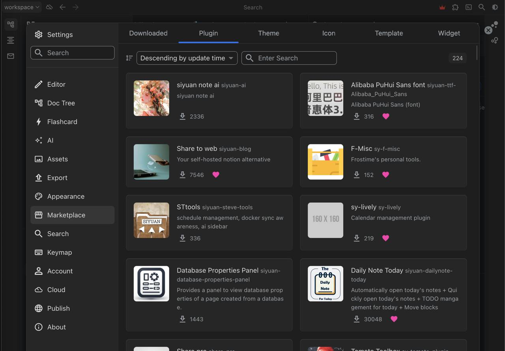
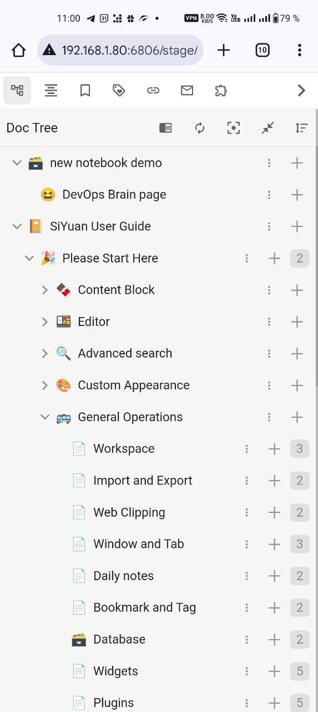
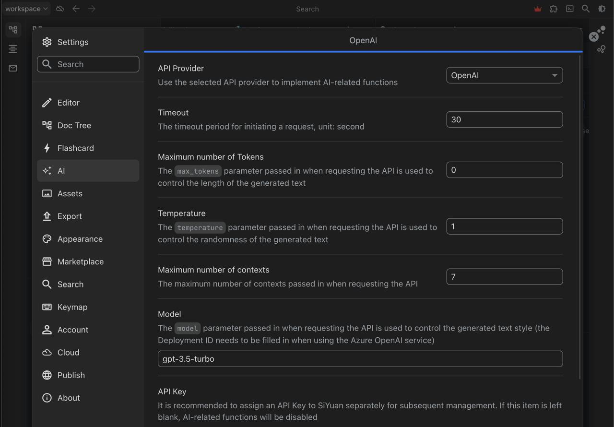

Наткнулся вчера на решение для личного управления знаниями https://github.com/siyuan-note/siyuan. Думаю вот круто - 28000 звезд, написан на go и typescript, есть просто мощнейший редактор, есть расширения и API, интеграция с AI, есть готовые образы docker и активное коммьюнити. 



Парни реально пишут крутое решение. Но есть пара минусов:

1. Нельзя заводить пользователей. Те доступ в workspace тупо по ключу. Ну оно и понятно оно же для личного управления знаниями все же.
2. SiYuan предоставляет большую часть функций бесплатно, даже для коммерческого использования. Однако есть платные возможности, которые доступны только членам Membership (платного тарифа). Например, синхронизация через облако. 



Я сначала подумал, что мобильной прилке в настройках указываешь url где лежит твой поднятый siyuan. Но нет - оказывается это отдельное приложение со своим внутренним стораджем. Вот тут то и нужна синхронизация - ведь одна из фич, что документы можно редачить даже в offline. Но если это вам не нужно то достаточно будет открыть web url где развернут ваш персональный siyuan.



В целом видно, что ребята сосредоточились именно на core-фичах своего продукта и это здорово. Думаю на этом развитие не остановится и скоро мы увидим разные методы аутентификации для бизнеса и клаудовую версию, но будет это все скорее всего за денюжку. И мир увидит новый полноценный конкурент notion. 



Подходит ли вам SiYuan? Как и с любым другим приложением, лучший способ понять, отвечает ли оно вашим задачам, — это попробовать. Так как оно бесплатное, вы ничего не теряете, кроме времени. В принципе и в рамках организации также можно его задействовать, прикрыв каким нибудь nginx + https://oauth2-proxy.github.io/oauth2-proxy/


```bash
mkdir -p siyuan/workspace && cd siyuan

cat <<EOF > compose.yml
services:
  main:
    image: b3log/siyuan
    command: ['--workspace=/siyuan/workspace/', '--accessAuthCode=change-me']
    ports:
      - 6806:6806
    volumes:
      - ./workspace:/siyuan/workspace
    restart: unless-stopped
EOF

docker compose up -d
```
