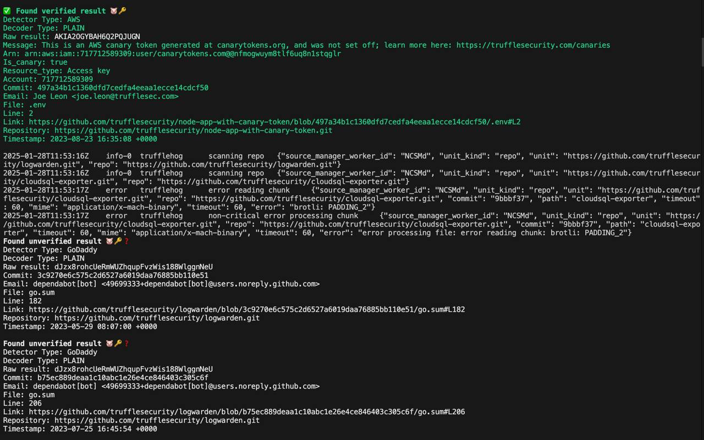

Утечка секретов это всегда больно. Несу вам два решения, которые помогут обнаружить  утекшие секреты и довольно легко интегрируются в cicd. (Методом pennis to nose интеграция в github actions займет минут 10 максимум).

Trufflehog (https://github.com/trufflesecurity/trufflehog) и Gitleaks (https://github.com/gitleaks/gitleaks) - оба решения очень похожи по своей сути, отличие только в алгоритмах поиска. Ну и Trufflehog - он более универсален и может искать утечки:

- git / github
- docker
- filesystem (files and directories)
- gitlab / circleci / travisci / jenkins
- gcs / s3
- postman
- syslog
- elasticsearch

Я не смог придумать кейсов когда надо постоянно проверять всю историю и при интеграции этих решений (если только вы не работаете в банке =) ). Кажется, достаточно проверить репозиторий один раз и дальше уже навешивать проверку просто на пул-реквесты ( с условием что у вас есть branch protection ). Ну и бонусом можно настроить git-хуки.

Подробные инструкции по использованию и установки я приводить нет смысла - они есть в github репах проектов. Единственное покажу как быстро потестить и запустить в докер проверку на файловой системе и репозиториях организации.

```bash
# проверяем текущий каталог
docker run --rm -it -v "$PWD:/pwd" trufflesecurity/trufflehog:latest filesystem

# проверяем github репы организации trufflesecurity на github
docker run --rm -it -v "$PWD:/pwd" trufflesecurity/trufflehog:latest github --org=trufflesecurity
```



Что в итоге выбрать?

- Trufflehog больше подходит для глубокого анализа, если вам нужно работать с разными источниками данных, но также может использоваться и для анализа пул-реквестов, ну и вашего кода.
- Gitleaks — если вы хотите быстро и просто проверять Git-репозитории с хорошей производительностью и минимальной настройкой.
