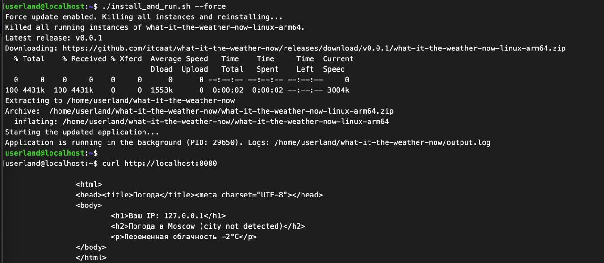
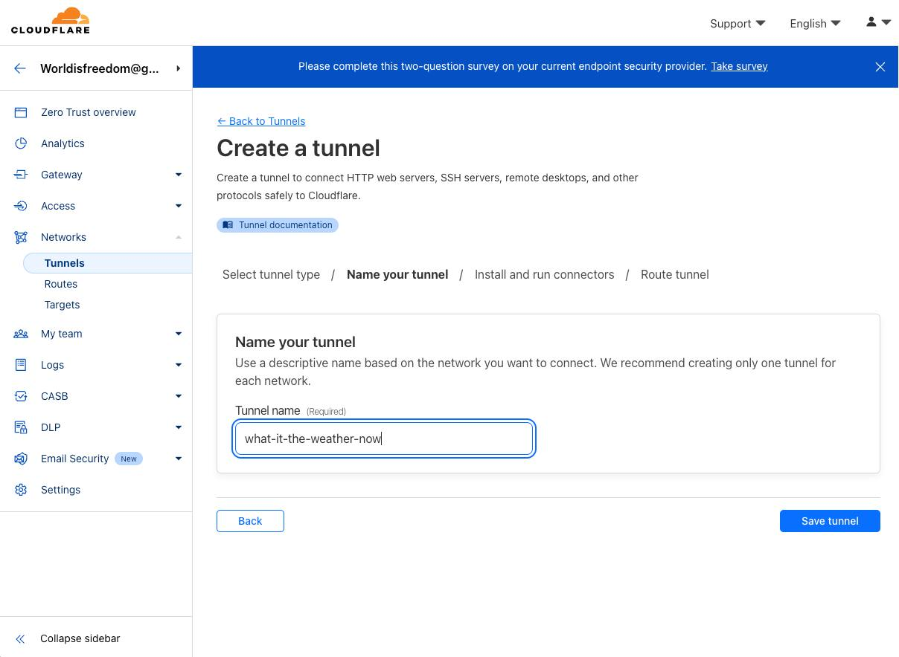
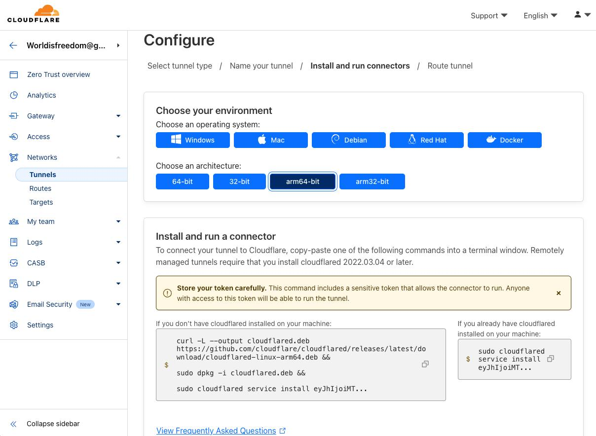
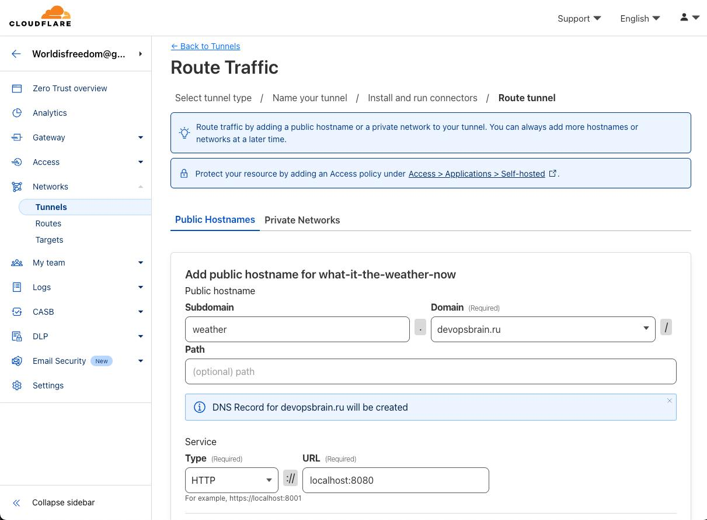
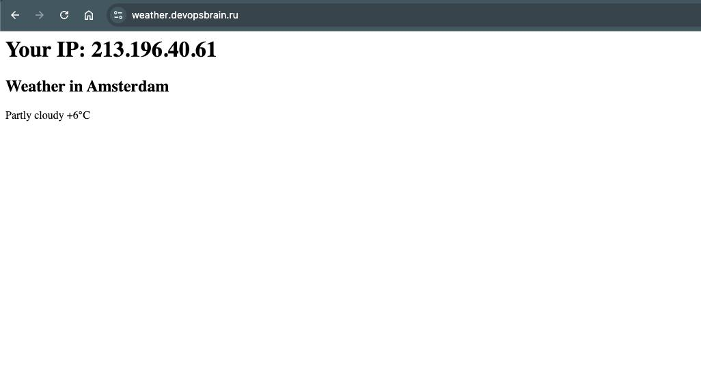

Сейчас научу плохому — будем поднимать наше веб-приложение на телефоне с https, dns, cloudflared туннелями и прочей красотой. 

Для этой цели я накидал приложение на go, которое определяет IP адрес, вычисляет город, отправляет запрос во внешний сервис и отдает страницу с данными о погоде в вашей локации. Я не стал упарываться - он просто нужен для демонстрации, исходники тут https://github.com/itcaat/what-is-the-weather-now. 

Что нам нужно:
1️⃣ Само веб-приложение.
2️⃣ Установленный UserLAnd https://userland.tech/ ( root не потребуется )
3️⃣ GitHub Actions чтобы собрать приложение.
4️⃣ Аккаунт на CloudFlare с нашим подключенным доменом — у меня будет devopsbrain.ru (бесплатный тариф подойдет)

Итак, качаем UserLAnd https://play.google.com/store/apps/details?id=tech.ula. В списке операционных систем выбираем Ubuntu (Minimal → Terminal). На телефоне откроется терминал и сразу установим пароль пользователя userland. Не спрашивайте почему через sudo - просто поверьте, так надо. =)

```bash
$ sudo passwd userland
```

Теперь посмотрим в настройках wifi свой IP адрес и подключимся с компа по ssh (порт 2022). Ну и сразу установим пакетики.

```bash
$ ssh userland@192.168.1.75 -p2022
$ sudo apt update && sudo apt install ca-certificates nano jq unzip -y
```

Само приложение и его сборка у меня уже готовы. Я собираю сразу под все платформы и архитектуры и качу релиз из main бранчи. Подсмотреть как сделано можно тут https://github.com/itcaat/what-is-the-weather-now/blob/main/.github/workflows/release.yml. Но  нам нужен только arm64. 

Деплоить на телефон мы будем максимально просто - сделаем скрипт который будет находить последний релиз и разворачивать в userland. 

Скрипт развертывания можно посмотреть тут: https://github.com/itcaat/what-is-the-weather-now/blob/main/install_and_run.sh. Там есть параметр —force, который убьет все процессы нашей прилки и заново скачает и запустит приложеньку. Также если скрипт обнаружит новый релиз, то также стопнет текущие процессы нашей прилки и раскатит новую версию. (Можно попробовать поставить github self-hosted runner и деплоить по красоте, но у меня памяти не хватило на него).

Просто кладем его в домашний каталог, chmod +x install_and_run.sh и запускаем. Он найдет последний релиз, скачает его под нашу платформу arm64 и запустит в фоне приложение. Приложение вешается на порт 8080. 



Дальше остается просто добавить туннель в cloudflare zerotrust. При активации вас попросит вбить карту - можно скипнуть этот шаг и сразу настроить туннель cloudflared. По сути нам надо просто выделить либо корневой домен, либо какой то поддомен. Логично что обслуживание домена у вас должно быть в cloudflare (напоминаю, что это бесплатно).



Далее нам нужно выбрать нужную архитектуру и операционную систему. В нашем случае debian arm64 и запустить команду для установки cloudflared. 



После установки зароутим web трафик в туннель. 



По итогу туннель будет запущен и можно открывать наш супер сайт https://weather.devopsbrain.ru, который хостится прямо на нашем телефоне. SSL также будет из коробки. 



```bash
$ curl https://weather.devopsbrain.ru

<html>
     <head>
       <title>Weather</title>
       <meta charset="UTF-8">
     </head>
     <body>
        <h1>Your IP: 213.196.40.61</h1>
        <h2>Weather in Amsterdam </h2>
        <p>Partly cloudy +9°C</p>
     </body>
</html>
```

Бонусом можно в Rules добавить редирект с http на https в пару кликов. Ну и как вы понимаете, запустить в принципе можно все что хотите (даже с бд-шками) при достаточном количестве памяти. А на этом все - всем хорошего вечерочка.

UPD Есть ненулевая вероятность, что демонстрационный сайт выйдет в окно, так как никакого кеширования там нет и выйти за рейты используемых API очень легко. И вообще это не продакшен-реди решение ;)

UPD2: все таки добавил in memory cache - а то без него грустно

