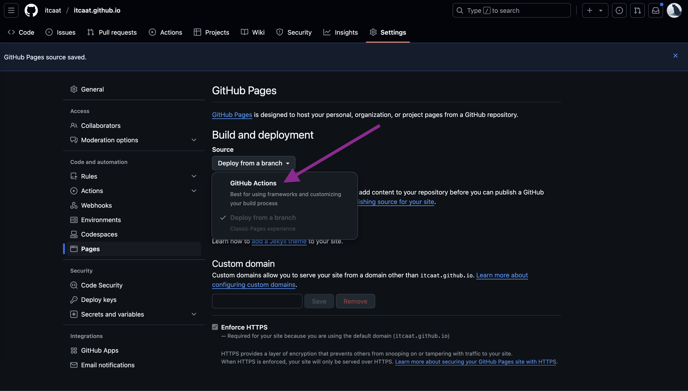
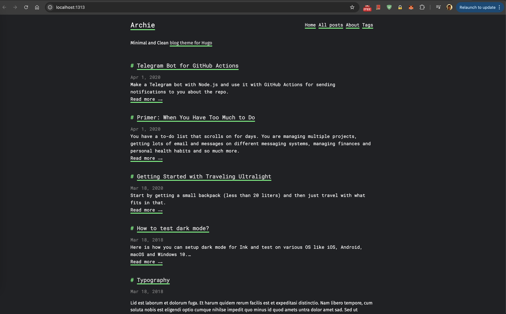
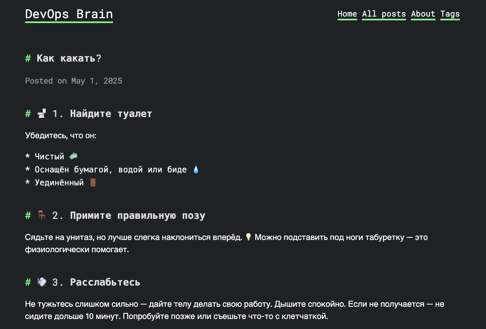
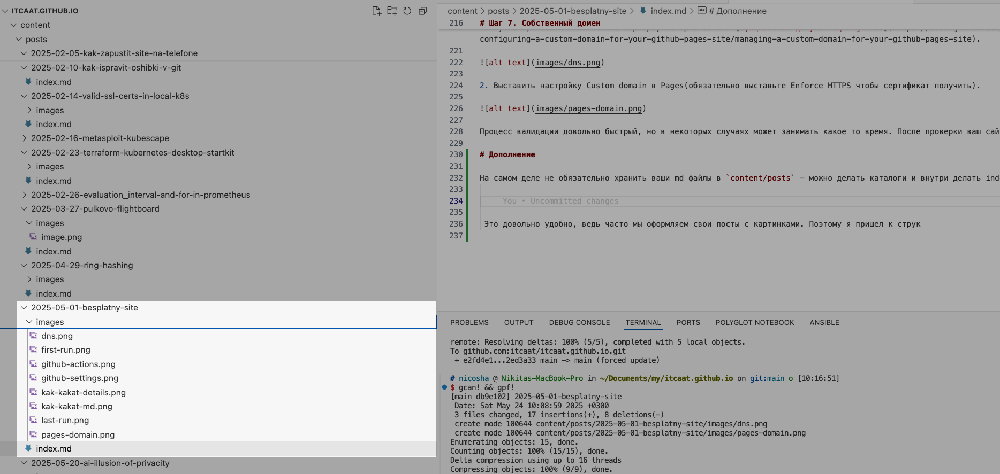
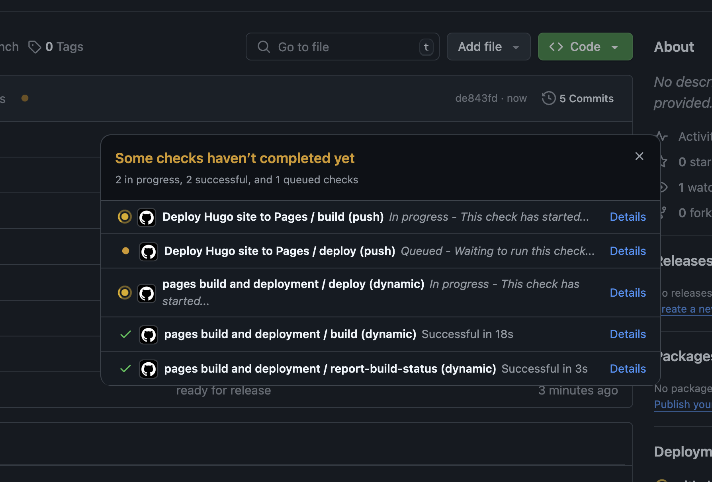
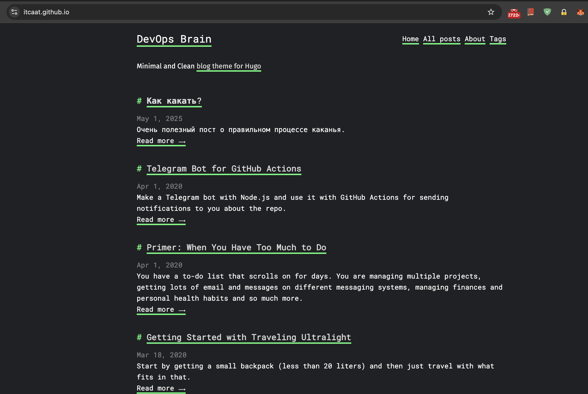
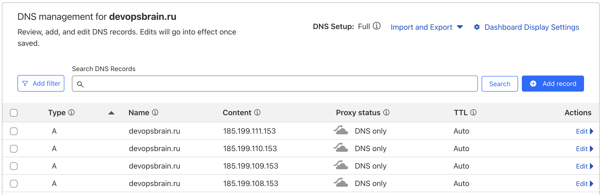
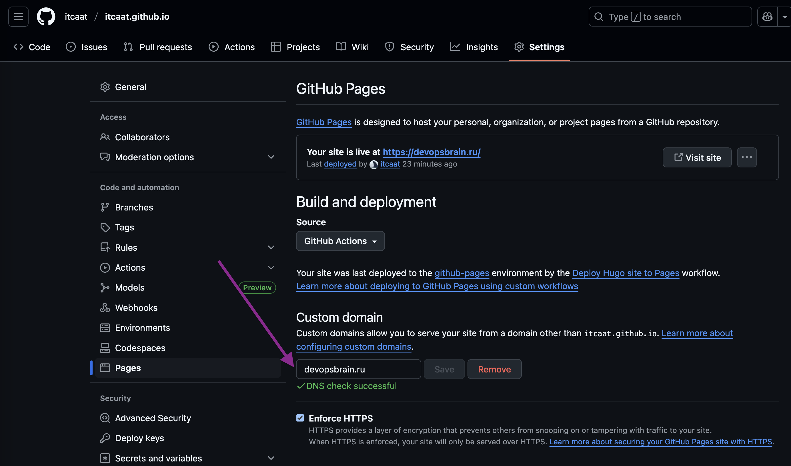

Как же меня бесят статьи в духе “Как всего за 139 рублей в месяц развернуть свой сайт-визитку на vps”. Какие 139 рублей за сайт-визитку, совсем уже стыд потеряли?! Давайте исправлять это недоразумение.

В этой статье я вам пошагово расскажу и покажу как бесплатно разместить и вести ваш личный сайт(блог, cv, wiki). Вам даже отдельный домен не нужен (все будет “из коробки”), хотя в последнем шагом мы и его прикрутим. От вас нужны будут базовые знания git и просто уметь работать с markdown.

Краткий план наш будет такой: создаем специальную репку, ставим локально генератор статических сайтов и генерим странички, немного магии github actions и профит! В основе всего будет GitHub Pages - бесплатный хостинг статических сайтов, который позволяет автоматически публиковать сайт из репозитория GitHub.

Я буду поднимать персональный блог с CV. И я хочу чтобы мой сайт был доступен по красивому адресу https://itcaat.github.io. Тут надо понимать, что занять вы можете адрес только с именем вашего аккаунта, т.е. `ACCOUNT_NAME.github.io`.

# Шаг 1. Создание и настройка репозитория

Создаем новый репозиторий c именем itcaat.github.io. Важно чтобы он имел именно формат: `ACCOUNT_NAME.github.io`, чтобы хост itcaat.github.io смотрел именно на этот репозиторий. Далее выставляем в настройках репозитория `Settings->Pages->Source=Github Actions`. Больше никакие настройки не трогаем. На данном этапе у нас будет просто пустой репозиторий без файлов и бранчей.



# Шаг 2. Создание базовой структуры 

Ставим генератор статических сайтов hugo и создаем базовую структуру.

```bash
# https://gohugo.io/installation/ - здесь можете выбрать под свою OS
brew install hugo
cd ~/Documents/my
hugo new site itcaat.github.io
```

Давайте добавим эти файлы в созданный репозиторий и зальем их. Так нам будет проще видеть историю изменений. Заранее создадим .gitignore.

```bash
cd itcaat.github.io

cat <<EOF >.gitignore
public
EOF

git init
git add .
git commit -m "mvp"
git branch -M main
git remote add origin git@github.com:itcaat/itcaat.github.io.git
git push -u origin main
```

# Шаг 3. Подключение темы hugo 

Теперь заглянем в магазин тем https://themes.gohugo.io и ту что вам подходит. Мне нравится минимализм, поэтому я остановился на https://github.com/athul/archie. 

```bash

# Подключим его как сабмодуль
git submodule add https://github.com/athul/archie.git themes/archie
```

# Шаг 4. Перенос настроек из темы

Почти все темы содержат пример сайта со всеми необходимыми параметрами для корректной работы темы. Давайте перенесем контент и настройки из exampleSite в корень нашего репозитория.

```bash
cp -R themes/archie/exampleSite/* ./

# Обычно в exampleSite настройки лежат в config.toml. 
# Поэтому нам надо переложить их в hugo.toml чтобы генератор увидел настройки
mv ./config.toml ./hugo.toml
git add . && git commit -m "added theme athul archie" && git push
```

Поздравлю, мы уже можем сгенерировать сайт локально и посмотреть что у мы имеем на данный момент. Тут важно понимать что сервер поднимается просто для локального тестирования - он просто собирает все воедино из css, тем и md-файлов. 

```bash

hugo server --buildDrafts

# Running in Fast Render Mode. For full rebuilds on change: hugo server --disableFastRender
# Web Server is available at http://localhost:1313/ (bind address 127.0.0.1) 
# Press Ctrl+C to stop
```



Открываем http://localhost:1313/ и смотрим что все корректно работает. “Но тут же чужие посты и контакты!”  скажете вы. Cейчас это поправим. За то что мы видим на сайте отвечают файлы внутри content и файл конфигурации hugo.toml. Я не хочу подробно тут останавливаться на hugo.toml - там все интуитивно понятно. У меня будет примерно будет так:

```bash
baseURL = "https://itcaat.github.io"
title = "ItCaat personal blog and CV"
....
[[params.social]]
name = "GitHub"
icon = "github"
url = "https://github.com/itcaat"
[[params.social]]
name = "Twitter"
icon = "twitter"
url = "https://x.com/itcaat"
....
```

# Шаг 5. Наполняем сайт

Тут надо понимать две простые вещи: все содержимое вашего сайта находится в каталоге `content` и все содержимое это обычные md-файлы из которых в дальнейшем генерируется сайт. Мы можем отредактировать, создать и удалить текущие посты как нам нравится. Ну и отредактировать about.md. Новые посты рекомендуется создавать через команду `hugo new` это позволит создать draft пост с необходимыми полями. Когда пост будет финально готов - то просто удалите draft: true, а также можно дополить `description` и `tags`.

```bash
hugo new posts/kak-kakat.md
```


Мы подошли к финалу - публикация нашего сайта. Давайте запустим его, проверим что нам все нравится и зальем финальные правки.

```bash
hugo server --buildDrafts
git add . && git commit -m "ready for release" && git push
```



## Про структуру и картинки

На самом деле не обязательно хранить ваши md файлы в `content/posts` - можно делать каталоги с именем поста и внутри делать index.md. 



Это довольно удобно, ведь часто мы оформляем свои посты с картинками и будет классно хранить картинки прямо рядом с текстом. 

# Шаг 6. Публикация

Доверим всю работу по публикации github actions. Для этого просто закинем в .github/workflows/hugo.yml содержимое ниже и commit push. Данный файл сделает всю грязную работу и опубликует наш сайт.

```bash
# .github/workflows/hugo.yml
name: Deploy Hugo site to Pages

on:
  # Runs on pushes targeting the default branch
  push:
    branches: ["main"]

  # Allows you to run this workflow manually from the Actions tab
  workflow_dispatch:

# Sets permissions of the GITHUB_TOKEN to allow deployment to GitHub Pages
permissions:
  contents: read
  pages: write
  id-token: write

# Allow only one concurrent deployment, skipping runs queued between the run in-progress and latest queued.
# However, do NOT cancel in-progress runs as we want to allow these production deployments to complete.
concurrency:
  group: "pages"
  cancel-in-progress: false

# Default to bash
defaults:
  run:
    shell: bash

jobs:
  # Build job
  build:
    runs-on: ubuntu-latest
    env:
      HUGO_VERSION: 0.145.0
    steps:
      - name: Install Hugo CLI
        run: |
          wget -O ${{ runner.temp }}/hugo.deb https://github.com/gohugoio/hugo/releases/download/v${HUGO_VERSION}/hugo_extended_${HUGO_VERSION}_linux-amd64.deb \
          && sudo dpkg -i ${{ runner.temp }}/hugo.deb
      - name: Install Dart Sass
        run: sudo snap install dart-sass
      - name: Checkout
        uses: actions/checkout@v4
        with:
          submodules: recursive
      - name: Setup Pages
        id: pages
        uses: actions/configure-pages@v5
      - name: Install Node.js dependencies
        run: "[[ -f package-lock.json || -f npm-shrinkwrap.json ]] && npm ci || true"
      - name: Build with Hugo
        env:
          HUGO_CACHEDIR: ${{ runner.temp }}/hugo_cache
          HUGO_ENVIRONMENT: production
        run: |
          hugo \
            --minify \
            --baseURL "${{ steps.pages.outputs.base_url }}/"
      - name: Upload artifact
        uses: actions/upload-pages-artifact@v3
        with:
          path: ./public

  # Deployment job
  deploy:
    environment:
      name: github-pages
      url: ${{ steps.deployment.outputs.page_url }}
    runs-on: ubuntu-latest
    needs: build
    steps:
      - name: Deploy to GitHub Pages
        id: deployment
        uses: actions/deploy-pages@v4
```

Заливаем правки по github actions и дожидаемся публикации нашего сайта. Обратите внимание на env переменную `HUGO_VERSION: 0.145.0`. Посмотрите локальную версию с помощью команды `hugo version` и пропишите такую же чтобы не было различий.

```bash
git add . && git commit -m "github actions" && git push
```



Поздравляю, у нас полностью бесплатный, с версионированием, без бекендов и баз данных сайт https://itcaat.github.io. Для тех кому лень разбираться в деталях и вы хотите такой же сайт в таком же исполнении - просто форкайте репу https://github.com/itcaat/itcaat.github.io и наполняйте своим контентом. 



В принципе этого уже будет достаточно и все будет работать на бесплатных рельсах. Но если у вас лишние пара сотен рублей и вы хотите подключить свой красивый домен, то надо сделать последний шаг. 


# Шаг 7. Собственный домен

Давайте прикрутим собственный домен к нашему сайту. Для этого:

1. Нужно прописать A-записи на сервера, которые есть в [официальной документации github](https://docs.github.com/en/pages/configuring-a-custom-domain-for-your-github-pages-site/managing-a-custom-domain-for-your-github-pages-site). 



2. Выставить настройку `Custom domain` в `Pages`(обязательно выставьте `Enforce HTTPS` чтобы получить сертификат). 



Процесс валидации довольно быстрый, но в некоторых случаях может занимать какое то время. После проверки ваш сайт будет доступен по указанному вами домену. 
