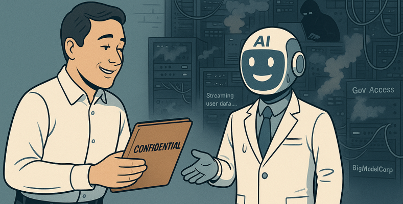

Кажется, ещё вчера искусственный интеллект был чем-то из фильмов и фантазий. А сегодня - он везде: в чатах, в рабочих инструментах, в личных помощниках. Мы удивительно легко впустили его в свою жизнь - с интересом, с восхищением, с доверием.

Мы отправляем в ИИ-сервисы документы, пароли, переписки, исходный код. Мы делимся внутренними обсуждениями, стратегиями, личными вопросами. Как только видим громкую новость о появлении очередной программы или сервиса который должен упростить нам жизнь - бежим его ставить и без оглядки даем доступы до всего что новоустановленный тул может дотянуться. 

Мы ведём себя так, будто это безопасное пространство. Будто есть некий невидимый контракт: "Ты такой классный помошник, я тебе доверяю".



Только проблема в том, что контракта нет. И гарантий тоже нет. Мы не читаем политику конфиденциальности. Не задумываемся, где хранятся эти данные, кто их видит, кто их анализирует. Мы верим в иллюзию приватности - просто потому, что интерфейс красивый, а ответ кажется умным.

Но ИИ не магия. И под капотом там инфраструктура и люди, которые ее обслуживают. А инфраструктура ломается. Сливается. Продаётся. Взламывается.

И здесь компании оказываются зажатыми в тиски: отказаться от использования инструментов ИИ невозможно - тебя просто выкинут с рынка конкуренты, которые запустили процессы интеграции с ИИ и стали эффективно их использовать. С другой стороны активное использование подразумевает передачу чувствительной информации в лапы ИИ. К тому же, компания не может запретить сотрудникам использовать инструменты ИИ, которые ему приглянусь и которые он считает очень удобными. 

```
Безопасники: Василий, мы обнаружили утечку данных и следы ведут к вам!
Василий: Но я просто промтил…
Безопасники: А, ну тогда все в порядке, извините за беспокойство.
```

Что можно и нужно сделать компаниям прямо сейчас?

1. Определить политики использования ИИ. Чётко зафиксировать, какие данные можно и нельзя передавать в ИИ-инструменты, особенно внешние.
2. Обучать сотрудников. Рассказывать не только о возможностях ИИ, но и о рисках. Показывать реальные кейсы утечек.
3. Использовать self-hosted и on-prem решения. Там, где это возможно - разворачивать модели локально, контролируя окружение.
4. Анализировать политику конфиденциальности используемых сервисов. Проверять, передаются ли данные третьим сторонам, используются ли они для обучения моделей.
5. Инвентаризировать, какие ИИ-сервисы уже используются в компании. "Теневой ИИ" - это как теневой IT: опасен, если не знаете, где он уже работает.

ИИ даёт мощные возможности. Но без здравого смысла и защиты данных - это всего лишь ещё один путь к новой форме утечки.
