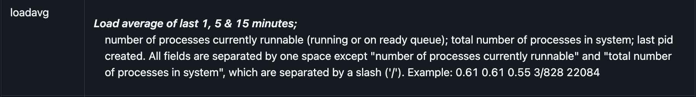

Сегодня мы рассмотрим два ключевых компонента: CPU Usage (процент использования процессора) и Load Average (среднюю загрузку). Оказывается, что не все понимают и неверно интерпритируют данные от htop или glances о процессоре. Мы заглянем под капот htop и разберем, как именно он получает и обрабатывает данные о CPU. Но прежде чем мы начнем давайте сначала определимся что же такое тактовая частота процессора. 

```
 — Почему процессор меряет в тактах? 
 — Потому что в «попугаях» уже занято.
```

Тактовая частота - это количество тактов (циклов), которые процессор выполняет за 1 секунду. Такт — это «тик» процессорных часов. Тактовая частота (например, 3 ГГц) = 3 миллиарда «ударов» в секунду. Представьте, что CPU — это фабрика, где каждый рабочий (транзистор) выполняет свою часть задачи строго по сигналу метронома. 1 такт = 1 удар метронома. 

Почему это удобно? Все компоненты CPU работают синхронно (как оркестр под дирижёра). Легко проектировать конвейеры (например, одна инструкция проходит 10 стадий за 10 тактов). Допустим у нас есть 2 операции которые должны быть исполнены процессором: сложение (ADD) и деление (DIV). В отличие от сложения, где процессор просто "складывает биты", деление - это многоступенчатый процесс, похожий на деление в столбик, но в двоичной системе. Из-за этого количество тактов, которые будут затрачены на операцию DIV будет в несколько раз (а иногда и в десятки раз больше) чем операция сложения. Так что в действительности реальная производительность будет зависеть от архитектуры, количества ядер, размера и количества кеш-памяти, наличия Turbo Boost, энергопотребления и еще кучи различных параметров, которые заложил производитель в свой процессор.

### Что такое Load Average

Представьте: вас разбудил алерт в 3 утра. На dashboard вы видите:
```
Load Average: 8.45 / 12.30 / 15.67
CPU Usage: 45%
```

**Вопрос**: система перегружена или нет? Нужно ли экскалировать проблему или можно спокойно иди спать дальше?

Без понимания Load Average вы не сможете ответить правильно. А правильный ответ зависит от того, сколько у вас CPU cores.



Load Average — это **количество процессов, которые хотят работать прямо сейчас**. Сюда входят:
- Процессы, которые **активно используют CPU** 
- Процессы, которые **ждут CPU** (в очереди планировщика)
- Процессы, которые **ждут I/O** (disk, network)

**Три цифры** означают среднее за 1, 5 и 15 минут.

### Как htop получает Load Average на разных системах

Данные для отображения load average в Linux уже подсчитаны ядром и аккуратно сложены в `/proc/loadavg`. 

```bash
$ cat /proc/loadavg
1.23 2.45 3.67     2/312  1425
# ^    ^    ^       ^      ^
# 1m   5m  15m    running/ lastpid
#                 total
```

Htop просто вычитывает готовые значения.

```c
// https://github.com/htop-dev/htop/blob/main/linux/Platform.c#L279-L300
void Platform_getLoadAverage(double* one, double* five, double* fifteen) {
   char loaddata[128] = {0};
   ...
   ssize_t loadread = xReadfile(PROCDIR "/loadavg", loaddata, sizeof(loaddata));
   if (loadread < 1)
      return;
   ...
   int r = sscanf(loaddata, "%lf %lf %lf", &scanOne, &scanFive, &scanFifteen);
   ...
}
```

Но давайте заглянем в исходный код ядра Linux и посмотрим, как создается файл `/proc/loadavg`:

```c
// https://github.com/torvalds/linux/blob/master/fs/proc/loadavg.c
static int loadavg_proc_show(struct seq_file *m, void *v)
{
    unsigned long avnrun[3];

    // Получаем Load Average от планировщика ядра
    get_avenrun(avnrun, FIXED_1/200, 0);
    //                  ^^^^^^^^^^^ коэффициент сглаживания

    // Форматируем строку для /proc/loadavg
    seq_printf(m, "%lu.%02lu %lu.%02lu %lu.%02lu %u/%d %d\n",
        LOAD_INT(avnrun[0]), LOAD_FRAC(avnrun[0]),     // 1 мин
        LOAD_INT(avnrun[1]), LOAD_FRAC(avnrun[1]),     // 5 мин  
        LOAD_INT(avnrun[2]), LOAD_FRAC(avnrun[2]),     // 15 мин
        nr_running(),        // количество процессов R состояния
        nr_threads,          // общее количество потоков
        idr_get_cursor(...) - 1); // последний PID
    return 0;
}
```

> Ядро обновляет Load Average каждые 5 секунд, используя экспоненциальное сглаживание. Поэтому резкие скачки "размазываются" по времени.

**Что здесь происходит:**

1. **`get_avenrun()`** — получает актуальные значения Load Average от планировщика ядра
2. **`FIXED_1/200`** — коэффициент для экспоненциального сглаживания (5 секунд из 1000)
3. **`nr_running()`** — количество процессов в состоянии `TASK_RUNNING` 
4. **Форматирование** — конвертация из fixed-point формата в десятичные числа

Давайте нырнём еще глубже. Мы уже нашли, что в `loadavg_proc_show` данные получаются из планировщика, но нам нужно разобраться до конца как считает ядро.

```c
// https://github.com/torvalds/linux/blob/master/kernel/sched/loadavg.c
// Глобальные переменные ядра
unsigned long avenrun[3];           // Наши 1min, 5min, 15min значения
atomic_long_t calc_load_tasks;      // Счетчик активных задач

// Основная функция обновления (вызывается каждые 5 секунд)
void calc_global_load(void)
{
    long active, delta;
    
    // Получаем количество активных задач со всех CPU
    active = atomic_long_read(&calc_load_tasks);
    active = active > 0 ? active * FIXED_1 : 0;  // Конвертация в fixed-point
    
    // Применяем экспоненциальное сглаживание для каждого периода
    avenrun[0] = calc_load(avenrun[0], EXP_1, active);   // 1 минута
    avenrun[1] = calc_load(avenrun[1], EXP_5, active);   // 5 минут  
    avenrun[2] = calc_load(avenrun[2], EXP_15, active);  // 15 минут
}

// Каждый CPU обновляет свой счетчик активных задач
void calc_global_load_tick(struct rq *this_rq)
{
    long delta;
    
    // nr_running + nr_uninterruptible = активные задачи
    delta = calc_load_fold_active(this_rq, 0);
    if (delta)
        atomic_long_add(delta, &calc_load_tasks);  // Атомарно добавляем к общему счетчику
}
```

Мы уже где то близко - осталось найти что скрывается внутри `calc_load(...)`.

```c
// https://github.com/torvalds/linux/blob/master/include/linux/sched/loadavg.h
#define FSHIFT    11        // 11 бит точности (2048 = 1.0)
#define FIXED_1   (1<<FSHIFT)  // 2048 = 1.0 в fixed-point
#define LOAD_FREQ (5*HZ+1)  // Обновление каждые 5 секунд
#define EXP_1     1884      // exp(-5sec/1min)  = 0.920 в fixed-point
#define EXP_5     2014      // exp(-5sec/5min)  = 0.983 в fixed-point
#define EXP_15    2037      // exp(-5sec/15min) = 0.994 в fixed-point

// Основная формула (точная реализация):
static inline unsigned long
calc_load(unsigned long load, unsigned long exp, unsigned long active)
{
    unsigned long newload;
    
    // newload = load * exp + active * (FIXED_1 - exp)
    // Это и есть: старое_значение * коэффициент + новое * (1 - коэффициент)
    newload = load * exp + active * (FIXED_1 - exp);
    
    // Округление для точности
    if (active >= load)
        newload += FIXED_1-1;
    
    return newload / FIXED_1;  // Конвертация обратно в обычное число
}

// Макросы для отображения в /proc/loadavg
#define LOAD_INT(x)  ((x) >> FSHIFT)                    // Целая часть
#define LOAD_FRAC(x) LOAD_INT(((x) & (FIXED_1-1)) * 100) // Дробная часть
```

### 🔢 Практический пример расчета или как это работает в ядре

Давайте сделаем псевдо-реальный расчет Load Average в ядре:

```c
// Начальное состояние
unsigned long avenrun[3] = {0, 0, 0};  // Load = 0.00 / 0.00 / 0.00

// Момент t=0: внезапно появилось 4 активных процесса
unsigned long active = 4 * FIXED_1;   // 4.0 в fixed-point = 4 * 2048 = 8192

// Через 5 секунд (первое обновление):
avenrun[0] = calc_load(0, EXP_1, active);
// = (0 * 1884 + 8192 * (2048-1884)) / 2048
// = (0 + 8192 * 164) / 2048  
// = 1343488 / 2048 = 656 = 0.32 в fixed-point

avenrun[1] = calc_load(0, EXP_5, active);  
// = (0 * 2014 + 8192 * (2048-2014)) / 2048
// = (0 + 8192 * 34) / 2048
// = 278528 / 2048 = 136 = 0.067 в fixed-point

// Результат в /proc/loadavg: "0.32 0.07 0.00"
```

Супер! Мы добрались до того как само ядро считает load avarage и готовы оттолкнуться от него и подводить итоги. 

---

## Часть 2: CPU Usage - как не попасть в ловушку "низкого CPU"

### Сценарий из реальной жизни SRE

Пятница, 18:00. Пользователи жалуются на медленную работу API. Вы заходите в мониторинг:

```
CPU Usage: 25%
Load Average: 0.8 / 1.2 / 1.5  (на 4-core сервере)
```

**Новичок скажет:** "CPU низкий, проблема не в процессоре"
**Опытный SRE подумает:** "А что там с iowait? Не блокируемся ли мы на I/O?"

Сегодня разберем, как **правильно читать** CPU метрики и **не попадать в ловушки**.

### CPU Usage: что это на самом деле?

CPU Usage = **процент времени, когда CPU НЕ простаивал**

Но CPU может быть занят разными вещами:
- 🟢 **user** — выполнение вашего приложения
- 🟡 **system** — системные вызовы (файлы, сеть, память)  
- 🔴 **iowait** — ждем диск/SSD
- 🟠 **irq/softirq** — обработка прерываний (сеть, диски)
- 🟣 **steal** — гипервизор забрал CPU (актуально для облака)

**Ключевой инсайт для SRE:** Высокий **iowait** означает, что CPU ждет диск. Ваше приложение тормозит, но "CPU Usage" может быть низким!

### Как ядро ОС собирает статистику

Ядро ведет счетчики времени для каждого CPU core в **jiffies** (тики таймера):

```c
// Примерная структура в ядре Linux
struct cpu_time {
    unsigned long user;      // Время в пользовательском режиме
    unsigned long nice;      // Время nice-процессов  
    unsigned long system;    // Время в режиме ядра
    unsigned long idle;      // Время простоя
    unsigned long iowait;    // Время ожидания I/O
    unsigned long irq;       // Время обработки прерываний
    // ... и еще несколько
};
```

Эти счетчики **монотонно растут** с момента загрузки системы. Чтобы получить **текущую загрузку**, нужно вычислить **дельту** между двумя измерениями.

### Как htop читает данные на Linux: /proc/stat

Linux предоставляет CPU статистику через `/proc/stat`:

```bash
$ cat /proc/stat
cpu  123456 7890 12345 67890 5432 1098 765 0 0 0
cpu0 12345 789 1234 6789 543 109 76 0 0 0
cpu1 11111 800 1111 6100 489 989 89 0 0 0
# ^  ^     ^   ^    ^    ^   ^   ^  ^ ^ ^
# |  user nice sys idle iow irq si st gu gn
```

**Что означают эти числа:**
- **user** (123456) — jiffies в пользовательском режиме
- **nice** (7890) — jiffies nice-процессов (низкий приоритет)
- **system** (12345) — jiffies в режиме ядра
- **idle** (67890) — jiffies простоя ⬅️ **самое большое число в норме**
- **iowait** (5432) — jiffies ожидания I/O ⬅️ **следите за этим!**
- **irq** (1098) — jiffies обработки прерываний
- **softirq** (765) — jiffies программных прерываний
- **steal** — время, украденное гипервизором ⬅️ **важно в облаке!**

### Структура данных htop

```c
typedef struct CPUData_ {
   // Абсолютные значения (кумулятивные с загрузки)
   unsigned long long int userTime;       
   unsigned long long int systemTime;     
   unsigned long long int idleTime;       
   unsigned long long int ioWaitTime;     // ⬅️ Ключевая метрика для SRE!
   unsigned long long int stealTime;      // ⬅️ Важно для облачных инстансов!

   // Дельты между измерениями (то, что мы видим в процентах)
   unsigned long long int userPeriod;
   unsigned long long int systemPeriod;
   unsigned long long int ioWaitPeriod;   // ⬅️ Высокий = проблемы с I/O
   unsigned long long int stealPeriod;    // ⬅️ Высокий = noisy neighbor

   bool online;                           // CPU активен/отключен
} CPUData;
```

### Сбор исходных данных

#### Linux: чтение из /proc/stat

Функция `LinuxMachine_scanCPUTime()` читает данные из `/proc/stat`:

```c
static void LinuxMachine_scanCPUTime(LinuxMachine* this) {
   FILE* file = fopen(PROCSTATFILE, "r");  // "/proc/stat"
   
   for (unsigned int i = 0; i <= super->existingCPUs; i++) {
      char buffer[PROC_LINE_LENGTH + 1];
      unsigned long long int usertime, nicetime, systemtime, idletime;
      unsigned long long int ioWait = 0, irq = 0, softIrq = 0, steal = 0, guest = 0, guestnice = 0;

      // Чтение строк формата:
      // cpu  123456 7890 12345 67890 123 456 789 0 0 0
      // cpu0 12345 789 1234 6789 12 45 78 0 0 0
      
      if (i == 0) {
         // Общая статистика всех CPU
         sscanf(buffer, "cpu  %16llu %16llu %16llu %16llu %16llu %16llu %16llu %16llu %16llu %16llu", 
                &usertime, &nicetime, &systemtime, &idletime, &ioWait, &irq, &softIrq, &steal, &guest, &guestnice);
      } else {
         // Статистика отдельного CPU
         unsigned int cpuid;
         sscanf(buffer, "cpu%4u %16llu %16llu %16llu %16llu %16llu %16llu %16llu %16llu %16llu %16llu", 
                &cpuid, &usertime, &nicetime, &systemtime, &idletime, &ioWait, &irq, &softIrq, &steal, &guest, &guestnice);
      }
```

#### Предварительная обработка данных

```c
      // Guest time уже учтено в usertime, избегаем двойного подсчета
      usertime -= guest;
      nicetime -= guestnice;
      
      // Группировка связанных метрик
      unsigned long long int idlealltime = idletime + ioWait;
      unsigned long long int systemalltime = systemtime + irq + softIrq;
      unsigned long long int virtalltime = guest + guestnice;
      unsigned long long int totaltime = usertime + nicetime + systemalltime + idlealltime + steal + virtalltime;
```

### Вычисление дельт

Htop использует **saturating subtraction** для безопасного вычисления разностей:

```c
// В Macros.h
static inline unsigned long long saturatingSub(unsigned long long a, unsigned long long b) {
   return a > b ? a - b : 0;  // Защита от переполнения
}

// Применение в LinuxMachine_scanCPUTime()
cpuData->userPeriod = saturatingSub(usertime, cpuData->userTime);
cpuData->nicePeriod = saturatingSub(nicetime, cpuData->niceTime);
cpuData->systemPeriod = saturatingSub(systemtime, cpuData->systemTime);
cpuData->totalPeriod = saturatingSub(totaltime, cpuData->totalTime);

// Сохранение текущих значений для следующего цикла
cpuData->userTime = usertime;
cpuData->niceTime = nicetime;
cpuData->systemTime = systemtime;
cpuData->totalTime = totaltime;
```

**Почему saturating subtraction важна:**
- Защищает от integer overflow при переполнении счетчиков
- Обрабатывает случаи перезагрузки системы или сброса счетчиков
- Гарантирует неотрицательные результаты

### Расчет процентов

В `Platform_setCPUValues()` происходит финальный расчет процентов:

```c
double Platform_setCPUValues(Meter* this, unsigned int cpu) {
   const LinuxMachine* lhost = (const LinuxMachine*) this->host;
   const CPUData* cpuData = &(lhost->cpuData[cpu]);
   
   // Избегаем деления на ноль
   double total = (double)(cpuData->totalPeriod == 0 ? 1 : cpuData->totalPeriod);
   double* v = this->values;

   if (!cpuData->online) {
      this->curItems = 0;
      return NAN;  // CPU отключен
   }

   // Расчет процентов: (время_в_режиме / общее_время) * 100
   v[CPU_METER_NICE]    = cpuData->nicePeriod / total * 100.0;
   v[CPU_METER_NORMAL]  = cpuData->userPeriod / total * 100.0;
   v[CPU_METER_KERNEL]  = cpuData->systemPeriod / total * 100.0;
   v[CPU_METER_IRQ]     = cpuData->irqPeriod / total * 100.0;
   v[CPU_METER_SOFTIRQ] = cpuData->softIrqPeriod / total * 100.0;
   v[CPU_METER_STEAL]   = cpuData->stealPeriod / total * 100.0;
   v[CPU_METER_GUEST]   = cpuData->guestPeriod / total * 100.0;
   v[CPU_METER_IOWAIT]  = cpuData->ioWaitPeriod / total * 100.0;

   // Суммирование активного использования CPU
   percent = sumPositiveValues(v, this->curItems);
   percent = MINIMUM(percent, 100.0);  // Ограничение сверху
   
   return percent;
}
```

### Вспомогательные функции

#### sumPositiveValues()

```c
double sumPositiveValues(const double* array, size_t count) {
   double sum = 0.0;
   for (size_t i = 0; i < count; i++) {
      if (isPositive(array[i]))  // Пропускает NaN и отрицательные значения
         sum += array[i];
   }
   return sum;
}
```

Эта функция обеспечивает робастность, игнорируя некорректные данные и суммируя только валидные положительные значения.

### Ключевые принципы алгоритма

1. **Дельта-измерения**: Все расчеты основаны на разностях между текущими и предыдущими измерениями
2. **Защита от ошибок**: Saturating subtraction предотвращает переполнение и отрицательные значения
3. **Нормализация**: Все проценты приводятся к диапазону 0-100%
4. **Модульность**: Платформо-зависимый код изолирован в отдельных модулях
5. **Робастность**: Обработка особых случаев (отключенные CPU, деление на ноль, некорректные данные)

## Практические советы для SRE: что делать с этими знаниями

### 1. Правильная настройка алертов

**❌ Плохо:**
```yaml
alert: HighCPU
expr: cpu_usage > 80%
```

**✅ Хорошо:**
```yaml  
alert: HighCPUUser
expr: cpu_user > 70%

alert: HighIOWait  
expr: cpu_iowait > 30%  # Проблемы с дисками!

alert: HighSteal
expr: cpu_steal > 20%   # Noisy neighbor в облаке!
```

### 2. Корреляция метрик при инцидентах

**Сценарий:** Высокий Load Average, но низкий CPU%

```bash
# Проверьте:
Load: 8.5 / 12.1 / 15.2  (на 4-core)  ⬅️ Растет!
CPU: user:15% sys:10% iowait:65%      ⬅️ Блокировка на I/O!

# Действия:
1. iostat -x 1    # Проверить диски
2. iotop          # Найти процесс-виновник  
3. Масштабировать IOPS или мигрировать на SSD
```

### 3. Облачные инстансы: следите за steal

```bash
# Если steal > 10% длительное время:
CPU: user:30% sys:10% steal:25%  ⬅️ Проблема!

# Действия:
1. Поменять тип инстанса (избежать shared CPU)
2. Мигрировать в другую AZ
3. Рассмотреть dedicated hosts
```

### 4. Мониторинг производительности мониторинга

**Знайте накладные расходы:**
- Чтение `/proc/stat` — ~0.001ms (очень быстро)
- Чтение `/proc/[pid]/stat` для каждого процесса — дороже
- Частота обновления htop по умолчанию — 1.5 секунды

**Вывод для SRE:** CPU мониторинг сам по себе не нагружает систему. Если htop тормозит — проблема в количестве процессов или в I/O.

### 5. Интерпретация метрик в контексте

```bash
# ✅ Здоровая система:
Load: 2.1 / 2.0 / 1.9    (на 4-core)
CPU: user:45% sys:15% idle:40% iowait:0%

# ⚠️ Подозрительная система:  
Load: 1.2 / 1.8 / 2.5    (растущий тренд)
CPU: user:30% sys:20% idle:35% iowait:15%

# 🔥 Проблемная система:
Load: 8.5 / 12.1 / 15.2  
CPU: user:15% sys:10% idle:10% iowait:65%
```

## Заключение для SRE

Понимание того, **как работают ваши инструменты мониторинга**, — это не академический интерес. Это **практические знания**, которые помогают:

1. **Правильно интерпретировать алерты** в 3 утра
2. **Быстрее находить root cause** во время инцидентов  
3. **Настраивать более точные SLI/SLO**
4. **Избегать ложных выводов** при анализе производительности

**Главный вывод:** Load Average и CPU Usage — это **разные метрики**, которые дополняют друг друга. Load показывает **давление на систему**, CPU% показывает **чем именно занят процессор**.

Изучайте свои инструменты, понимайте их ограничения, и ваши дежурства станут спокойнее! 🚀

---

*Материал подготовлен на основе анализа исходного кода htop. Полезно изучить исходники инструментов, которыми вы пользуется каждый день — это делает вас лучшим SRE!*