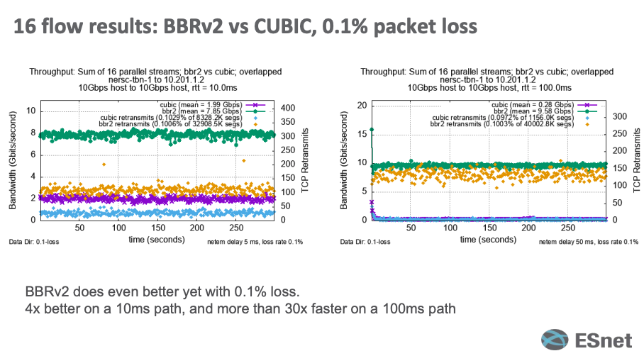

Сегодня поговорим как разогнать скорость передачи по сети на максимум всего за пару команд. В качестве примера представим, что у нас распределенная инфраструктура, которая живет в разных регионах. Также у нас есть какой то VPN между ЦОД-ами, который решает проблему связности ресурсов и безопасности. И есть требование: каждый час надо скачивать бекап на 50GB и разворачивать в другом регионе.

И вот вы настроили свой cronjob, запустили его и пошли пить чай и брать следующую таску в работу. Через какое то время обнаруживаете что скорость во время скачивания бекапа серьезно проседает, ну и плюс периодически могут теряться пакеты, а RTT вообще 30ms. И вот бекап уже даже за пару часов не может скачаться.

Это классическая история для алгоритма управления перегрузкой (Congestion Control Algorithms) CUBIC. Эти алгоритмы встроены в ядро операционных систем и работают автоматически, без вашего участия.

Но не все так плохо - Google начал придумывать более оптимальный алгоритм еще в 2016 и назвал его BBR (Bottleneck Bandwidth and Round-trip time). Алгоритм BBR проходит через несколько фаз, но для простоты можно выделить его основную логику:

1. Разведка: BBR периодически ненадолго увеличивает скорость отправки данных, чтобы проверить, не выросла ли пропускная способность канала (вдруг «трубу» расширили?).
2. Дренаж: После разведки он наоборот, немного снижает скорость, чтобы «осушить» возможные очереди из пакетов, которые могли скопиться в буферах маршрутизаторов, уменьшая задержку.
3. Стабильная работа: Основное время BBR работает на рассчитанной оптимальной скорости, которая обеспечивает максимальную пропускную способность при минимальной задержке.

Ключевое отличие в том, что CUBIC реагирует на потери, а BBR реагирует на изменения в сети (сравнение CUBIC и BBR на реальных устройствах от компании ESNet https://internet2.edu/wp-content/uploads/2022/12/techex22-AdvancedNetworking-ExploringtheBBRv2CongestionControlAlgorithm-Tierney.pdf)



BBRv2 вы можете самостоятельно включить на свежих ядрах как Linux так и Windows:

```bash
# linux
echo "net.core.default_qdisc=fq" >> /etc/sysctl.conf
echo "net.ipv4.tcp_congestion_control=bbr" >> /etc/sysctl.conf
sysctl -p

# windows
NetTCPSetting | Select SettingName, CongestionProvider
netsh int tcp set supplemental template=Internet congestionprovider=BBR2
netsh int tcp set supplemental template=InternetCustom congestionprovider=BBR2
netsh int tcp set supplemental template=Datacenter congestionprovider=BBR2
netsh int tcp set supplemental template=DatacenterCustom congestionprovider=BBR2
netsh int tcp set supplemental template=Compat congestionprovider=BBR2
```

Где можно попробовать включать: между облаками/ЦОДами (NAT и VPN-шлюзы), а также конечные сервера где требуется просасывать большие объемы трафика.

На моей практике включение BBR на конечных серверах и VPN-инстансах дало буст по сетке x6. Но вы должны иметь ввиду, что BBR может быть довольно агрессивен по отношению к соседям использующим CUBIC - поэтому после включения стоит понаблюдать за ситуацией. А сравнить эффективность вы можете через iperf3 -c YOUR_IP -t 60 -P 16.
