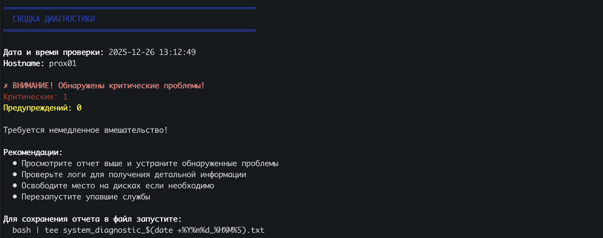

Когда ты администрируешь несколько серверов, или просто хочешь быстро понять состояние системы - обычно приходится выполнять десяток команд, анализировать логи, смотреть на метрики. Но что если автоматизировать это всё одним скриптом?



Сегодня я покажу вам универсальный bash-скрипт, который проводит полную диагностику Linux системы и формирует понятный отчет прямо в консоли. Скрипт работает на Ubuntu, Debian, CentOS, RHEL, Fedora, Arch и других дистрибутивах.

## Быстрый старт

Хотите попробовать прямо сейчас? Запустите скрипт одной командой:

```bash
# Базовая проверка (без некоторых привилегированных данных)
curl -s https://gist.githubusercontent.com/itcaat/45edeaf15f2d508bee766daa9a97400c/raw/linux-diag-script.sh | bash
```

Или для полной диагностики с правами root:

```bash
# Полная проверка (рекомендуется)
curl -s https://gist.githubusercontent.com/itcaat/45edeaf15f2d508bee766daa9a97400c/raw/linux-diag-script.sh | sudo bash
```

**⚠️ Важно для безопасности:** 
- Всегда проверяйте содержимое скриптов перед запуском через `curl | bash`
- Просмотрите код скрипта: https://gist.github.com/itcaat/45edeaf15f2d508bee766daa9a97400c
- Скрипт только читает данные и не вносит изменений в систему
- Для дополнительной безопасности используйте локальную установку (Способ 2 ниже)

## Что проверяет скрипт

Скрипт выполняет комплексную проверку по следующим категориям:

0. **Проверка зависимостей** - проверка установленных инструментов с подсказками по установке
1. **Системная информация** - версия ОС, ядро, архитектура, uptime, внешний IP
2. **Аппаратные ресурсы** - CPU, RAM, Swap, температура процессоров
3. **Дисковое пространство** - занятое место, inodes, SMART статус
4. **Тест скорости дисков** - скорость записи/чтения (100MB тест)
5. **Сетевые интерфейсы** - статус, ошибки, активные соединения
6. **Тест скорости интернета** - проверка скорости скачивания
7. **Процессы** - топ по CPU и памяти, zombie процессы
8. **Системные логи** - критические ошибки, OOM события, kernel warnings
9. **Системные службы** - проверка упавших служб
10. **Безопасность** - неудачные входы, активные SSH сессии
11. **Docker** (опционально) - статус контейнеров и их ресурсы

## Полный код скрипта

Скрипт полностью автономный, не требует дополнительных зависимостей (кроме стандартных утилит) и работает сразу после копирования:

```bash
#!/bin/bash

#############################################
# Linux System Diagnostic Script
# Универсальный скрипт диагностики системы
# Версия: 1.0
#############################################

# Цвета для вывода
RED='\033[0;31m'
YELLOW='\033[1;33m'
GREEN='\033[0;32m'
BLUE='\033[0;34m'
NC='\033[0m' # No Color
BOLD='\033[1m'

# Символы для статусов
CHECK_OK="✓"
CHECK_WARN="⚠"
CHECK_CRIT="✗"

# Переменные для сводки
WARNINGS=0
CRITICALS=0

# Функция для заголовков секций
print_section() {
    echo ""
    echo -e "${BOLD}${BLUE}═══════════════════════════════════════════════════════${NC}"
    echo -e "${BOLD}${BLUE}  $1${NC}"
    echo -e "${BOLD}${BLUE}═══════════════════════════════════════════════════════${NC}"
    echo ""
}

# Функция для вывода с иконками статуса
print_status() {
    local status=$1
    local message=$2
    
    case $status in
        "ok")
            echo -e "${GREEN}${CHECK_OK}${NC} $message"
            ;;
        "warn")
            echo -e "${YELLOW}${CHECK_WARN}${NC} $message"
            ((WARNINGS++))
            ;;
        "crit")
            echo -e "${RED}${CHECK_CRIT}${NC} $message"
            ((CRITICALS++))
            ;;
    esac
}

# Проверка наличия команды
command_exists() {
    command -v "$1" >/dev/null 2>&1
}

# Определение дистрибутива для команд установки
detect_distro() {
    if [ -f /etc/os-release ]; then
        . /etc/os-release
        echo "$ID"
    elif [ -f /etc/redhat-release ]; then
        echo "rhel"
    else
        echo "unknown"
    fi
}

#############################################
# 0. ПРОВЕРКА ЗАВИСИМОСТЕЙ
#############################################
check_dependencies() {
    print_section "ПРОВЕРКА НЕОБХОДИМЫХ ИНСТРУМЕНТОВ"
    
    DISTRO=$(detect_distro)
    MISSING_TOOLS=0
    
    # Список необходимых инструментов с описанием
    declare -A TOOLS=(
        ["curl"]="Для проверки скорости интернета и внешнего IP"
        ["bc"]="Для математических вычислений"
        ["lsblk"]="Для получения информации о дисках"
        ["df"]="Для проверки дискового пространства"
        ["free"]="Для проверки памяти"
        ["ps"]="Для проверки процессов"
    )
    
    # Опциональные инструменты
    declare -A OPTIONAL_TOOLS=(
        ["sensors"]="Для проверки температуры (lm-sensors)"
        ["smartctl"]="Для проверки SMART статуса дисков (smartmontools)"
        ["ss"]="Для проверки сетевых соединений (iproute2)"
        ["systemctl"]="Для проверки системных служб (systemd)"
        ["journalctl"]="Для анализа логов (systemd)"
    )
    
    echo -e "${BOLD}Проверка обязательных инструментов:${NC}"
    for tool in "${!TOOLS[@]}"; do
        if command_exists "$tool"; then
            print_status "ok" "$tool - установлен"
        else
            print_status "crit" "$tool - НЕ УСТАНОВЛЕН (${TOOLS[$tool]})"
            ((MISSING_TOOLS++))
        fi
    done
    
    echo ""
    echo -e "${BOLD}Проверка опциональных инструментов:${NC}"
    for tool in "${!OPTIONAL_TOOLS[@]}"; do
        if command_exists "$tool"; then
            print_status "ok" "$tool - установлен"
        else
            echo -e "${YELLOW}⚬${NC} $tool - не установлен (${OPTIONAL_TOOLS[$tool]})"
        fi
    done
    
    # Если есть недостающие обязательные инструменты - показываем команды установки
    if [ $MISSING_TOOLS -gt 0 ]; then
        echo ""
        echo -e "${RED}${BOLD}Обнаружены недостающие обязательные инструменты!${NC}"
        echo ""
        echo -e "${BOLD}Команды для установки:${NC}"
        
        case $DISTRO in
            ubuntu|debian)
                echo "  sudo apt update"
                echo "  sudo apt install -y curl bc util-linux coreutils procps"
                echo ""
                echo "Опциональные:"
                echo "  sudo apt install -y lm-sensors smartmontools iproute2"
                ;;
            centos|rhel|rocky|almalinux)
                echo "  sudo yum install -y curl bc util-linux coreutils procps-ng"
                echo ""
                echo "Опциональные:"
                echo "  sudo yum install -y lm_sensors smartmontools iproute"
                ;;
            fedora)
                echo "  sudo dnf install -y curl bc util-linux coreutils procps-ng"
                echo ""
                echo "Опциональные:"
                echo "  sudo dnf install -y lm_sensors smartmontools iproute"
                ;;
            arch|manjaro)
                echo "  sudo pacman -S curl bc util-linux coreutils procps-ng"
                echo ""
                echo "Опциональные:"
                echo "  sudo pacman -S lm_sensors smartmontools iproute2"
                ;;
            *)
                echo "  Не удалось определить дистрибутив автоматически."
                echo "  Установите недостающие пакеты вручную."
                ;;
        esac
        
        echo ""
        read -p "Продолжить выполнение без некоторых инструментов? (y/n): " -n 1 -r
        echo
        if [[ ! $REPLY =~ ^[Yy]$ ]]; then
            echo "Выполнение прервано пользователем."
            exit 1
        fi
    else
        echo ""
        print_status "ok" "Все обязательные инструменты установлены"
    fi
    
    echo ""
}

#############################################
# 1. СИСТЕМНАЯ ИНФОРМАЦИЯ
#############################################
check_system_info() {
    print_section "СИСТЕМНАЯ ИНФОРМАЦИЯ"
    
    echo -e "${BOLD}Hostname:${NC} $(hostname)"
    echo -e "${BOLD}OS:${NC} $(cat /etc/os-release 2>/dev/null | grep PRETTY_NAME | cut -d'"' -f2 || uname -s)"
    echo -e "${BOLD}Kernel:${NC} $(uname -r)"
    echo -e "${BOLD}Architecture:${NC} $(uname -m)"
    echo -e "${BOLD}Uptime:${NC} $(uptime -p 2>/dev/null || uptime | awk -F'up ' '{print $2}' | awk -F',' '{print $1}')"
    
    # Внешний IP адрес (используем публичные сервисы)
    if command_exists curl; then
        # Пробуем получить IP с 2ip.ru, при неудаче - с icanhazip.com
        EXTERNAL_IP=$(curl -s --max-time 5 https://2ip.ru 2>/dev/null || curl -s --max-time 5 https://icanhazip.com 2>/dev/null || echo "Недоступно")
        # Очищаем результат - извлекаем только IPv4 адрес
        EXTERNAL_IP=$(echo "$EXTERNAL_IP" | grep -oE '^[0-9]+\.[0-9]+\.[0-9]+\.[0-9]+' | head -1)
        if [ -z "$EXTERNAL_IP" ]; then
            EXTERNAL_IP="Недоступно"
        fi
        echo -e "${BOLD}External IP:${NC} $EXTERNAL_IP"
    fi
    
    # CPU информация
    if [ -f /proc/cpuinfo ]; then
        CPU_MODEL=$(grep "model name" /proc/cpuinfo | head -1 | cut -d':' -f2 | xargs)
        CPU_CORES=$(grep -c "processor" /proc/cpuinfo)
        echo -e "${BOLD}CPU:${NC} $CPU_MODEL ($CPU_CORES cores)"
    fi
    
    # RAM информация
    if command_exists free; then
        TOTAL_RAM=$(free -h | awk '/^Mem:/ {print $2}')
        echo -e "${BOLD}Total RAM:${NC} $TOTAL_RAM"
    fi
}

#############################################
# 2. РЕСУРСЫ СИСТЕМЫ
#############################################
check_resources() {
    print_section "ИСПОЛЬЗОВАНИЕ РЕСУРСОВ"
    
    # Load Average
    if [ -f /proc/loadavg ]; then
        LOAD_AVG=$(cat /proc/loadavg | awk '{print $1, $2, $3}')
        CPU_CORES=$(grep -c "processor" /proc/cpuinfo)
        LOAD_1MIN=$(cat /proc/loadavg | awk '{print $1}')
        
        echo -e "${BOLD}Load Average:${NC} $LOAD_AVG (${CPU_CORES} cores)"
        
        # Проверка нагрузки
        if (( $(echo "$LOAD_1MIN > $CPU_CORES * 2" | bc -l) )); then
            print_status "crit" "Высокая нагрузка на CPU!"
        elif (( $(echo "$LOAD_1MIN > $CPU_CORES" | bc -l) )); then
            print_status "warn" "Повышенная нагрузка на CPU"
        else
            print_status "ok" "Нагрузка в норме"
        fi
    fi
    
    echo ""
    
    # Память
    if command_exists free; then
        echo -e "${BOLD}Память:${NC}"
        free -h
        
        # Проверка использования памяти
        MEM_USED_PERCENT=$(free | grep Mem | awk '{print int($3/$2 * 100)}')
        echo ""
        if [ "$MEM_USED_PERCENT" -gt 90 ]; then
            print_status "crit" "Использование памяти: ${MEM_USED_PERCENT}% (критично!)"
        elif [ "$MEM_USED_PERCENT" -gt 80 ]; then
            print_status "warn" "Использование памяти: ${MEM_USED_PERCENT}%"
        else
            print_status "ok" "Использование памяти: ${MEM_USED_PERCENT}%"
        fi
        
        # Проверка swap
        SWAP_USED_PERCENT=$(free | grep Swap | awk '{if ($2 > 0) print int($3/$2 * 100); else print 0}')
        if [ "$SWAP_USED_PERCENT" -gt 50 ]; then
            print_status "warn" "Использование swap: ${SWAP_USED_PERCENT}%"
        elif [ "$SWAP_USED_PERCENT" -gt 0 ]; then
            print_status "ok" "Использование swap: ${SWAP_USED_PERCENT}%"
        fi
    fi
}

#############################################
# 3. ТЕМПЕРАТУРА
#############################################
check_temperature() {
    print_section "ТЕМПЕРАТУРА"
    
    # Проверка sensors (lm-sensors)
    if command_exists sensors; then
        sensors 2>/dev/null | grep -E "^(Core|CPU|temp)" | head -10
        
        echo ""
        
        # Проверка критичных температур
        HIGH_TEMP=$(sensors 2>/dev/null | grep -oP '\+\K[0-9]+' | awk '{if ($1 > 80) print $1}' | head -1)
        if [ ! -z "$HIGH_TEMP" ]; then
            print_status "crit" "Обнаружена высокая температура: ${HIGH_TEMP}°C!"
        else
            print_status "ok" "Температура в норме"
        fi
    else
        print_status "warn" "Утилита 'sensors' не установлена"
        echo ""
        echo "Для установки lm-sensors:"
        echo "  Ubuntu/Debian: sudo apt install lm-sensors && sudo sensors-detect"
        echo "  CentOS/RHEL:   sudo yum install lm_sensors"
        echo "  Fedora:        sudo dnf install lm_sensors"
        echo "  Arch:          sudo pacman -S lm_sensors"
    fi
}

#############################################
# 4. ДИСКОВОЕ ПРОСТРАНСТВО
#############################################
check_disk_space() {
    print_section "ДИСКОВОЕ ПРОСТРАНСТВО"
    
    echo -e "${BOLD}Использование разделов:${NC}"
    df -h -x tmpfs -x devtmpfs | grep -v "^Filesystem"
    
    echo ""
    
    # Проверка заполненности разделов
    df -h -x tmpfs -x devtmpfs | grep -v "^Filesystem" | awk '{print $5 " " $6}' | while read line; do
        USAGE=$(echo $line | awk '{print $1}' | sed 's/%//')
        MOUNT=$(echo $line | awk '{print $2}')
        
        if [ "$USAGE" -gt 90 ]; then
            print_status "crit" "Раздел $MOUNT заполнен на ${USAGE}%!"
        elif [ "$USAGE" -gt 80 ]; then
            print_status "warn" "Раздел $MOUNT заполнен на ${USAGE}%"
        fi
    done
    
    # Проверка inodes
    echo ""
    echo -e "${BOLD}Использование inodes (топ-5 разделов):${NC}"
    df -i -x tmpfs -x devtmpfs | grep -v "^Filesystem" | awk '{print $5 " " $6}' | while read line; do
        USAGE_PERCENT=$(echo $line | awk '{print $1}')
        MOUNT=$(echo $line | awk '{print $2}')
        USAGE=$(echo $USAGE_PERCENT | sed 's/%//' | grep -E '^[0-9]+$')
        
        if [ ! -z "$USAGE" ]; then
            echo "  $MOUNT: ${USAGE_PERCENT}"
            
            if [ "$USAGE" -gt 90 ]; then
                print_status "crit" "Inodes на $MOUNT критично заполнены!"
            elif [ "$USAGE" -gt 80 ]; then
                print_status "warn" "Inodes на $MOUNT требуют внимания"
            fi
        fi
    done | head -15
    
    # SMART статус (если доступен)
    if command_exists smartctl; then
        echo ""
        echo -e "${BOLD}SMART статус дисков:${NC}"
        for disk in $(lsblk -d -o name,type 2>/dev/null | awk '$2=="disk" {print $1}'); do
            SMART_STATUS=$(smartctl -H /dev/$disk 2>/dev/null | grep "SMART overall-health")
            
            if [ -z "$SMART_STATUS" ]; then
                echo "  /dev/$disk: N/A"
            else
                echo "  /dev/$disk: $SMART_STATUS"
                
                # Проверяем на FAILED
                if echo "$SMART_STATUS" | grep -qi "FAILED"; then
                    print_status "crit" "Диск /dev/$disk имеет проблемы SMART!"
                fi
            fi
        done
    fi
}

#############################################
# 4.5. ТЕСТ СКОРОСТИ ДИСКОВ
#############################################
check_disk_speed() {
    print_section "ТЕСТ СКОРОСТИ ДИСКОВ"
    
    # Проверяем доступность dd
    if ! command_exists dd; then
        print_status "warn" "Утилита 'dd' не найдена"
        return
    fi
    
    # Получаем корневой раздел
    ROOT_MOUNT=$(df / | tail -1 | awk '{print $6}')
    TEST_FILE="/tmp/disk_speed_test_$$"
    
    echo -e "${BOLD}Тест скорости записи/чтения для $ROOT_MOUNT:${NC}"
    echo "  (используется временный файл 100MB)"
    echo ""
    
    # Тест скорости записи
    echo -n "  Скорость записи: "
    WRITE_SPEED=$(dd if=/dev/zero of="$TEST_FILE" bs=1M count=100 oflag=direct 2>&1 | grep -oP '[0-9.]+ MB/s' | head -1)
    if [ -z "$WRITE_SPEED" ]; then
        # Альтернативный парсинг для разных версий dd
        WRITE_SPEED=$(dd if=/dev/zero of="$TEST_FILE" bs=1M count=100 oflag=direct 2>&1 | tail -1 | awk '{print $(NF-1), $NF}')
    fi
    echo "$WRITE_SPEED"
    
    # Очистка кеша (если есть права)
    sync
    if [ -w /proc/sys/vm/drop_caches ]; then
        echo 3 > /proc/sys/vm/drop_caches 2>/dev/null
    fi
    
    # Тест скорости чтения
    echo -n "  Скорость чтения:  "
    READ_SPEED=$(dd if="$TEST_FILE" of=/dev/null bs=1M 2>&1 | grep -oP '[0-9.]+ MB/s' | head -1)
    if [ -z "$READ_SPEED" ]; then
        # Альтернативный парсинг для разных версий dd
        READ_SPEED=$(dd if="$TEST_FILE" of=/dev/null bs=1M 2>&1 | tail -1 | awk '{print $(NF-1), $NF}')
    fi
    echo "$READ_SPEED"
    
    # Удаляем тестовый файл
    rm -f "$TEST_FILE"
    
    echo ""
    print_status "ok" "Тест скорости дисков завершен"
    echo ""
    echo -e "${BOLD}Примечание:${NC} Это базовый тест. Для детального анализа используйте fio или hdparm."
}

#############################################
# 6. СЕТЕВАЯ ДИАГНОСТИКА
#############################################
check_network() {
    print_section "СЕТЕВАЯ ДИАГНОСТИКА"
    
    echo -e "${BOLD}Сетевые интерфейсы:${NC}"
    if command_exists ip; then
        ip -br addr show | grep -v "^lo"
    else
        ifconfig | grep -E "^[a-z]|inet "
    fi
    
    echo ""
    
    # Проверка ошибок на интерфейсах
    if [ -f /proc/net/dev ]; then
        echo -e "${BOLD}Ошибки на интерфейсах:${NC}"
        awk 'NR>2 {print $1, $4, $12}' /proc/net/dev | while read iface rx_errors tx_errors; do
            iface=$(echo $iface | sed 's/:$//')
            if [ "$iface" != "lo" ]; then
                TOTAL_ERRORS=$((rx_errors + tx_errors))
                if [ "$TOTAL_ERRORS" -gt 100 ]; then
                    print_status "warn" "$iface: RX errors: $rx_errors, TX errors: $tx_errors"
                fi
            fi
        done
    fi
    
    echo ""
    
    # Активные соединения (внешние)
    echo -e "${BOLD}Топ-10 внешних соединений (по IP):${NC}"
    
    # Получаем локальные IP адреса для фильтрации
    LOCAL_IPS=$(ip addr show 2>/dev/null | grep -oP 'inet \K[\d.]+' | grep -v '^127\.')
    
    if command_exists ss; then
        CONNECTIONS=$(ss -tun state established 2>/dev/null | awk 'NR>1 {print $5}' | grep -v "^$" | sed 's/:[0-9]*$//' | grep -E '^[0-9]+\.' | grep -v "^127\.\|^0\.0\.0\.0")
    else
        CONNECTIONS=$(netstat -tun 2>/dev/null | grep ESTABLISHED | awk '{print $5}' | sed 's/:[0-9]*$//' | grep -E '^[0-9]+\.' | grep -v "^127\.\|^0\.0\.0\.0")
    fi
    
    # Фильтруем локальные IP
    FILTERED_CONNECTIONS=""
    for ip in $CONNECTIONS; do
        IS_LOCAL=0
        for local_ip in $LOCAL_IPS; do
            if [ "$ip" = "$local_ip" ]; then
                IS_LOCAL=1
                break
            fi
        done
        if [ $IS_LOCAL -eq 0 ]; then
            FILTERED_CONNECTIONS="$FILTERED_CONNECTIONS$ip\n"
        fi
    done
    
    if [ -z "$FILTERED_CONNECTIONS" ]; then
        echo "  Нет активных внешних соединений"
    else
        echo -e "$FILTERED_CONNECTIONS" | grep -v "^$" | sort | uniq -c | sort -rn | head -10
    fi
    
    # Проверка подключения к интернету
    echo ""
    if ping -c 1 8.8.8.8 >/dev/null 2>&1; then
        print_status "ok" "Подключение к интернету работает"
    else
        print_status "crit" "Нет подключения к интернету!"
    fi
    
    # Тест скорости интернета (опционально)
    echo ""
    if command_exists curl; then
        echo -e "${BOLD}Тест скорости интернета:${NC}"
        echo -n "  Скачивание (тест 100MB файл): "
        
        # Тестируем скорость скачивания с помощью curl
        # %{speed_download} возвращает скорость в байтах/сек
        DOWNLOAD_SPEED=$(curl -o /dev/null -s -w '%{speed_download}' --max-time 15  http://speedtest.selectel.ru/100MB 2>/dev/null)
        
        if [ ! -z "$DOWNLOAD_SPEED" ] && [ "$DOWNLOAD_SPEED" != "0.000" ] && [ "$DOWNLOAD_SPEED" != "0" ]; then
            # Конвертируем байты/сек в MB/s (делим на 1048576)
            if command_exists bc; then
                DOWNLOAD_MBPS=$(echo "scale=2; $DOWNLOAD_SPEED / 1048576" | bc 2>/dev/null)
            else
                # Без bc используем awk
                DOWNLOAD_MBPS=$(awk "BEGIN {printf \"%.2f\", $DOWNLOAD_SPEED / 1048576}")
            fi
            
            if [ ! -z "$DOWNLOAD_MBPS" ] && [ "$DOWNLOAD_MBPS" != "0.00" ]; then
                echo "${DOWNLOAD_MBPS} MB/s"
            else
                echo "Недоступно (файл слишком мал для измерения)"
            fi
        else
            echo "Недоступно (проверьте интернет-соединение)"
        fi
    fi
}

#############################################
# 7. ПРОЦЕССЫ
#############################################
check_processes() {
    print_section "ПРОЦЕССЫ"
    
    echo -e "${BOLD}Топ-10 процессов по CPU:${NC}"
    ps aux --sort=-%cpu | head -11 | tail -10
    
    echo ""
    echo -e "${BOLD}Топ-10 процессов по памяти:${NC}"
    ps aux --sort=-%mem | head -11 | tail -10
    
    # Zombie процессы
    echo ""
    ZOMBIE_COUNT=$(ps aux | awk '{if ($8 == "Z") print $0}' | wc -l)
    if [ "$ZOMBIE_COUNT" -gt 0 ]; then
        print_status "warn" "Найдено zombie процессов: $ZOMBIE_COUNT"
        ps aux | awk '{if ($8 == "Z") print $0}'
    else
        print_status "ok" "Zombie процессов не найдено"
    fi
    
    # Общее количество процессов
    echo ""
    TOTAL_PROCESSES=$(ps aux | wc -l)
    echo -e "${BOLD}Всего процессов:${NC} $TOTAL_PROCESSES"
}

#############################################
# 8. АНАЛИЗ ЛОГОВ
#############################################
check_logs() {
    print_section "АНАЛИЗ СИСТЕМНЫХ ЛОГОВ"
    
    # Определяем какая система логирования используется
    if command_exists journalctl; then
        echo -e "${BOLD}Критические ошибки за последние 24 часа (journalctl):${NC}"
        journalctl -p err -S "24 hours ago" --no-pager | tail -20
        
        echo ""
        echo -e "${BOLD}OOM (Out of Memory) события:${NC}"
        journalctl -k | grep -i "out of memory\|oom" | tail -10
        
    elif [ -f /var/log/syslog ]; then
        echo -e "${BOLD}Критические ошибки (syslog):${NC}"
        grep -i "error\|critical\|fail" /var/log/syslog | tail -20
        
        echo ""
        echo -e "${BOLD}OOM события:${NC}"
        grep -i "out of memory\|oom" /var/log/syslog | tail -10
        
    elif [ -f /var/log/messages ]; then
        echo -e "${BOLD}Критические ошибки (messages):${NC}"
        grep -i "error\|critical\|fail" /var/log/messages | tail -20
        
        echo ""
        echo -e "${BOLD}OOM события:${NC}"
        grep -i "out of memory\|oom" /var/log/messages | tail -10
    fi
    
    # Kernel warnings
    echo ""
    echo -e "${BOLD}Kernel warnings (dmesg):${NC}"
    if command_exists dmesg; then
        # Используем -T для показа реального времени (если поддерживается)
        if dmesg -T >/dev/null 2>&1; then
            dmesg -T -l err,crit,alert,emerg 2>/dev/null | tail -15
        else
            # Для старых версий без поддержки -T
            dmesg -l err,crit,alert,emerg 2>/dev/null | tail -15
        fi
    fi
    
    # Failed SSH attempts
    echo ""
    echo -e "${BOLD}Неудачные SSH попытки (последние 10):${NC}"
    if [ -f /var/log/auth.log ]; then
        grep "Failed password" /var/log/auth.log | tail -10
    elif [ -f /var/log/secure ]; then
        grep "Failed password" /var/log/secure | tail -10
    fi
}

#############################################
# 9. СИСТЕМНЫЕ СЛУЖБЫ
#############################################
check_services() {
    print_section "СИСТЕМНЫЕ СЛУЖБЫ"
    
    if command_exists systemctl; then
        echo -e "${BOLD}Упавшие службы:${NC}"
        FAILED_SERVICES=$(systemctl list-units --state=failed --no-pager --no-legend)
        
        if [ -z "$FAILED_SERVICES" ]; then
            print_status "ok" "Упавших служб не найдено"
        else
            print_status "crit" "Найдены упавшие службы:"
            echo "$FAILED_SERVICES"
        fi
    else
        echo "systemctl не найден, проверьте службы вручную"
    fi
}

#############################################
# 10. БЕЗОПАСНОСТЬ
#############################################
check_security() {
    print_section "БЕЗОПАСНОСТЬ"
    
    # Последние успешные входы
    echo -e "${BOLD}Последние успешные входы:${NC}"
    if command_exists last; then
        last -n 10 | grep -v "^$\|^wtmp"
    fi
    
    echo ""
    
    # Активные SSH сессии
    echo -e "${BOLD}Активные SSH сессии:${NC}"
    who | grep -v "^$"
    
    # Проверка количества активных SSH сессий
    SSH_COUNT=$(who | wc -l)
    if [ "$SSH_COUNT" -gt 5 ]; then
        print_status "warn" "Обнаружено $SSH_COUNT активных SSH сессий"
    fi
    
    echo ""
    
    # Sudo активность за последние 24 часа
    echo -e "${BOLD}Sudo активность за последние 24 часа:${NC}"
    if [ -f /var/log/auth.log ]; then
        grep "sudo.*COMMAND" /var/log/auth.log | grep "$(date +%b' '%d)" | tail -10
    elif [ -f /var/log/secure ]; then
        grep "sudo.*COMMAND" /var/log/secure | grep "$(date +%b' '%d)" | tail -10
    fi
}

#############################################
# 11. DOCKER (если установлен)
#############################################
check_docker() {
    if command_exists docker; then
        print_section "DOCKER"
        
        echo -e "${BOLD}Статус контейнеров:${NC}"
        docker ps -a --format "table {{.Names}}\t{{.Status}}\t{{.Image}}"
        
        echo ""
        
        # Проверка на упавшие контейнеры
        EXITED_CONTAINERS=$(docker ps -a --filter "status=exited" --format "{{.Names}}" | wc -l)
        if [ "$EXITED_CONTAINERS" -gt 0 ]; then
            print_status "warn" "Найдено остановленных контейнеров: $EXITED_CONTAINERS"
        else
            print_status "ok" "Все контейнеры работают"
        fi
        
        echo ""
        echo -e "${BOLD}Использование ресурсов контейнерами:${NC}"
        docker stats --no-stream --format "table {{.Name}}\t{{.CPUPerc}}\t{{.MemUsage}}"
    fi
}

#############################################
# ФИНАЛЬНЫЙ ОТЧЕТ
#############################################
generate_summary() {
    print_section "СВОДКА ДИАГНОСТИКИ"
    
    echo -e "${BOLD}Дата и время проверки:${NC} $(date '+%Y-%m-%d %H:%M:%S')"
    echo -e "${BOLD}Hostname:${NC} $(hostname)"
    echo ""
    
    if [ "$CRITICALS" -eq 0 ] && [ "$WARNINGS" -eq 0 ]; then
        echo -e "${GREEN}${BOLD}${CHECK_OK} Система в отличном состоянии!${NC}"
    elif [ "$CRITICALS" -eq 0 ]; then
        echo -e "${YELLOW}${BOLD}${CHECK_WARN} Обнаружены предупреждения: $WARNINGS${NC}"
        echo -e "Рекомендуется обратить внимание на указанные проблемы."
    else
        echo -e "${RED}${BOLD}${CHECK_CRIT} ВНИМАНИЕ! Обнаружены критические проблемы!${NC}"
        echo -e "${RED}Критических: $CRITICALS${NC}"
        echo -e "${YELLOW}Предупреждений: $WARNINGS${NC}"
    fi
    
    echo ""
    echo -e "${BOLD}Рекомендации:${NC}"
    
    if [ "$CRITICALS" -gt 0 ] || [ "$WARNINGS" -gt 0 ]; then
        echo "  • Просмотрите отчет выше и устраните обнаруженные проблемы"
        echo "  • Проверьте логи для получения детальной информации"
        echo "  • Освободите место на дисках если необходимо"
        echo "  • Перезапустите упавшие службы"
    else
        echo "  • Продолжайте регулярный мониторинг системы"
        echo "  • Рекомендуется запускать этот скрипт раз в день"
    fi
    
    echo ""
    echo -e "${BOLD}Для сохранения отчета в файл запустите:${NC}"
    echo "  $0 | tee system_diagnostic_\$(date +%Y%m%d_%H%M%S).txt"
    
    # Возвращаем код ошибки для интеграции с системами мониторинга
    if [ "$CRITICALS" -gt 0 ]; then
        return 2  # Есть критические проблемы
    elif [ "$WARNINGS" -gt 0 ]; then
        return 1  # Есть предупреждения
    else
        return 0  # Все в порядке
    fi
}

#############################################
# ГЛАВНАЯ ФУНКЦИЯ
#############################################
main() {
    clear
    echo -e "${BOLD}${BLUE}"
    echo "╔════════════════════════════════════════════════════════════════╗"
    echo "║                                                                ║"
    echo "║        ДИАГНОСТИКА LINUX СИСТЕМЫ                              ║"
    echo "║        System Diagnostic Script v1.0                          ║"
    echo "║                                                                ║"
    echo "╚════════════════════════════════════════════════════════════════╝"
    echo -e "${NC}"
    echo ""
    
    # Проверка прав root (некоторые проверки требуют sudo)
    if [ "$EUID" -ne 0 ]; then 
        echo -e "${YELLOW}${CHECK_WARN} Скрипт запущен без прав root. Некоторые проверки могут быть недоступны.${NC}"
        echo -e "${YELLOW}Для полной диагностики запустите: sudo $0${NC}"
        echo ""
    fi
    
    # Проверка зависимостей
    check_dependencies
    
    # Запуск всех проверок
    check_system_info
    check_resources
    check_temperature
    check_disk_space
    check_disk_speed
    check_network
    check_processes
    check_logs
    check_services
    check_security
    check_docker
    
    # Финальная сводка
    generate_summary
    EXIT_CODE=$?
    
    echo ""
    echo -e "${BLUE}╚════════════════════════════════════════════════════════════════╝${NC}"
    
    # Выходим с соответствующим кодом
    exit $EXIT_CODE
}

# Запуск скрипта
main
```

## Как использовать

### Способ 1: Быстрый запуск (рекомендуется)

Самый простой способ - запустить скрипт прямо из [GitHub Gist](https://gist.github.com/itcaat/45edeaf15f2d508bee766daa9a97400c):

```bash
# Полная проверка с правами root
curl -s https://gist.githubusercontent.com/itcaat/45edeaf15f2d508bee766daa9a97400c/raw/linux-diag-script.sh | sudo bash
```

### Способ 2: Установка локально

Если хотите сохранить скрипт для регулярного использования:

1. Скачайте скрипт:

```bash
curl -o system_diagnostic.sh https://gist.githubusercontent.com/itcaat/45edeaf15f2d508bee766daa9a97400c/raw/linux-diag-script.sh
```

2. Сделайте его исполняемым:

```bash
chmod +x system_diagnostic.sh
```

3. Запустите:

```bash
# Базовая проверка (без некоторых привилегированных данных)
./system_diagnostic.sh

# Полная проверка (рекомендуется)
sudo ./system_diagnostic.sh
```

### Сохранение отчета в файл

Чтобы сохранить результат в файл для последующего анализа:

```bash
# При запуске через curl
curl -s https://gist.githubusercontent.com/itcaat/45edeaf15f2d508bee766daa9a97400c/raw/linux-diag-script.sh | sudo bash | tee diagnostic_$(date +%Y%m%d_%H%M%S).txt

# При локальном запуске
sudo ./system_diagnostic.sh | tee diagnostic_$(date +%Y%m%d_%H%M%S).txt
```

## Интерпретация результатов

Скрипт использует цветовую индикацию для быстрого определения проблем:

- **✓ (зеленый)** - всё в порядке
- **⚠ (желтый)** - предупреждение, требуется внимание
- **✗ (красный)** - критическая проблема, требуется немедленное действие

### Что считается проблемой

**Критические проблемы:**
- Load Average превышает количество ядер CPU в 2 раза
- Использование памяти > 90%
- Температура процессора > 80°C
- Диск заполнен > 90%
- Inodes заполнены > 90%
- SMART статус диска: FAILED
- Нет подключения к интернету
- Есть упавшие системные службы

**Предупреждения:**
- Load Average превышает количество ядер CPU
- Использование памяти > 80%
- Использование swap > 50%
- Диск заполнен > 80%
- Inodes заполнены > 80%
- Обнаружены zombie процессы
- Большое количество ошибок на сетевых интерфейсах
- Много активных SSH сессий (> 5)

## Кастомизация скрипта

### Изменение порогов

Вы можете изменить пороговые значения в соответствующих секциях. Например, для памяти:

```bash
# Вместо 90% и 80% используйте свои значения
if [ "$MEM_USED_PERCENT" -gt 95 ]; then
    print_status "crit" "Использование памяти: ${MEM_USED_PERCENT}% (критично!)"
elif [ "$MEM_USED_PERCENT" -gt 85 ]; then
    print_status "warn" "Использование памяти: ${MEM_USED_PERCENT}%"
```

### Отключение секций

Если какая-то секция вам не нужна, просто закомментируйте её вызов в функции `main()`:

```bash
main() {
    # ...
    check_system_info
    check_resources
    # check_temperature  # отключили проверку температуры
    check_disk_space
    # ...
}
```

## Тесты производительности

### Тест скорости дисков

Скрипт автоматически выполняет тест скорости записи и чтения для корневого раздела:
- Создает временный файл размером 100MB
- Измеряет скорость записи с помощью `dd` и флага `oflag=direct`
- Очищает кеш системы
- Измеряет скорость чтения
- Удаляет тестовый файл

**Результаты показывают:**
- Реальную производительность диска
- Потенциальные проблемы с медленными дисками
- Разницу между SSD и HDD

**Примечание:** Для более детального анализа рекомендуется использовать специализированные инструменты:
- `fio` - гибкий тестер I/O производительности
- `hdparm` - измерение производительности дисков
- `ioping` - мониторинг задержек I/O

### Тест скорости интернета

Скрипт проверяет скорость скачивания используя:
- Тестовый файл 10MB с speedtest сервера
- Утилиту `curl` для измерения скорости
- Таймаут 10 секунд для быстрого результата

**Результаты показывают:**
- Скорость скачивания в MB/s
- Общую производительность интернет-подключения
- Проблемы с медленным соединением

**Для более точных тестов используйте:**
```bash
# Установка speedtest-cli
apt install speedtest-cli  # Ubuntu/Debian
yum install speedtest-cli  # CentOS/RHEL

# Запуск теста
speedtest-cli
```

## Exit коды для автоматизации

Скрипт возвращает разные exit коды в зависимости от результата проверки, что позволяет использовать его в автоматизированных системах мониторинга:

| Exit Code | Значение | Описание |
|-----------|----------|----------|
| **0** | Успех | Система в отличном состоянии, проблем не обнаружено |
| **1** | Предупреждение | Обнаружены предупреждения, требуется внимание |
| **2** | Критично | Обнаружены критические проблемы, требуется немедленное вмешательство |

### Примеры использования exit кодов

**В shell скриптах:**
```bash
#!/bin/bash

# Запускаем диагностику
./system_diagnostic.sh

# Проверяем результат
case $? in
    0)
        echo "✓ Система в порядке"
        ;;
    1)
        echo "⚠ Обнаружены предупреждения"
        # Отправить уведомление
        ;;
    2)
        echo "✗ КРИТИЧЕСКИЕ ПРОБЛЕМЫ!"
        # Отправить алерт в PagerDuty/Opsgenie
        ;;
esac
```

**В cron для мониторинга:**
```bash
# /etc/cron.d/system-check
0 */6 * * * root /usr/local/bin/system_diagnostic.sh || echo "System issues detected on $(hostname)" | mail -s "Alert" admin@example.com
```

**В CI/CD пайплайнах:**
```yaml
# .gitlab-ci.yml
system_check:
  script:
    - ./system_diagnostic.sh
  # Пайплайн упадет если exit code не 0
```

**С Nagios/Icinga:**
```bash
# check_system.sh
#!/bin/bash
OUTPUT=$(./system_diagnostic.sh 2>&1)
EXIT_CODE=$?

case $EXIT_CODE in
    0) echo "OK - System healthy" ; exit 0 ;;
    1) echo "WARNING - $OUTPUT" ; exit 1 ;;
    2) echo "CRITICAL - $OUTPUT" ; exit 2 ;;
esac
```

## Автоматизация: Cron + Telegram

### Шаг 1: Создание Telegram бота

1. Найдите [@BotFather](https://t.me/BotFather) в Telegram
2. Отправьте команду `/newbot`
3. Следуйте инструкциям и получите токен бота (например: `123456789:ABCdefGHIjklMNOpqrsTUVwxyz`)
4. Создайте группу или используйте личный чат
5. Добавьте бота в группу (или начните диалог)
6. Получите Chat ID:
   - Отправьте сообщение боту
   - Откройте: `https://api.telegram.org/bot<YOUR_BOT_TOKEN>/getUpdates`
   - Найдите `"chat":{"id":` - это ваш Chat ID

### Шаг 2: Создание обертки для отправки уведомлений

Создайте файл `/usr/local/bin/system_diagnostic_notify.sh`:

```bash
#!/bin/bash

# Конфигурация Telegram
TELEGRAM_BOT_TOKEN="YOUR_BOT_TOKEN_HERE"
TELEGRAM_CHAT_ID="YOUR_CHAT_ID_HERE"

# Путь к скрипту диагностики
DIAGNOSTIC_SCRIPT="/usr/local/bin/system_diagnostic.sh"

# Временный файл для вывода
OUTPUT_FILE="/tmp/system_diagnostic_$(date +%Y%m%d_%H%M%S).txt"

# Запускаем диагностику и сохраняем вывод
$DIAGNOSTIC_SCRIPT > "$OUTPUT_FILE" 2>&1
EXIT_CODE=$?

# Функция отправки в Telegram
send_telegram() {
    local message="$1"
    curl -s -X POST "https://api.telegram.org/bot${TELEGRAM_BOT_TOKEN}/sendMessage" \
        -d chat_id="${TELEGRAM_CHAT_ID}" \
        -d text="${message}" \
        -d parse_mode="HTML" \
        > /dev/null
}

# Отправка файла в Telegram
send_telegram_file() {
    local file="$1"
    local caption="$2"
    curl -s -X POST "https://api.telegram.org/bot${TELEGRAM_BOT_TOKEN}/sendDocument" \
        -F chat_id="${TELEGRAM_CHAT_ID}" \
        -F document=@"${file}" \
        -F caption="${caption}" \
        > /dev/null
}

# Обработка результата
HOSTNAME=$(hostname)
DATE=$(date '+%Y-%m-%d %H:%M:%S')

case $EXIT_CODE in
    0)
        # Все хорошо - отправляем только если хотите регулярные отчеты
        # Раскомментируйте если нужны уведомления о нормальном состоянии
        # send_telegram "✅ <b>$HOSTNAME</b> - Система в порядке
        # Время: $DATE"
        ;;
    1)
        # Предупреждения
        send_telegram "⚠️ <b>ПРЕДУПРЕЖДЕНИЯ на $HOSTNAME</b>

Время: $DATE
Статус: Обнаружены предупреждения

Просмотрите детали в приложенном файле."
        send_telegram_file "$OUTPUT_FILE" "Отчет диагностики $HOSTNAME"
        ;;
    2)
        # Критические проблемы
        send_telegram "🚨 <b>КРИТИЧЕСКИЕ ПРОБЛЕМЫ на $HOSTNAME!</b>

Время: $DATE
Статус: Требуется немедленное вмешательство!

⚠️ Просмотрите детали СРОЧНО!"
        send_telegram_file "$OUTPUT_FILE" "⚠️ Критический отчет $HOSTNAME"
        ;;
esac

# Удаляем временный файл (закомментируйте если хотите сохранять)
rm -f "$OUTPUT_FILE"

# Возвращаем оригинальный код выхода
exit $EXIT_CODE
```

Сделайте скрипт исполняемым:

```bash
chmod +x /usr/local/bin/system_diagnostic_notify.sh
```

### Шаг 3: Настройка cron

**Вариант 1: Проверка каждые 6 часов**

```bash
sudo crontab -e
```

Добавьте:

```cron
# Диагностика системы каждые 6 часов
0 */6 * * * /usr/local/bin/system_diagnostic_notify.sh

# Или в конкретное время (например в 6:00, 12:00, 18:00, 00:00)
0 6,12,18,0 * * * /usr/local/bin/system_diagnostic_notify.sh
```

**Вариант 2: Проверка каждый день в 9:00**

```cron
# Ежедневная диагностика в 9:00
0 9 * * * /usr/local/bin/system_diagnostic_notify.sh
```

**Вариант 3: Проверка каждый понедельник в 10:00**

```cron
# Еженедельная диагностика по понедельникам
0 10 * * 1 /usr/local/bin/system_diagnostic_notify.sh
```

**Вариант 4: С логированием**

```cron
# С сохранением логов
0 */6 * * * /usr/local/bin/system_diagnostic_notify.sh >> /var/log/system_diagnostic.log 2>&1
```

### Шаг 4: Проверка работы

Протестируйте отправку вручную:

```bash
# Запустите скрипт
sudo /usr/local/bin/system_diagnostic_notify.sh

# Проверьте логи cron
sudo tail -f /var/log/syslog | grep CRON
# или для систем с systemd
sudo journalctl -u cron -f
```

### Пример уведомления в Telegram

При обнаружении проблем вы получите сообщение:

```
🚨 КРИТИЧЕСКИЕ ПРОБЛЕМЫ на server-prod-01!

Время: 2025-12-26 15:30:00
Статус: Требуется немедленное вмешательство!

⚠️ Просмотрите детали СРОЧНО!
```

И файл с полным отчетом диагностики.

### Продвинутая конфигурация

**Отправка только критичных проблем (без warnings):**

```bash
case $EXIT_CODE in
    2)
        # Только критические проблемы
        send_telegram "🚨 КРИТИЧЕСКИЕ ПРОБЛЕМЫ на $HOSTNAME!"
        send_telegram_file "$OUTPUT_FILE"
        ;;
esac
```

**Отправка в разные чаты по важности:**

```bash
TELEGRAM_CHAT_ID_CRITICAL="-1001234567890"  # Группа для критичных алертов
TELEGRAM_CHAT_ID_WARNINGS="-1009876543210"  # Группа для предупреждений

case $EXIT_CODE in
    1)
        TELEGRAM_CHAT_ID="$TELEGRAM_CHAT_ID_WARNINGS"
        send_telegram "⚠️ Предупреждения на $HOSTNAME"
        ;;
    2)
        TELEGRAM_CHAT_ID="$TELEGRAM_CHAT_ID_CRITICAL"
        send_telegram "🚨 КРИТИЧНО на $HOSTNAME!"
        ;;
esac
```

**Добавление @mention для критических проблем:**

```bash
# В критичных случаях упомянуть администратора
send_telegram "🚨 <b>КРИТИЧНО!</b> @admin_username

Сервер: $HOSTNAME
Время: $DATE"
```

### Troubleshooting

**Cron не запускается:**
```bash
# Проверьте статус cron
sudo systemctl status cron

# Перезапустите cron
sudo systemctl restart cron
```

**Telegram не получает сообщения:**
```bash
# Проверьте токен и chat_id
curl -X POST "https://api.telegram.org/bot<YOUR_TOKEN>/sendMessage" \
  -d chat_id="<YOUR_CHAT_ID>" \
  -d text="Тест"

# Убедитесь что бот добавлен в группу и имеет права на отправку
```

**Проверка прав доступа:**
```bash
# Скрипты должны быть исполняемыми
ls -la /usr/local/bin/system_diagnostic*.sh

# Должно быть: -rwxr-xr-x
```

## Дополнительные возможности

### Встраивание уведомлений прямо в скрипт

Если вы хотите встроить Telegram уведомления прямо в скрипт диагностики, добавьте в начало скрипта:

```bash
# Конфигурация Telegram (в начале скрипта после переменных цветов)
TELEGRAM_ENABLED=true
TELEGRAM_BOT_TOKEN="YOUR_BOT_TOKEN"
TELEGRAM_CHAT_ID="YOUR_CHAT_ID"

# Функция отправки в Telegram
send_telegram_alert() {
    if [ "$TELEGRAM_ENABLED" = true ]; then
        local message="$1"
        curl -s -X POST "https://api.telegram.org/bot${TELEGRAM_BOT_TOKEN}/sendMessage" \
            -d chat_id="${TELEGRAM_CHAT_ID}" \
            -d text="${message}" \
            -d parse_mode="HTML" > /dev/null 2>&1
    fi
}
```

Затем в функции `generate_summary()` перед `return`:

```bash
# Отправка уведомления в Telegram
if [ "$CRITICALS" -gt 0 ]; then
    send_telegram_alert "🚨 <b>КРИТИЧНО!</b> $HOSTNAME
    
Критических проблем: $CRITICALS
Предупреждений: $WARNINGS
Время: $(date '+%Y-%m-%d %H:%M:%S')"
elif [ "$WARNINGS" -gt 0 ]; then
    send_telegram_alert "⚠️ <b>Предупреждения</b> на $HOSTNAME
    
Предупреждений: $WARNINGS
Время: $(date '+%Y-%m-%d %H:%M:%S')"
fi
```

### Сравнение с предыдущим запуском

Для отслеживания изменений во времени можно сохранять метрики:

```bash
# Сохранение метрик
echo "$(date +%s),$LOAD_1MIN,$MEM_USED_PERCENT,$DISK_USAGE" >> /var/log/metrics.csv
```

## Проверка зависимостей

Перед запуском диагностики скрипт автоматически проверяет наличие необходимых инструментов и разделяет их на:

### Обязательные инструменты
- `curl` - для проверки скорости интернета и внешнего IP
- `bc` - для математических вычислений
- `lsblk` - для получения информации о дисках
- `df` - для проверки дискового пространства
- `free` - для проверки памяти
- `ps` - для проверки процессов

### Опциональные инструменты
- `sensors` (lm-sensors) - для проверки температуры
- `smartctl` (smartmontools) - для проверки SMART статуса дисков
- `ss` (iproute2) - для проверки сетевых соединений
- `systemctl` (systemd) - для проверки системных служб
- `journalctl` (systemd) - для анализа логов

**Если недостающие инструменты обнаружены:**
- Скрипт покажет какие инструменты отсутствуют
- Предложит команды для установки в зависимости от дистрибутива
- Спросит хотите ли вы продолжить без них

**Пример вывода:**
```
═══════════════════════════════════════════════════════
  ПРОВЕРКА НЕОБХОДИМЫХ ИНСТРУМЕНТОВ
═══════════════════════════════════════════════════════

Проверка обязательных инструментов:
✓ curl - установлен
✓ bc - установлен
✗ lsblk - НЕ УСТАНОВЛЕН (Для получения информации о дисках)

Проверка опциональных инструментов:
⚬ sensors - не установлен (Для проверки температуры)
✓ smartctl - установлен

Команды для установки:
  Ubuntu/Debian:
    sudo apt update
    sudo apt install -y curl bc util-linux coreutils procps
    
  Опциональные:
    sudo apt install -y lm-sensors smartmontools iproute2
```

## Устранение проблем

### Скрипт не запускается

Проверьте права на выполнение:
```bash
chmod +x system_diagnostic.sh
```

### Некоторые команды не найдены

Скрипт автоматически проверит недостающие инструменты при запуске и покажет команды для установки. Но вы также можете установить их вручную:

**Ubuntu/Debian:**
```bash
sudo apt update
sudo apt install -y curl bc lm-sensors smartmontools iproute2 util-linux
```

**CentOS/RHEL:**
```bash
sudo yum install -y curl bc lm_sensors smartmontools iproute util-linux
```

**Fedora:**
```bash
sudo dnf install -y curl bc lm_sensors smartmontools iproute util-linux
```

### Нет данных о температуре

Установите и настройте lm-sensors:

**Ubuntu/Debian:**
```bash
sudo apt install lm-sensors
sudo sensors-detect
# Отвечайте YES на вопросы
sudo systemctl restart kmod
sensors
```

**CentOS/RHEL/Fedora:**
```bash
sudo yum install lm_sensors  # или dnf для Fedora
sudo sensors-detect
sensors
```

## Заключение

Этот скрипт - отличный инструмент для быстрой диагностики состояния Linux системы. Он помогает:

- **Сэкономить время** - вместо десятка команд один скрипт
- **Не упустить детали** - проверяет все критичные компоненты системы
- **Быстро реагировать** - понятная цветовая индикация проблем
- **Оценить производительность** - тесты скорости дисков и интернета
- **Автоматизировать мониторинг** - легко настроить в cron с уведомлениями в Telegram
- **Документировать состояние** - сохранение отчетов для анализа

Скрипт полностью бесплатный и open-source. Актуальная версия всегда доступна на [GitHub Gist](https://gist.github.com/itcaat/45edeaf15f2d508bee766daa9a97400c). Вы можете модифицировать его под свои нужды, добавлять новые проверки или интегрировать с вашими системами мониторинга.

**Полезные ссылки:**
- [Скрипт на GitHub Gist](https://gist.github.com/itcaat/45edeaf15f2d508bee766daa9a97400c) - актуальная версия скрипта
- [Документация по systemd](https://www.freedesktop.org/wiki/Software/systemd/)
- [Руководство по bash scripting](https://www.gnu.org/software/bash/manual/)
- [lm-sensors documentation](https://hwmon.wiki.kernel.org/)

Используйте этот скрипт регулярно, и ваши серверы будут всегда под контролем! 🚀

Если у вас есть предложения по улучшению скрипта или вопросы - пишите в комментариях!

