Привет, мой читатель! Если ты всегда хотел не только читать про сети, но и ставить эксперименты, настраивать разное сетевое оборудование, прокачать свои навыки - то тебе точно нужен классный симулятор сети. И это … **GNS3**.

Не буду долго рассказывать почему тут “такие” параметры, а тут “другие”. Я просто собрал пошаговый план, который работает у меня под m-процессором. И, поверь, там есть своя специфика и неочевидных вещей, которые могу ввести в тупик даже опытных спецалистов. Ну а в следующих статьях частях мы с вами пошагово будем проектировать сети, увеличивая их сложность.

1.  Скачиваем ARM образ. Для этого переходим на страницу релизов [https://github.com/GNS3/gns3-gui/releases](https://github.com/GNS3/gns3-gui/releases) и находим там последний релиз который содержит VM. У нас это **GNS3.VM.ARM64.2.2.24.zip**. Качаем его и дополнительно сразу скачаем сам **GNS-2.2.54.dmg** - он нам чуть позже понадобится.

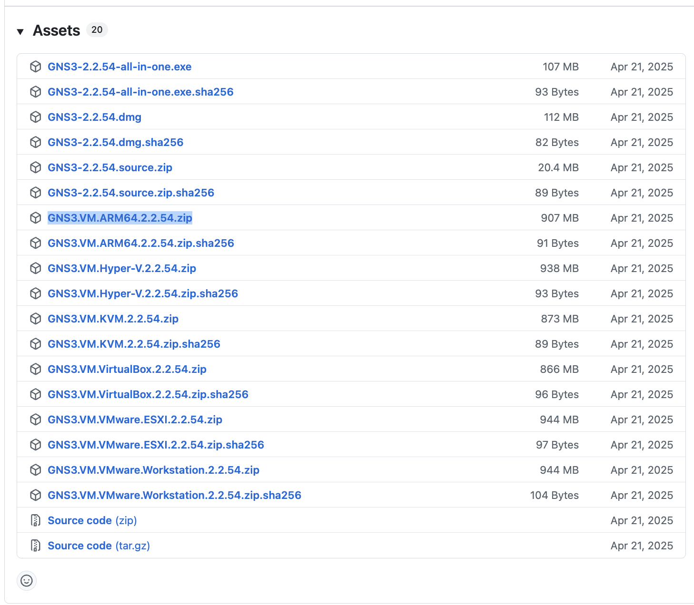
    
2.  После скачивания **GNS3.VM.ARM64.2.2.24.zip** - распакуйте архив. Внутри будет 2 диска - они нам понадобятся чуть позже.


    
3.  Качаем **VMWare Fusion**. Для этого переходим на официальный сайт, регистрируемся в [support portal](https://support.broadcom.com/) и далее [по ссылке качаем](https://support.broadcom.com/group/ecx/productdownloads?subfamily=VMware%20Fusion&freeDownloads=true) VMWare Fusion 25H2.

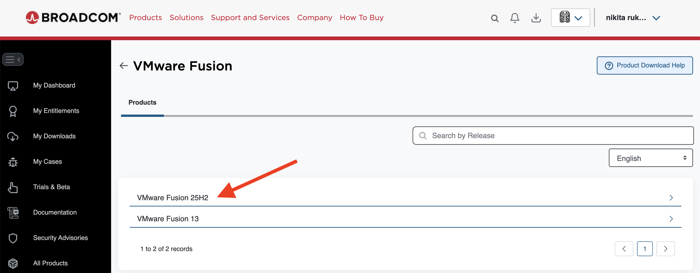
    
4.  Устанавливаем VMWare Fusion и запускаем его. После чего создаем custom VM и выбираем Linux → Ubuntu 64bit Arm.

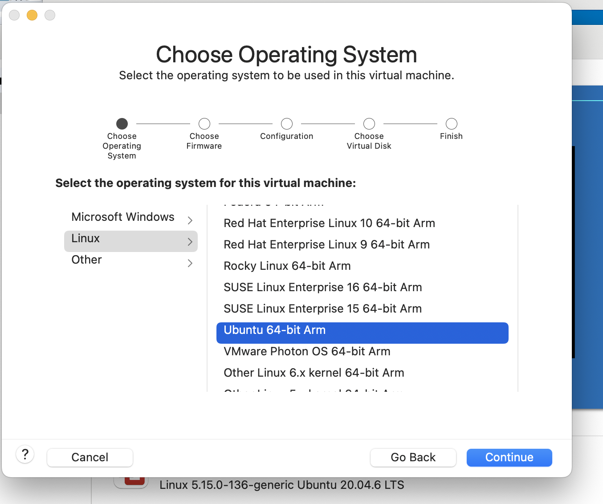
    
5.  Следующим шагом нам надо выбрать уже существующий gns3vm-disk1 из шага 2. disk2 пока не трогаем. Мы его подключим чуть позже.

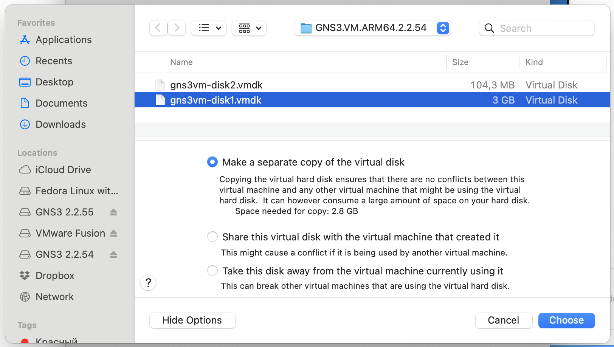
    
6.  На последнем шаге нажмите Customize Settings и здесь мы поменяем пару вещей.

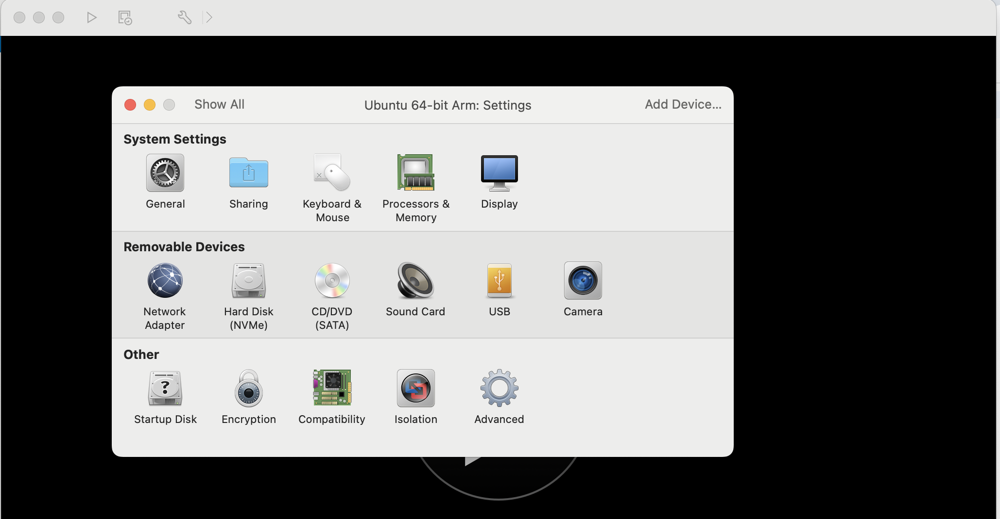
    
7.  Перейдите в **Network Adapter** и выставьте галку напротив **Wi-Fi**.

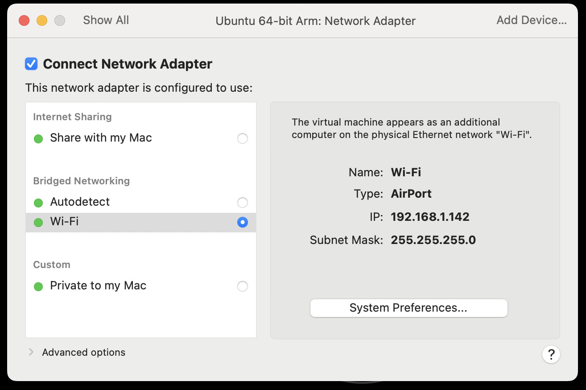

8.  Далее нажмите Hard Disk и справа вверху Add Device → Existing Hard Disk → Add и выберите disk-2.

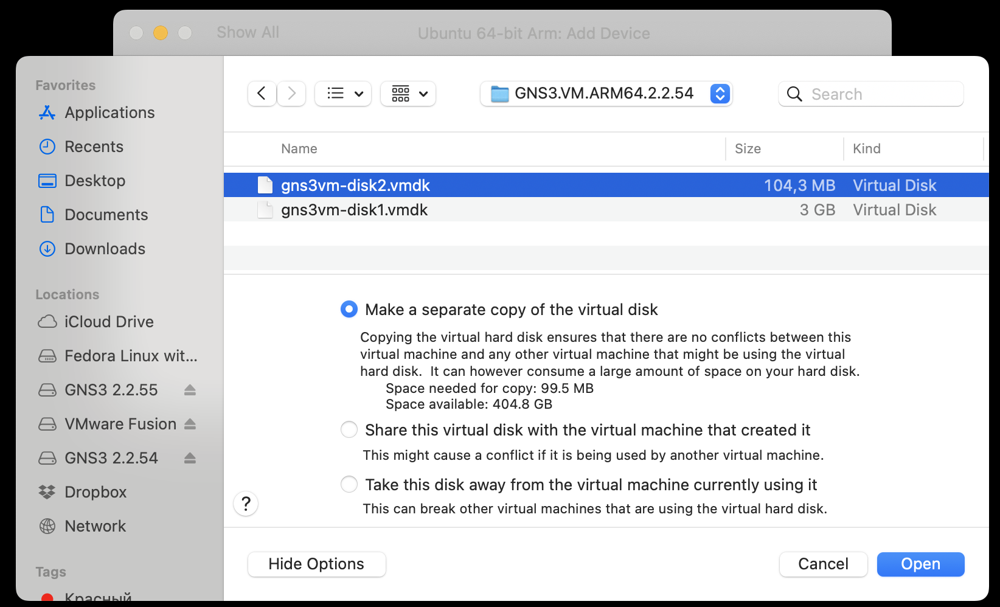
    
9.  Запускаем нашу VM и вы должны увидеть, что IP адрес выдан из вашей подсети.

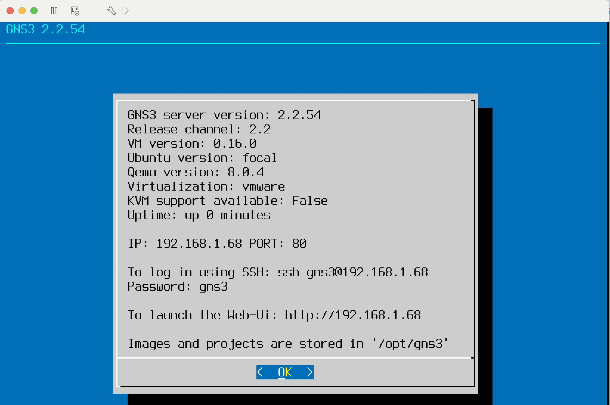
    
10.  Нажмите OK и выберите пункт Configure.

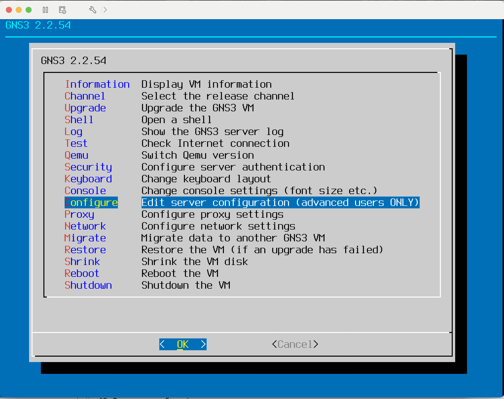
    
11.  В конец файла добавьте данный кусок конфигурации.Будте очень внимательны - нужно прописать все “один в один”, включая регистр.
    
    ```bash
    [Qemu]
    enable_hardware_acceleration = False
    require_hardware_acceleration = False
    enable_kvm = False
    
    ```
    
    Сохраните настройки и в меню выберите пункт **Reboot**. После загрузки вы также увидите IP адрес, порт и пароль от серверной части GNS3.
    
12.  Установка GNS3 ничем не отличается от обычной установки в MacOS. Ставим наш заранее скачанный **GNS-2.2.54.dmg** и запускаем программу.
    
13.  Переходим в настройки и прописываем конфигурацию для подключения к серверу. Для этого снимаем галку с Enable local server и прописываем параметры из шага 9.

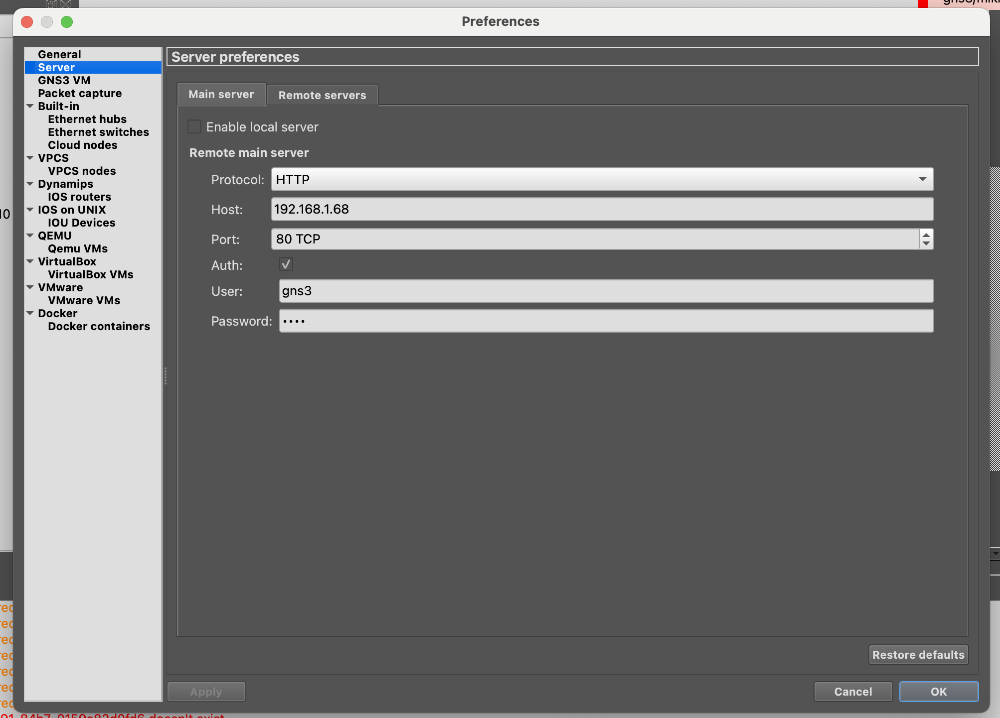
    
14.  Если вам привычнее iTerm2, то прописываем его в настройках **General → Console applications**. Ничего прописывать руками не надо - просто выбрать из выпадающего списка **iTerm2 3.x**.

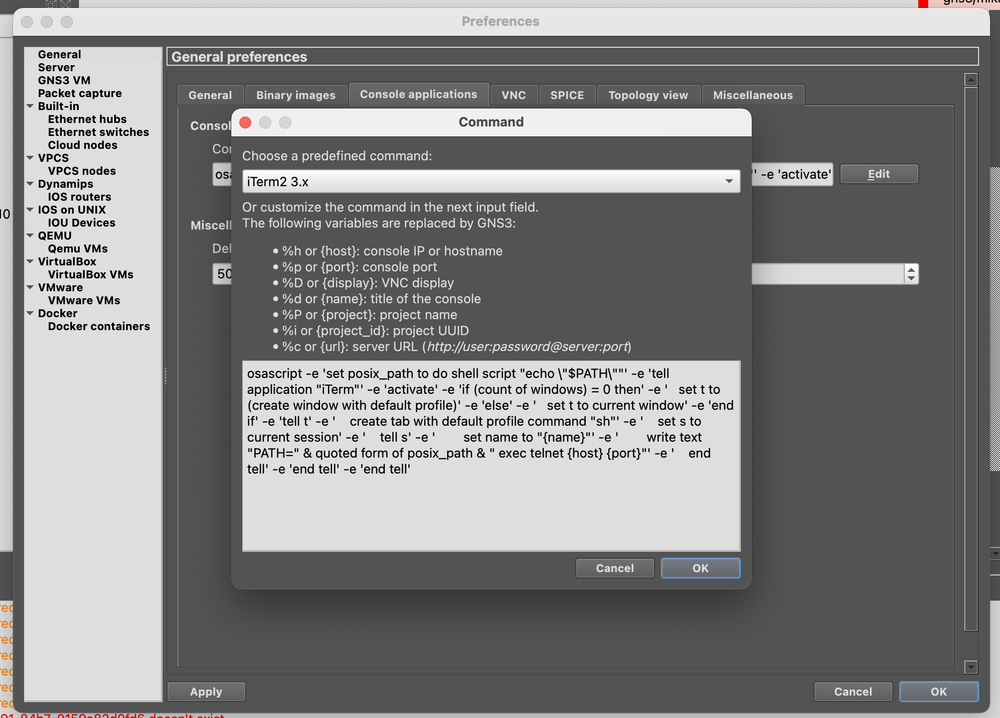
    
Уфф - мы великолепны ( сам себя не похвалишь - никто не похвалит ). Теперь давайте уже накидаем свой первый проект базовой сети в этом прекрасном инструменте.

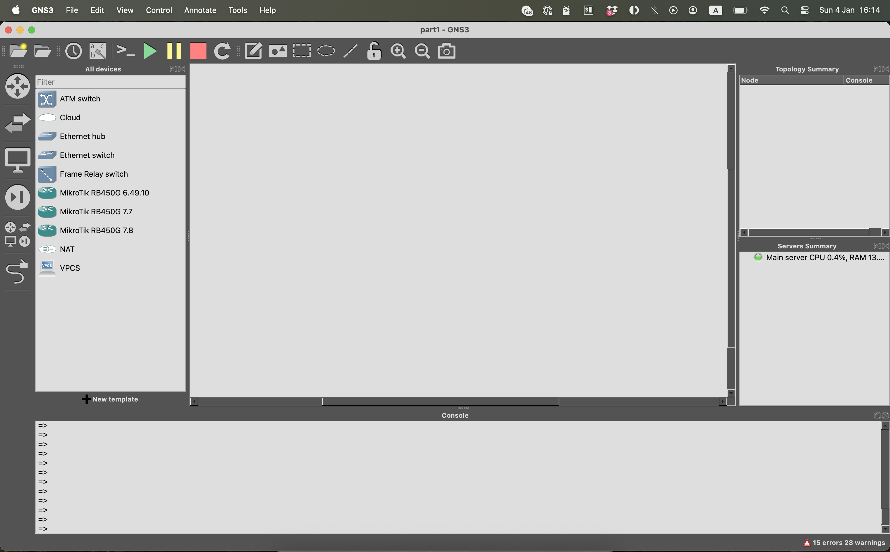

Надеюсь у тебя всё получилось и **GNS3** успешно запущен на Mac с M-процессором. Теперь у нас есть мощная лаборатория, где можно безопасно экспериментировать с сетевыми конфигурациями.

Ну а в следующей части мы спроектируем наш первый проект сети и изучим:

-   **Работу с GNS3** для моделирования сетей
-   **Настройку MikroTik RouterOS** через консоль (CLI)
-   **Конфигурацию статических и динамических IP-адресов**
-   **Настройку DHCP-серверов** с разными пулами адресов
-   **Реализацию NAT** для доступа в интернет
-   **Создание и применение Firewall правил**
-   **Использование адресных списков** для упрощения управления
-   **Сегментацию сети и реализацию политик безопасности**