Привет, в первой части мы разобрались как [заставить работать GNS3 под MacOS](/posts/2026-01-07-modelirovanie-seti-na-macos-ustanovka-i-nastroyka/).  
Ну а в этой мы пройдем путь от создания  **простейшей сети**  до построения  **сегментированной инфраструктуры**  с политиками безопасности. Вы освоите не только базу, но и будете понимать логику построения безопасных и масштабируемых сетевых решений.

#### На кого расчитан данный материал:

1.  **Студентов IT-специальностей**, которые прошли теорию сетей, но не работали с реальным оборудованием.
    
2.  **Начинающих администраторов и энтузиастов**, которые хотят начать практиковаться в настройке сетей в безопасной виртуальной среде.
    
3.  **Специалистов смежных областей** (сисадмины, DevOps), которым необходимо базовое понимание сетевой инфраструктуры и навыки конфигурирования.
    
4.  **Подготовленных новичков**, которые уже знакомы с понятиями IP-адресации, подсетей и маршрутизации, но не знают, как применить эти знания на практике.
    
5.  **Будущих сетевых инженеров**, делающих первые шаги в профессии и ищущих структурированное практическое руководство.
    

#### Что вы изучите:

-   **Работу с GNS3** для моделирования сетей.
-   **Настройку MikroTik RouterOS** через консоль (CLI).
-   **Конфигурацию**  статических и динамических **IP-адресов.**
-   **Настройку DHCP-серверов** с разными пулами адресов.
-   **Реализацию NAT** для доступа в интернет.
-   **Создание и применение Firewall правил.**
-   **Использование адресных списков** для упрощения управления.
-   **Сегментацию сети и реализацию политик безопасности.**

Мы начнем с простой схемы из одного роутера и постепенно будем ее усложнять, добавляя новые функции и компоненты. Каждый шаг будет сопровождаться подробными объяснениями, скриншотами и готовыми командами для копирования. Давайте начнем!

### Создаем простейшую сеть

Давайте реализуем самую простейшую сеть, которую можно только представить: один роутер, пара свитчей и несколько клиентов. Это будут разные подсетки, связанные между собой.

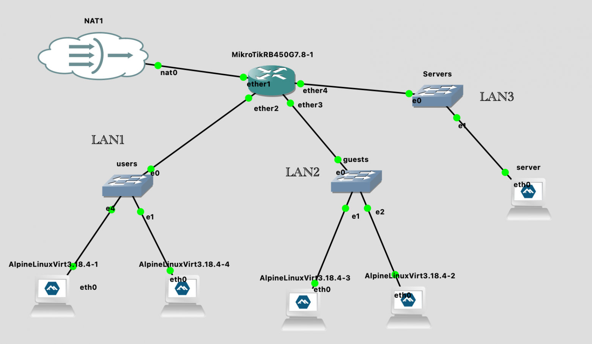

В начале был роутер

Первая проблема с который вы можете столкнуться - ограниченный список устройств, который можно добавить на схему.

Для того чтобы у нас они появились их надо создать. Нажимаем  **New Template**  и там выбираем  **Install and appliance from GNS3 Server**. Далее выбираем для нашего примера  **Mikrotik RB450G**. В GNS3 мы используем виртуальный образ MikroTik CHR, который полностью повторяет функциональность RouterOS и идеально подходит для обучения.

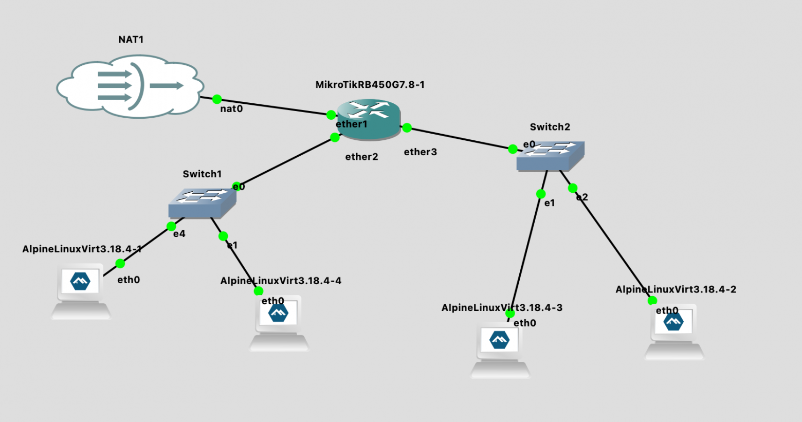

New Template

Жмем кнопку  **Install**  и выбираем  **Install the appliance on the main server**. После чего нужно будет выбрать прошивку и скачать ее образ. Перед импортом обязательно распакуйте скаченный образ.

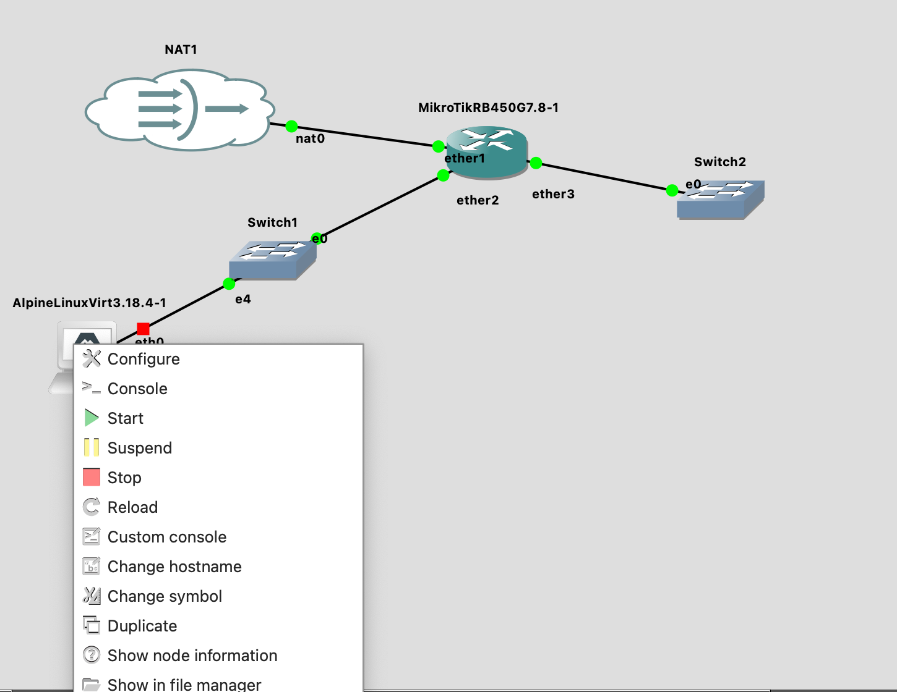

Подключение образа

После успешного импорта в списке устройств появится ваш Mikrotik.

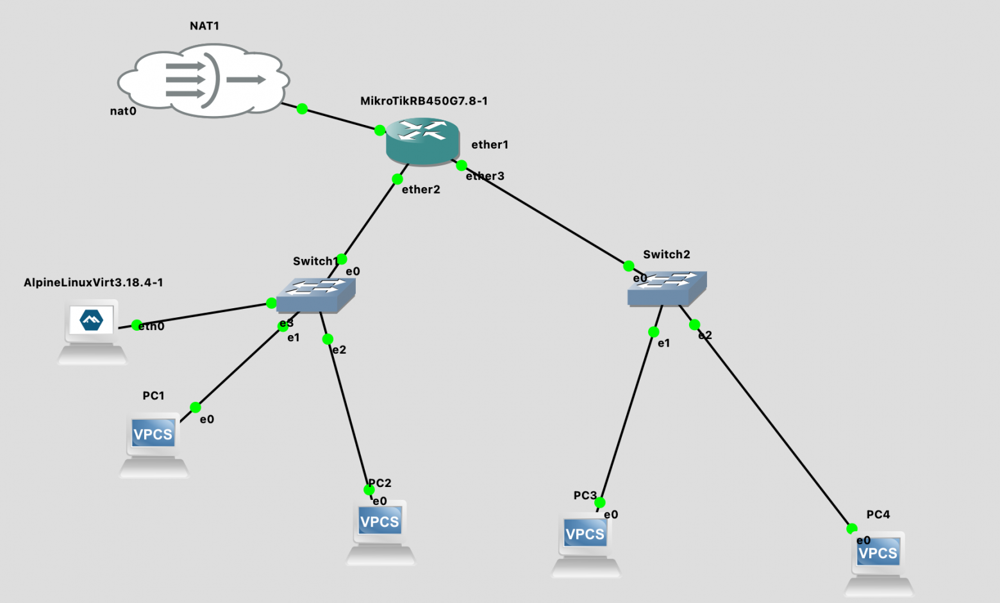

Список доступных виртуальных устройств

Осталось перенести всё что мы хотели на нашу схему: у нас будет 2 изолированные подсети (192.168.10.0/24, 192.168.20.0/24). В каждом из сетей будет неуправляемый коммутатор и пара VPCS (это очень простой виртуальный ПК в GNS3).

Мы хотим добиться связности между нашими сетями. Но для начала давайте составим списки IP адресов, а уже потом будем конфигурировать устройства и ставить эксперименты. Итак, мы имеем:

| Device | IP | Gateway |
|--------|----|---------| 
| PC1 | 192.168.10.2 | 192.168.10.1 |
| PC2 | 192.168.10.3 | 192.168.10.1 |
| PC3 | 192.168.20.2 | 192.168.20.1 |
| PC4 | 192.168.20.3 | 192.168.20.1 |
| Router1 (Mikrotik) | 192.168.10.1 (ether2), 192.168.20.1 (ether3) | - |

Поскольку в дальнейшем я планирую эту схему расширять, то  **ether1**  оставим зарезервированным под интернет.

Реализуйте схему как на скриншоте ниже - все элементы которые нужны для реализации, включая L2-соединения отмечены стрелочками. В конце не забудьте запустить свой проект и вы должны увидеть что всё стало зеленое.

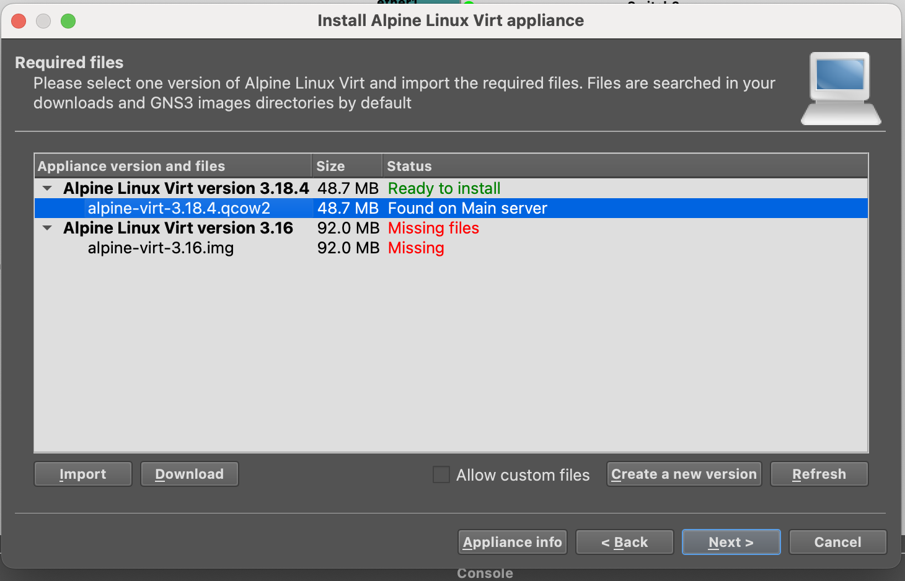

Первый старт

Давайте подключимся к консоли  **Mikrotik**  и настроим его ( по-умолчанию логин admin и пустой пароль). Для этого можно кликнуть ПКМ на роутере и выбрать  **Console**.

```
# Прописываем на интерфейсы IP адреса
[admin@MikroTik] > /ip address add address=192.168.10.1/24 interface=ether2
[admin@MikroTik] > /ip address add address=192.168.20.1/24 interface=ether3

# Проверяем что все ОК или НЕ ОК.
[admin@MikroTik] > /interface ethernet print
Flags: R - RUNNING
Columns: NAME, MTU, MAC-ADDRESS, ARP
#   NAME     MTU  MAC-ADDRESS        ARP
0   ether1  1500  0C:15:54:66:00:00  enabled
1 R ether2  1500  0C:15:54:66:00:01  enabled
2 R ether3  1500  0C:15:54:66:00:02  enabled
3   ether4  1500  0C:15:54:66:00:03  enabled
4   ether5  1500  0C:15:54:66:00:04  enabled

# Смотрим линк ( в рамках обучения )
[admin@MikroTik] > /interface ethernet monitor ether2,ether3 once
                     name: ether2   ether3
                   status: link-ok  link-ok
                     rate: 10Gbps   10Gbps
              full-duplex: yes      yes
    default-cable-setting: standard standard

# Проверяем, что IP прописались
[admin@MikroTik] > /ip address print
Columns: ADDRESS, NETWORK, INTERFACE
# ADDRESS         NETWORK      INTERFACE
0 192.168.10.1/24  192.168.10.0  ether2
1 192.168.20.1/24  192.168.20.0  ether3

# Проверим маршруты
[admin@MikroTik] > /ip route print
Flags: D - DYNAMIC; A - ACTIVE; c, y - COPY
Columns: DST-ADDRESS, GATEWAY, DISTANCE
    DST-ADDRESS     GATEWAY  DISTANCE
DAc 192.168.10.0/24  ether2          0
DAc 192.168.20.0/24  ether3          0
```

К счастью, нам не нужно никаких танцев в MikroTik с бубнами, что бы связность появилась сразу и мы можем сразу перейти к настройке наших VPCS. Таким же образом, через консоль, подключаемся и каждой из VPCS пропишем статичный IP и соотвествующий gateway.

```
PC1> ip 192.168.10.2/24 192.168.10.1
PC2> ip 192.168.10.3/24 192.168.10.1
PC3> ip 192.168.20.2/24 192.168.20.1
PC4> ip 192.168.20.3/24 192.168.20.1
```

После этого мы уже можем проверять связность. Давайте зайдем на PC1 и пропингуем PC3:

```
PC1> ping 192.168.20.2
84 bytes from 192.168.20.2 icmp_seq=1 ttl=63 time=11.863 ms
84 bytes from 192.168.20.2 icmp_seq=2 ttl=63 time=5.874 ms
84 bytes from 192.168.20.2 icmp_seq=3 ttl=63 time=5.809 ms
```

К сожалению после того как мы остановим VPCS изменения по IP адресам не будут сохранены. Поэтому, чтобы нам дальше не думать о ручном прописывании IP адресов давайте включим DHCP на Mikrotik.

```
# ether2 (192.168.10.0/24)
/ip pool add name=pool_lan1 ranges=192.168.10.100-192.168.10.200
/ip dhcp-server add name=dhcp_lan1 interface=ether2 address-pool=pool_lan1 lease-time=1h
/ip dhcp-server enable dhcp_lan1
/ip dhcp-server network add address=192.168.10.0/24 gateway=192.168.10.1 dns-server=1.1.1.1,8.8.8.8

# ether3 (192.168.20.0/24)
/ip pool add name=pool_lan2 ranges=192.168.20.100-192.168.20.200
/ip dhcp-server add name=dhcp_lan2 interface=ether3 address-pool=pool_lan2 lease-time=1h
/ip dhcp-server enable dhcp_lan2
/ip dhcp-server network add address=192.168.20.0/24 gateway=192.168.20.1 dns-server=1.1.1.1,8.8.8.8
```

DHCP серверы настроены на портах. Давайте подключимся к PC1 и попробуем получить адрес.

```
PC1> ip dhcp
DORA IP 192.168.10.200/24 GW 192.168.10.1

PC1> show ip
NAME        : PC1[1]
IP/MASK     : 192.168.10.200/24
GATEWAY     : 192.168.10.1
DNS         : 8.8.8.8
DHCP SERVER : 192.168.10.1
DHCP LEASE  : 3510, 3600/1800/3150
MAC         : 00:50:79:66:68:00
LPORT       : 20012
RHOST:PORT  : 127.0.0.1:20013
MTU         : 1500
```

Ну и в конце в целях обучения также посмотрим какой IP и кому был выдан на самом Mikrotik.

```
[admin@MikroTik] > /ip dhcp-server lease print
Flags: D, B - BLOCKED
Columns: ADDRESS, MAC-ADDRESS, HOST-NAME, SERVER, STATUS, LAST-SEEN
#   ADDRESS        MAC-ADDRESS        HOST-NAME  SERVER     STATUS  LAST-SEEN
0 D 192.168.10.200  00:50:79:66:68:00  PC1        dhcp_lan1  bound   1m6s
```

## Улучшение сети

Прежде чем что то делать дальше хочется чтобы мы могли иметь доступ в Интернет. Для этого давайте добавим на схему NAT и соединим его интерфейс с Mikrotik.

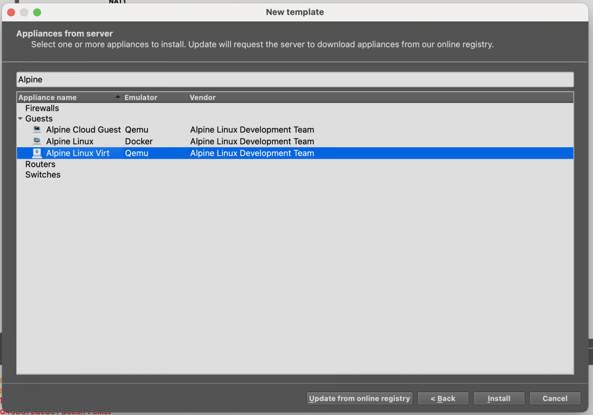

Подключаем nat

На всякий случай включим получение IP адреса на ether1 по dhcp от NAT.

```
[admin@MikroTik] > /ip dhcp-client add interface=ether1 disabled=no
failure: dhcp-client on that interface already exists

[admin@MikroTik] > /ip address print
Flags: D - DYNAMIC
Columns: ADDRESS, NETWORK, INTERFACE
#   ADDRESS             NETWORK        INTERFACE
0   192.168.10.1/24      192.168.10.0    ether2
1   192.168.20.1/24      192.168.20.0    ether3
2 D 192.168.122.154/24  192.168.122.0  ether1

[admin@MikroTik] > /ip route print
Flags: D - DYNAMIC; A - ACTIVE; c, d, y - COPY
Columns: DST-ADDRESS, GATEWAY, DISTANCE
    DST-ADDRESS       GATEWAY        DISTANCE
DAd 0.0.0.0/0         192.168.122.1         1
DAc 192.168.10.0/24    ether2                0
DAc 192.168.20.0/24    ether3                0
DAc 192.168.122.0/24  ether1                0

[admin@MikroTik] > /tool ping 8.8.8.8
  SEQ HOST                                     SIZE TTL TIME       STATUS
    0 8.8.8.8                                    56 110 10ms898us
    1 8.8.8.8                                    56 110 13ms254us
    2 8.8.8.8                                    56 110 12ms425us
    sent=3 received=3 packet-loss=0% min-rtt=10ms898us avg-rtt=12ms192us max-rtt=13ms254us
```

Теперь нужно включить маскарадинг, чтобы другие наши клиентские устройства также могли выйти в интернет.

```
/ip firewall nat add chain=srcnat out-interface=ether1 action=masquerade
```

Проверим на PC1

```
PC1> /ip dhcp
DORA IP 192.168.10.200/24 GW 192.168.10.1

PC1> show ip
NAME        : PC1[1]
IP/MASK     : 192.168.10.200/24
GATEWAY     : 192.168.10.1
DNS         : 1.1.1.1  8.8.8.8
DHCP SERVER : 192.168.10.1
DHCP LEASE  : 3599, 3600/1800/3150
MAC         : 00:50:79:66:68:00
LPORT       : 20012
RHOST:PORT  : 127.0.0.1:20013
MTU         : 1500

PC1> ping 192.168.20.1
84 bytes from 192.168.20.1 icmp_seq=1 ttl=64 time=16.495 ms
84 bytes from 192.168.20.1 icmp_seq=2 ttl=64 time=6.239 ms

PC1> ping ya.ru
ya.ru resolved to 77.88.44.242
84 bytes from 77.88.44.242 icmp_seq=1 ttl=52 time=20.905 ms
84 bytes from 77.88.44.242 icmp_seq=2 ttl=52 time=27.412 ms
```

### Отказ от VPCS в пользу Alpine

Теперь давайте все таки откажемся от VPCS в пользу  **Alpine Linux Virt**  для того чтобы мы приблизиться к максимально боевым условиям. Давайте добавим  **Alpine**  через  **New Template**.

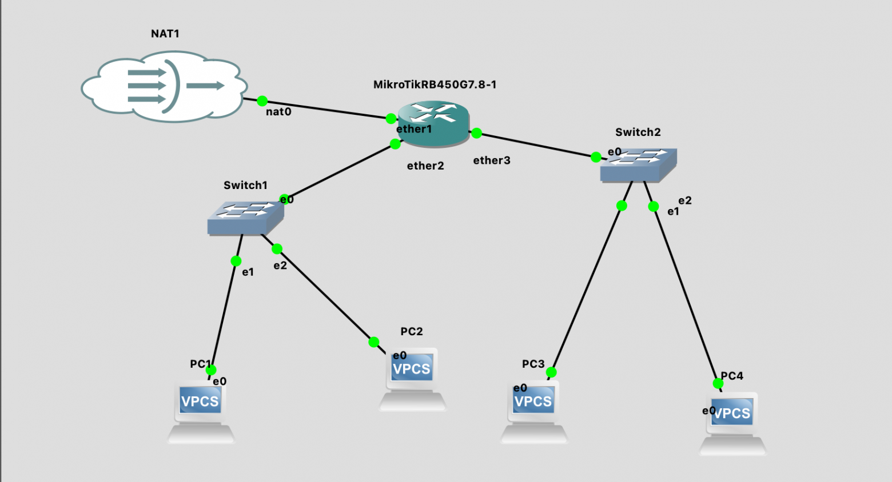

Подключаем Alpine

На шаге где будут запрашиваться файлы - нажимаем Download. Скачиваем образ, если нужно распаковываем и делаем Import. И далее, по шагам, со всем соглашаемся.

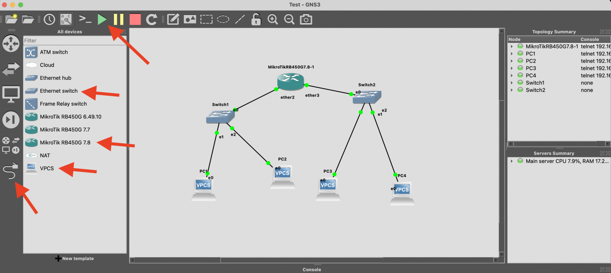

Подключаем образ Alpine

Теперь добавим  **Alpine Linux Virt**  на нашу схему и соединим с  **Switch1**.

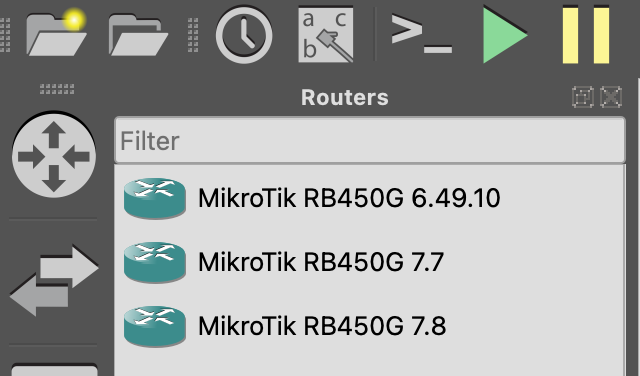

Новая схема

Включим нашу новую виртуалку и настроим сеть на получение адреса по dhcp. После чего сразу перезагрузим и проверим что интернет появился.

```
alpine:~# setup-interfaces
Available interfaces are: eth0.
Enter '?' for help on bridges, bonding and vlans.
Which one do you want to initialize? (or '?' or 'done') [eth0]
Ip address for eth0? (or 'dhcp', 'none', '?') [192.168.20.200] dhcp
Do you want to do any manual network configuration? (y/n) [n] n

alpine:~# /etc/init.d/networking restart
 * WARNING: you are stopping a boot service
 * Stopping networking ...
 *   lo ... [ ok ]
 *   eth0 ...
cat: can't open '/var/run/udhcpc.eth0.pid': No such file or directory
sh: you need to specify whom to kill [ ok ]
 * Starting networking ...
 *   lo ... [ ok ]
 *   eth0 ...
udhcpc: started, v1.36.1
udhcpc: broadcasting discover
udhcpc: broadcasting select for 192.168.10.199, server 192.168.10.1
udhcpc: lease of 192.168.10.199 obtained from 192.168.10.1, lease time 3600 [ ok ]

alpine:~# ping ya.ru
PING ya.ru (5.255.255.242): 56 data bytes
64 bytes from 5.255.255.242: seq=0 ttl=243 time=19.885 ms
```

Теперь удалим все VPCS, выключим  **Alpine Linux Virt**, сделаем копии через  **Duplicate**  в меню, чтобы постоянно не делать одно и то же для настройки сети.

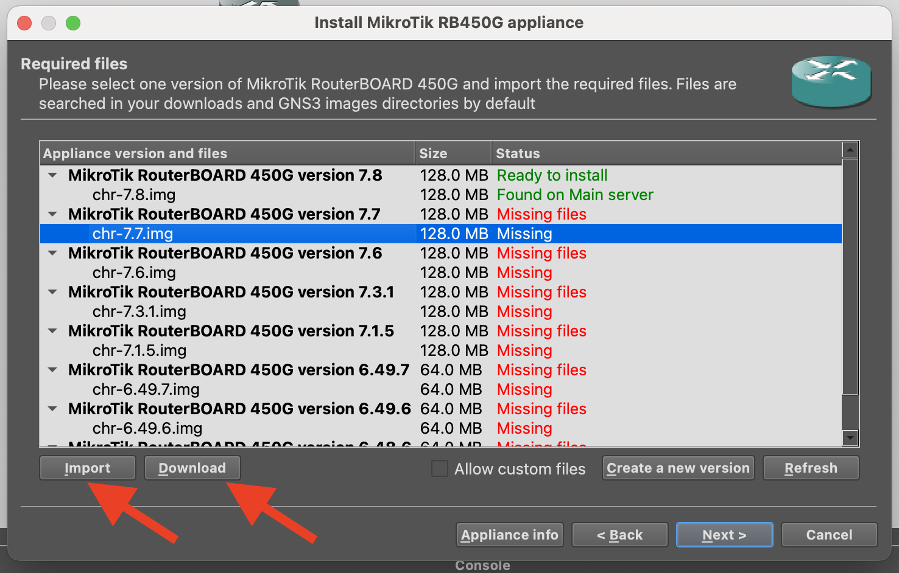

Давай по новой

После этого у нас будет такая схема.

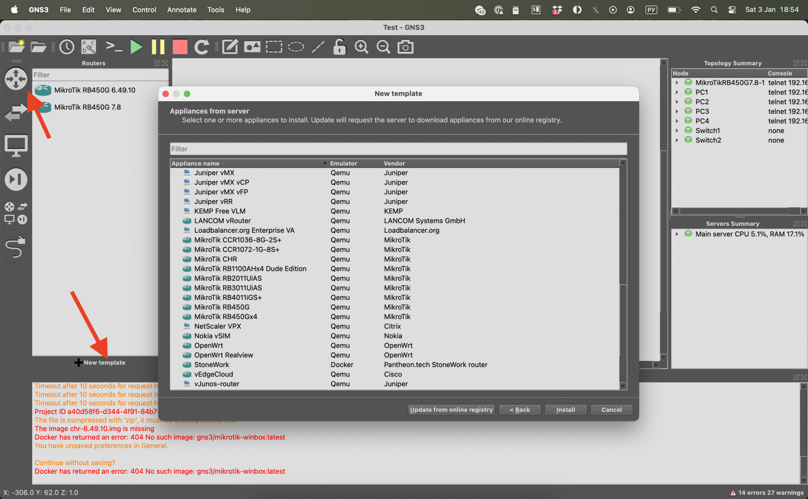

Переехали на Alpine

Теперь на Mikrotik проверим какие IP выданы DHCP сервером.

```
[admin@MikroTik] > /ip dhcp-server lease print
Flags: D, B - BLOCKED
Columns: ADDRESS, MAC-ADDRESS, HOST-NAME, SERVER, STATUS, LAST-SEEN
#   ADDRESS        MAC-ADDRESS        HOST-NAME  SERVER     STATUS  LAST-SEEN
0 D 192.168.10.200  00:50:79:66:68:00  PC1        dhcp_lan1  bound   50m39s
1 D 192.168.10.199  0C:DD:51:48:00:00  alpine     dhcp_lan1  bound   24m57s
2 D 192.168.20.200  0C:8A:11:AE:00:00  alpine     dhcp_lan2  bound   24m57s
3 D 192.168.10.198  0C:64:80:56:00:00  alpine     dhcp_lan1  bound   24m57s
4 D 192.168.20.199  0C:43:F1:88:00:00  alpine     dhcp_lan2  bound   24m56s
```

Подключимся к любому новому Alpine и проверим что есть интернет.

```
alpine:~# ping ya.ru
PING ya.ru (77.88.55.242): 56 data bytes
64 bytes from 77.88.55.242: seq=0 ttl=52 time=21.013 ms
64 bytes from 77.88.55.242: seq=1 ttl=52 time=28.526 ms
64 bytes from 77.88.55.242: seq=2 ttl=52 time=34.983 ms
```

### Настройка Firewall

Теперь немного причешем безопасность. Ведь ее много не бывает.

```
# Разрешаем ответы
/ip firewall filter add chain=forward connection-state=established,related action=accept

# Дропаем мусор
/ip firewall filter add chain=forward connection-state=invalid action=drop

# Разрешаем LAN → Internet
/ip firewall filter add chain=forward in-interface=ether2 out-interface=ether1 action=accept
/ip firewall filter add chain=forward in-interface=ether3 out-interface=ether1 action=accept

# Запрещаем Internet → LAN
/ip firewall filter add chain=forward in-interface=ether1 action=drop
```

### Добавляем серверную

Чуть усложним нашу схему и добавим туда LAN3(в порт ether4) с подсетью 192.168.30.0/24 для серверов. Также предложим, что в LAN1 (users) находятся сотрудники, которые должны иметь доступ к серверам. А в LAN2(guests) - они могут ходить только в интернет. Также из LAN3 будет доступ в интернет.

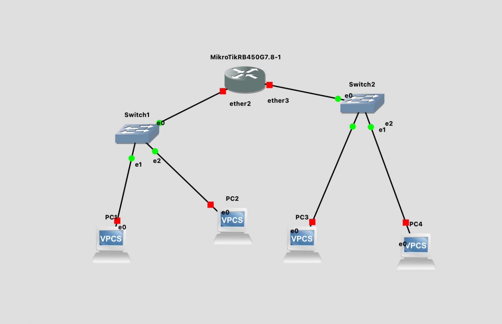

Наконец-то появилась серверная

Настроим DHCP для LAN3.

```
/ip address add address=192.168.30.1/24 interface=ether4
/ip pool add name=pool_lan3 ranges=192.168.30.100-192.168.30.200
/ip dhcp-server add name=dhcp_lan3 interface=ether4 address-pool=pool_lan3 lease-time=1h
/ip dhcp-server enable dhcp_lan3
/ip dhcp-server network add address=192.168.30.0/24 gateway=192.168.30.1 dns-server=1.1.1.1,8.8.8.8

# Заодно зафиксируем привязку MAC адреса сервера к выдаваемому IP. 
# В проде вам нужно использовать статичный IP конечно.
/ip dhcp-server lease add mac-address=0C:34:7C:77:00:00 address=192.168.30.200 comment="server01"
```

### DNS Forwarder

Для управляемости удобнее раздавать клиентам DNS роутера/локального резолвера, а уже он будет форвардить наружу. Давайте это исправим и используем MikroTik как  **DNS forwarder**.

```
/ip dns set servers=1.1.1.1,8.8.8.8 allow-remote-requests=yes

[admin@MikroTik] /ip/dhcp-server> /ip dhcp-server network print
Columns: ADDRESS, GATEWAY, DNS-SERVER
# ADDRESS          GATEWAY       DNS-SERVER
0 192.168.10.0/24  192.168.10.1  1.1.1.1
                                 8.8.8.8
1 192.168.20.0/24  192.168.20.1  1.1.1.1
                                 8.8.8.8
2 192.168.30.0/24  192.168.30.1  8.8.8.8
                                 1.1.1.1

/ip dhcp-server network set 0 dns-server=192.168.10.1
/ip dhcp-server network set 1 dns-server=192.168.20.1
/ip dhcp-server network set 2 dns-server=192.168.30.1
```

### Настроим Firewall

Прежде чем двигаться дальше - нам надо причесать Firewall. Давайте посмотрим что там есть

```
[admin@MikroTik] /ip/firewall/address-list> /ip firewall filter print
Flags: X - disabled, I - invalid; D - dynamic 
0    chain=forward action=accept connection-state=established,related 
1    chain=forward action=drop connection-state=invalid 
2    chain=forward action=accept in-interface=ether2 out-interface=ether1 
3    chain=forward action=accept in-interface=ether3 out-interface=ether1 
4    chain=forward action=drop in-interface=ether1
```

Наши текущие правила используют **интерфейсы.**  Поскольку количество подсетей будет расти - давайте перейдем на **адресные списки,**  чтобы каждый раз не прописывать сети.

```
# Добавим адресные списки
/ip firewall address-list add list=LAN1 address=192.168.10.0/24
/ip firewall address-list add list=LAN2 address=192.168.20.0/24
/ip firewall address-list add list=LAN3 address=192.168.30.0/24
```

Следующим шагом мы удалим лишние правила и создадим по новой.

```
# Удалим все правила
/ip firewall filter remove [find]

# 1. Базовые правила для любой сети
/ip firewall filter add chain=forward action=accept connection-state=established,related comment="Allow established"
/ip firewall filter add chain=forward action=drop connection-state=invalid comment="Drop invalid"
/ip firewall filter add chain=input action=accept connection-state=established,related
/ip firewall filter add chain=input action=drop connection-state=invalid

# 2. DNS правила в forward (для клиентов во внешний DNS)
/ip firewall filter add chain=forward action=accept protocol=udp dst-port=53 comment="Allow DNS UDP"
/ip firewall filter add chain=forward action=accept protocol=tcp dst-port=53 comment="Allow DNS TCP"

# 3. Межсетевые правила
/ip firewall filter add chain=forward action=accept src-address-list=LAN1 dst-address-list=LAN3 comment="LAN1->LAN3"
/ip firewall filter add chain=forward action=drop src-address-list=LAN2 dst-address-list=LAN1 comment="Block LAN2->LAN1"
/ip firewall filter add chain=forward action=drop src-address-list=LAN2 dst-address-list=LAN3 comment="Block LAN2->LAN3"
/ip firewall filter add chain=forward action=drop src-address-list=LAN3 dst-address-list=LAN1 comment="Block LAN3->LAN1"
/ip firewall filter add chain=forward action=drop src-address-list=LAN3 dst-address-list=LAN2 comment="Block LAN3->LAN2"

# 4. Правила для выхода в интернет
/ip firewall filter add chain=forward action=accept src-address-list=LAN1 out-interface=ether1 comment="LAN1->Internet"
/ip firewall filter add chain=forward action=accept src-address-list=LAN2 out-interface=ether1 comment="LAN2->Internet"
/ip firewall filter add chain=forward action=accept src-address-list=LAN3 out-interface=ether1 comment="LAN3->Internet"

# 5. Блокировка интернета внутрь
/ip firewall filter add chain=forward action=drop in-interface=ether1 comment="Block Internet->LAN"
```

Ну и добьем эту историю настройка Input правил к нашему  **Mikrotik**. Закроем доступ из гостевой сети ( LAN2 ), но оставим открытым ping (icmp). А также оставим доступ к управляющем порту 8291 (winbox) из юзерской сети (LAN1).

```
# INPUT правила (доступ к роутеру)
/ip firewall filter add chain=input action=accept protocol=icmp src-address-list=LAN1 comment="Ping from LAN1"
/ip firewall filter add chain=input action=accept protocol=icmp src-address-list=LAN2 comment="Ping from LAN2"
/ip firewall filter add chain=input action=accept protocol=icmp src-address-list=LAN3 comment="Ping from LAN3"
/ip firewall filter add chain=input action=accept protocol=tcp src-address-list=LAN1 port=8291 comment="Winbox from LAN1"
/ip firewall filter add chain=input action=accept protocol=udp src-address-list=LAN1 dst-port=53 comment="DNS from LAN1"
/ip firewall filter add chain=input action=accept protocol=tcp src-address-list=LAN1 dst-port=53 comment="DNS TCP from LAN1"
/ip firewall filter add chain=input action=accept protocol=udp src-address-list=LAN2 dst-port=53 comment="DNS from LAN2"
/ip firewall filter add chain=input action=accept protocol=tcp src-address-list=LAN2 dst-port=53 comment="DNS TCP from LAN2"
/ip firewall filter add chain=input action=accept protocol=udp src-address-list=LAN3 dst-port=53 comment="DNS from LAN3"
/ip firewall filter add chain=input action=accept protocol=tcp src-address-list=LAN3 dst-port=53 comment="DNS TCP from LAN3"
/ip firewall filter add chain=input action=drop in-interface=ether1 comment="Block Internet->Router"
/ip firewall filter add chain=input action=drop src-address-list=LAN2 comment="Block LAN2->Router"
/ip firewall filter add chain=input action=drop src-address-list=LAN3 comment="Block LAN3->Router"
```

Вы, могли заметить что мы зачем то создали правила DROP и они избыточны. Но на самом деле явные drop правила нам более детально диагностировать и если необходимо даже включить логирование.

Например, давайте отправим несколько icmp-пакетов в сторону сервера из гостевой сети.

```
[admin@MikroTik] /ip/firewall/filter> /ip firewall filter print stats where packets>0
Columns: CHAIN, ACTION, BYTES, PACKETS
 # CHAIN    ACTION  BYTES  PACKETS
;;; Allow established
 0 forward  accept    252        3
 2 input    accept    506        3
;;; Block LAN2->LAN3
 8 forward  drop      420        5
;;; LAN2->Internet
12 forward  accept     84        1
;;; DNS from LAN2
21 input    accept    102        2
;;; Block LAN2->Router
26 input    drop      656        2
;;; Block LAN3->Router
27 input    drop      328        1
```

Здесь явно видно что правило отработало и это очень полезно, особенно на начальных этапах настройки сетей. Но вам в приципе ничего не мешает упростить конфигурацию.

### Заключение

В этой части мы изучили, как из простейшей сети вырастает полноценная сегментированная инфраструктура с продуманной безопасностью. Освоенные принципы работы с  **RouterOS**  и  **GNS3**  станут фундаментом для проектирования сетей любой сложности.

Ну а в следующей части мы  **пересоберем сеть**, задействуем  **Cisco L2-коммутатор**  и  **VLAN-ы**. И самое главное разберемся почему это важно в контексте масштабирования сети.