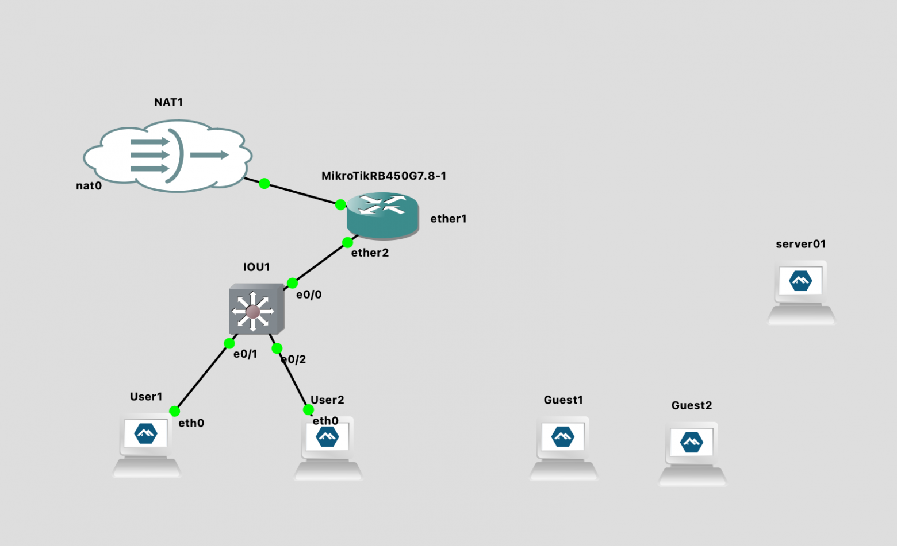
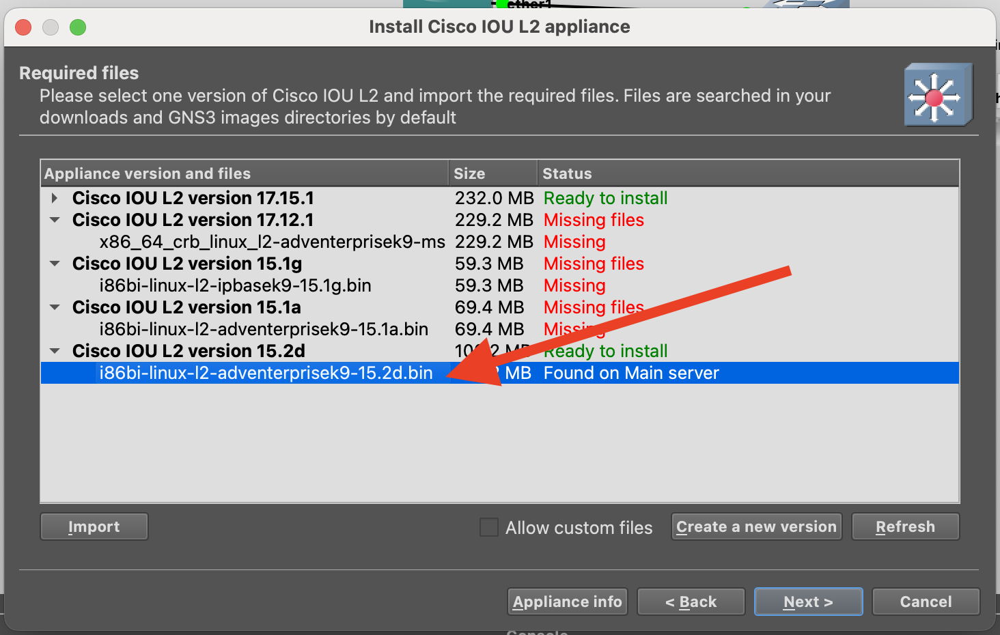
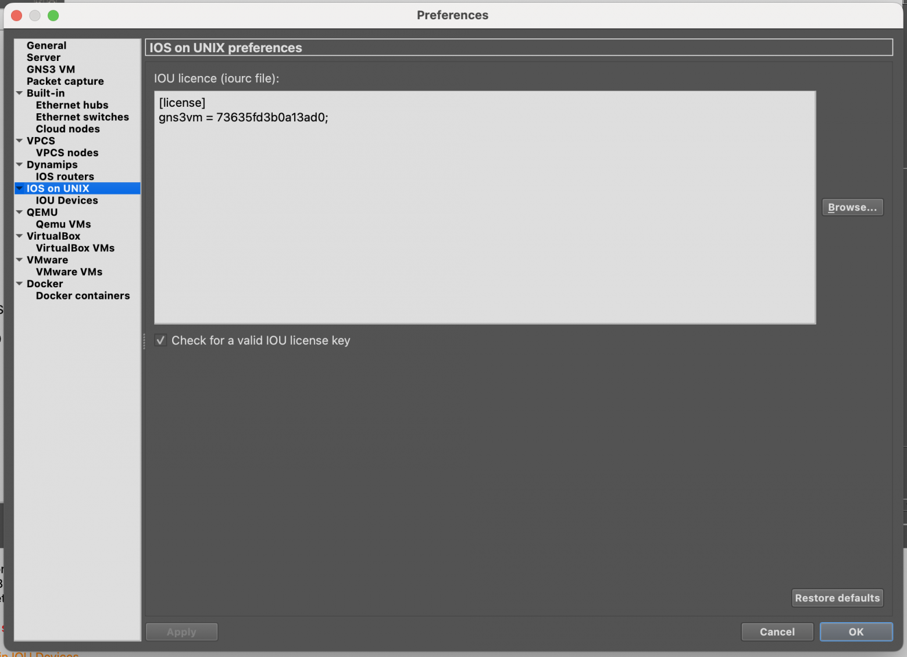
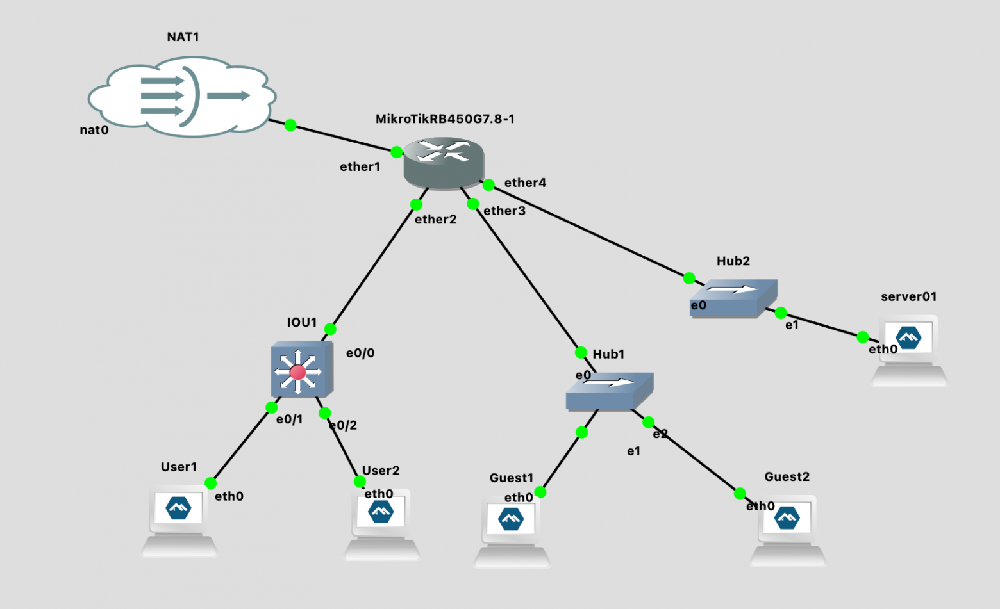
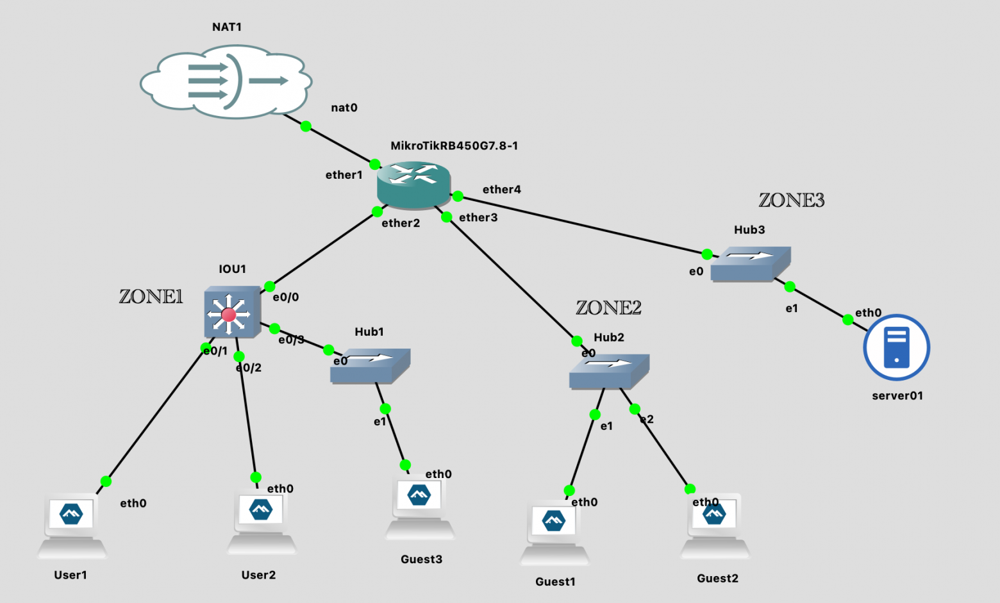

Привет,в этой серии мы продолжаем осваивать возможности GNS3 и изучать теорию сетей на практике.

Предыдущие части:

 - [Симулируем сети в GNS3. Часть 1 - настройка под MacOS](/posts/2026-01-07-modelirovanie-seti-na-macos-ustanovka-i-nastroyka/) 
 - [Симулируем сети в GNS3. Часть 2 - делаем свою первую сеть](/posts/2026-01-20-simuliruem-seti-v-gns3-delaem-pervuyu-set/)  

Наша схема сети уже неплохая, но она плохо масштабируется. Для простоты понимания в чем проблема, - давайте представим что это сеть небольшого предприятия, в котором есть 3 здания: LAN1 - это 1-ое здание, LAN2 - второе и LAN3 - третье (ZONE1-3 соотвественно).

Сейчас у нас схема такая:

```
ether2 = LAN1 (сотрудники)
ether3 = LAN2 (гости)
ether4 = LAN3 (сервера)
```

Представим, что во 2-м здании мест для гостей предприятия уже не хватает. А в первом здании есть свободный open space и очень много свободного места. В результате обсуждения руководителей предприятия было принято решение организовать гостевой доступ в этом openspace.

Вы немного подумали и поняли, что при текущей схеме вы очень сильно ограничены и если и получится организовать гостевой доступ ( я напомню что в гостевой сети есть доступ только в Интернет), то придется начать городить костыли на Mirotik. Поэтому вы решили пока не поздно перейти от физической сегментации сети к логической.

Новая схема:

```
ether2 = TRUNK
  ├─ VLAN10 (LAN1 – сотрудники)
  ├─ VLAN20 (LAN2 – гости)
ether3 = VLAN20 (LAN2 – гости)
ether4 = VLAN30 (LAN3 - сервера)
```

### Переходим на L2-коммутатор Cisco IOU

Теперь нам надо  **на порте коммутатора**, который смотрит на  **Mikrotik**, создать транк с  **VLAN (10,20)**. А на тех, которые подключены к конечным устройствам задать нужный и соответсвующий VLAN. И у нас … не получится это сделать, используя Network Switch. Это связано с определенными ограничениями.

Поэтому давайте заменим  **Ethernet Switch**  на  **Cisco IOU L2 15.2d**. И заодно удалим оставшиеся  **Network Switch**  - они больше не понадобятся. Позже мы их заменим на Ethernet Hub.



Надо переделать пока не поздно

Как обычно через  **New Template**  добавим коммутатор  **Cisco IOU L2 15.2d**.



Но тут уже не будет кнопки  **Download**  и вы не сможете скачать образ. Поищите образ  **i86bi-linux-l2-adventerprisek9-15.2d.bin**  в Интернете. Не нужно переживать, что вы скачаете файл с неофициально сайта - при импорте GNS3 проверит  **checksum**  и предупредит вас, если что-то не так.

При работе с Cisco будет еще нюанс -  **IOU License**. Ее нужно будет сгенерировать на сервере c  **GNS3**. Так что подключимся к нему по ssh, предварительно поискав генератор лицензий на github.

```
ns3@gns3vm:~$ curl -o keygen.py <https://raw.githubusercontent.com/obscur95/gns3-server/refs/heads/master/IOU/CiscoIOUKeygen.py>
  % Total    % Received % Xferd  Average Speed   Time    Time     Time  Current
                                 Dload  Upload   Total   Spent    Left  Speed
100  1056  100  1056    0     0   5360      0 --:--:-- --:--:-- --:--:--  5360
gns3@gns3vm:~$ python3 keygen.py 
*********************************************************************
Cisco IOU License Generator - Kal 2011, python port of 2006 C version
Modified to work with python3 by c_d 2014
hostid=00000000, hostname=gns3vm, ioukey=25e

Add the following text to ~/.iourc:
**[license]
gns3vm = 73635fd3b0a13ad0;**

You can disable the phone home feature with something like:
 echo '127.0.0.127 xml.cisco.com' >> /etc/hosts
```

И прописываем в настройках IOS on UNIX.



Пропишем лицуху

Подключаемся к консоли Cisco и прописываем конфигурацию ниже

```
IOU1#conf t
vlan 10
name LAN10
vlan 20
name LAN20
end

IOU1#show vlan brief

VLAN Name                             Status    Ports
---- -------------------------------- --------- -------------------------------
1    default                          active    Et0/0, Et0/1, Et0/2, Et0/3
                                                Et1/0, Et1/1, Et1/2, Et1/3
                                                Et2/0, Et2/1, Et2/2, Et2/3
                                                Et3/0, Et3/1, Et3/2, Et3/3
10   LAN10                            active
20   LAN20                            active
1002 fddi-default                     act/unsup
1003 token-ring-default               act/unsup
1004 fddinet-default                  act/unsup
1005 trnet-default                    act/unsup

IOU1#conf t
interface Ethernet0/0
switchport trunk encapsulation dot1q
switchport mode trunk
switchport trunk allowed vlan 10,20
no shutdown
end

IOU1#show interfaces trunk
Port        Mode             Encapsulation  Status        Native vlan
Et0/0       on               802.1q         trunking      1
Port        Vlans allowed on trunk
Et0/0       10,20
Port        Vlans allowed and active in management domain
Et0/0       10,20
Port        Vlans in spanning tree forwarding state and not pruned
Et0/0       none

IOU1#conf t
interface Ethernet0/1
switchport mode access
switchport access vlan 10
no shutdown
end

IOU1#conf t
interface Ethernet0/2
switchport mode access
switchport access vlan 10
no shutdown
end

IOU1#show vlan brief

VLAN Name                             Status    Ports
---- -------------------------------- --------- -------------------------------
1    default                          active    Et0/3, Et1/0, Et1/1, Et1/2
                                                Et1/3, Et2/0, Et2/1, Et2/2
                                                Et2/3, Et3/0, Et3/1, Et3/2
                                                Et3/3
10   LAN10                            active    Et0/1, Et0/2
20   LAN20                            active
1002 fddi-default                     act/unsup
1003 token-ring-default               act/unsup
1004 fddinet-default                  act/unsup
1005 trnet-default                    act/unsup

IOU1#show interfaces switchport
Name: Et0/0
Switchport: Enabled
Administrative Mode: trunk
Operational Mode: trunk
Administrative Trunking Encapsulation: dot1q
Operational Trunking Encapsulation: dot1q
Negotiation of Trunking: On
Access Mode VLAN: 1 (default)
Trunking Native Mode VLAN: 1 (default)
Administrative Native VLAN tagging: enabled
Voice VLAN: none
Administrative private-vlan host-association: none
Administrative private-vlan mapping: none
Administrative private-vlan trunk native VLAN: none
Administrative private-vlan trunk Native VLAN tagging: enabled
Administrative private-vlan trunk encapsulation: dot1q
Administrative private-vlan trunk normal VLANs: none
Administrative private-vlan trunk associations: none
Administrative private-vlan trunk mappings: none
Operational private-vlan: none
Trunking VLANs Enabled: 10,20
Pruning VLANs Enabled: 2-1001
Capture Mode Disabled
...

IOU1#show interfaces trunk
Port        Mode             Encapsulation  Status        Native vlan
Et0/0       on               802.1q         trunking      1
Port        Vlans allowed on trunk
Et0/0       10,20
Port        Vlans allowed and active in management domain
Et0/0       10,20
Port        Vlans in spanning tree forwarding state and not pruned
Et0/0       10,20

IOU1#write memory
```

Все выглядит именно так как мы задумывали: Et0/0 - транк для VLAN 10 и 20. A Et0/1 и Et0/2 - порты с VLAN 10.

Тут у внимательного читателя должен возникнуть вопрос: а почему мы вообще VLAN 20 тут настраиваем? Дело в том, что я хотел показать силу VLAN-ов. Помните в начале статьи я просил вас представить как будто LAN1, LAN2 и LAN3 это разные здания.

### Делаем bridge и создаем VLAN интерфейсы

Теперь заменим оставшиеся  **Ethernet Switch**  на  **Ethernet Hub**  и соединим сетевые интерфейсы. Hub - это неуправляемое устройство, которое просто ретранслирует все фреймы. Это хорошо для демонстрации, что конечные устройства не знают о VLAN.



Теперь можем переходить к настройке Mikrotik.

```
# Посмотрим что там с IP-адресами сейчас
[admin@MikroTik] /ip/dhcp-server> /ip address print
Flags: D - DYNAMIC
Columns: ADDRESS, NETWORK, INTERFACE
#   ADDRESS            NETWORK        INTERFACE
0   192.168.10.1/24    192.168.10.0   ether2
1   192.168.20.1/24    192.168.20.0   ether3
2 D 192.168.122.83/24  192.168.122.0  ether1
3   192.168.30.1/24    192.168.30.0   ether4

# Сначала удаляем старые IP с физических интерфейсов
/ip address remove [find interface=ether2]
/ip address remove [find interface=ether3]
/ip address remove [find interface=ether4]

# Bridge - это виртуальный коммутатор L2 внутри MikroTik.
# Он объединяет физические порты (ether2-ether4) в единый логический коммутатор.
# vlan-filtering=yes - включаем фильтрацию по VLAN. Без этого VLAN работать не будут!
# ВАЖНО: Сам bridge НЕ получает IP-адрес. IP будут на VLAN-интерфейсах.
/interface bridge add name=br-lan vlan-filtering=yes

# Добавляем физические порты в bridge
# Это аналогично подключению кабелей к портам коммутатора
/interface bridge port
# ether2 - транковый порт к Cisco. Он будет передавать ТЕГИРОВАННЫЕ кадры (с тегами VLAN 10,20)
# PVID=1 по умолчанию: untagged трафик будет считаться VLAN 1
add bridge=br-lan interface=ether2

# ether3 - access порт для VLAN 20 (гости)
# PVID=20: весь untagged трафик с этого порта автоматически помечается как VLAN 20
# Устройства, подключенные сюда, НЕ знают о VLAN - они просто отправляют обычные кадры
add bridge=br-lan interface=ether3 pvid=20

# ether4 - access порт для VLAN 30 (серверы)
# PVID=30: весь untagged трафик с этого порта автоматически помечается как VLAN 30
add bridge=br-lan interface=ether4 pvid=30

# Создаём VLAN интерфейсы на bridge
# Это L3 (сетевые) интерфейсы для маршрутизации между VLAN
# Каждый VLAN-интерфейс работает на определённом VLAN ID поверх bridge
/interface vlan
# vlan10-users: логический интерфейс для VLAN 10
# vlan-id=10: слушает/отправляет кадры с тегом VLAN 10
# interface=br-lan: работает поверх нашего bridge
# На этот интерфейс позже назначим IP 192.168.10.1/24
add name=vlan10-users vlan-id=10 interface=br-lan

# vlan20-guests: логический интерфейс для VLAN 20
# vlan-id=20: слушает/отправляет кадры с тегом VLAN 20
# На этот интерфейс назначим IP 192.168.20.1/24
add name=vlan20-guests vlan-id=20 interface=br-lan

# vlan30-servers: логический интерфейс для VLAN 30
# vlan-id=30: слушает/отправляет кадры с тегом VLAN 30
# На этот интерфейс назначим IP 192.168.30.1/24
add name=vlan30-servers vlan-id=30 interface=br-lan

# Назначаем IP адреса (L3)
/ip address
add address=192.168.10.1/24 interface=vlan10-users
add address=192.168.20.1/24 interface=vlan20-guests
add address=192.168.30.1/24 interface=vlan30-servers

# Проверим таблицу маршрутизации
[admin@MikroTik] /interface/bridge/vlan> /ip route print
Flags: D - DYNAMIC; A - ACTIVE; c, d, y - COPY
Columns: DST-ADDRESS, GATEWAY, DISTANCE
    DST-ADDRESS       GATEWAY         DISTANCE
DAd 0.0.0.0/0         192.168.122.1          1
DAc 192.168.10.0/24   vlan10-users           0
DAc 192.168.20.0/24   vlan20-guests          0
DAc 192.168.30.0/24   vlan30-servers         0
DAc 192.168.122.0/24  ether1                 0

# Меняем интерфейсы DHCP-серверов на VLAN-интерфейсы
/ip dhcp-server
set dhcp_lan1 interface=vlan10-users
set dhcp_lan2 interface=vlan20-guests
set dhcp_lan3 interface=vlan30-servers

# DHCP-servers остаются те же
[admin@MikroTik] /ip/dhcp-server> /ip dhcp-server network print
Columns: ADDRESS, GATEWAY, DNS-SERVER
# ADDRESS          GATEWAY       DNS-SERVER
0 192.168.10.0/24  192.168.10.1  192.168.10.1
1 192.168.20.0/24  192.168.20.1  192.168.20.1
2 192.168.30.0/24  192.168.30.1  192.168.30.1
```

### Гостевой доступ в openspace

Итак, мы подключили новенький  **L2 Сisco**  коммутатор. Старые пользователи из LAN1 счастливы - мы им вернули Интернет

В процессе работы появилось требование в здании с LAN1 организовать изолированную сеть с правами как у LAN2. То есть  **только**  с доступом в интернет и более никуда. Нет проблем - добавлям коммутатор и настроим порт на Cisco-коммутаторе  **Ethernet0/3**  и прописываем на нем  **vlan 20**. Поскольку мы заранее позаботились о том, что в транке может быть быть VLAN 20 - нам останется просто прописать его на порту  **Ethernet0/3**.

```
IOU1#conf t
Enter configuration commands, one per line.  End with CNTL/Z.
IOU1(config)#interface Ethernet0/3
IOU1(config-if)#switchport mode access
IOU1(config-if)#switchport access vlan 20
IOU1(config-if)#no shutdown
IOU1(config-if)#end

```

А сейчас, несмотря на то что наши Guests находятся в первом здании, они получают IP адреса для VLAN2 и для них действуют все правила Firewall-а на роутере Mikrotik. Ничего дополнительно настраивать не нужно.




Вы можете самостоятельно проверить выданные IP адреса, доступность внутри и между зон. И если вы это сделали - то увидите, что клиенты в Zone 2 и Zone 3 не получили IP-адреса. Проблема в том, что клиенты не могут сами проставлять теги и нам надо сказать это Mikrotik чтобы он сам их проставлял.

```
[admin@MikroTik] /ip/address> /interface bridge port add bridge=br-lan interface=ether3 pvid=20
[admin@MikroTik] /ip/address> /interface bridge port add bridge=br-lan interface=ether4 pvid=30
[admin@MikroTik] /ip/address> /interface bridge port print
Columns: INTERFACE, BRIDGE, HW, PVID, PRIORITY, PATH-COST, INTERNAL-PATH-COST, HORIZON
# INTERFACE  BRIDGE  HW   PVID  PRIORITY  PATH-COST  INTERNAL-PATH-COST  HORIZON
0 ether2     br-lan  yes     1  0x80             10                  10  none
1 ether3     br-lan  yes    20  0x80             10                  10  none
2 ether4     br-lan  yes    30  0x80             10                  10  none

[admin@MikroTik] /ip/address> /interface bridge vlan print
Flags: D - DYNAMIC
Columns: BRIDGE, VLAN-IDS, CURRENT-TAGGED, CURRENT-UNTAGGED
#   BRIDGE  VLAN-IDS  CURRENT-TAGGED  CURRENT-UNTAGGED
0   br-lan        10  br-lan
                      ether2
1   br-lan        20  br-lan          ether3
                      ether2
2   br-lan        30  br-lan          ether4
                      ether2
3 D br-lan         1                  br-lan
                                      ether2
```

Если вы не понимали зачем вам может понадобиться VLAN - то это прекрасный пример. Мы ушли от физических соединений к логическим. Если бы мы не использовали VLAN, то задача усложнилась бы в разы чтобы грамотно и красиво организовать доступы находясь физически в другом сегменте сети. Ну а если у меня хватит терпения и сил, то в следующей части мы будем настраивать уже OSPF. Спасибо за внимание, господа.
