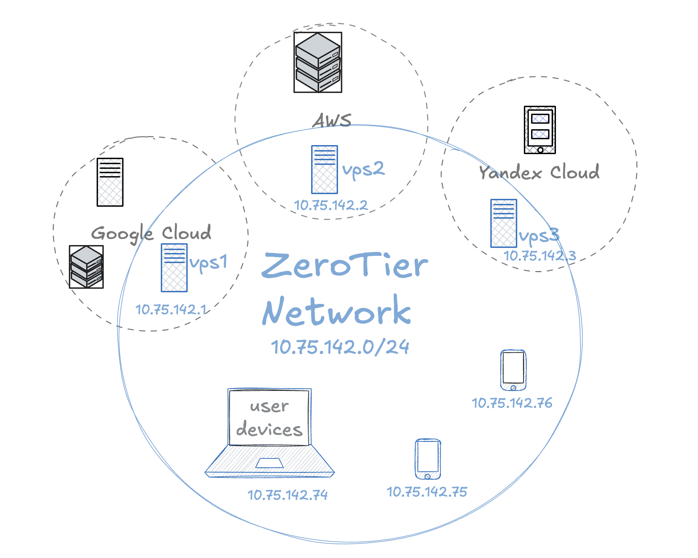
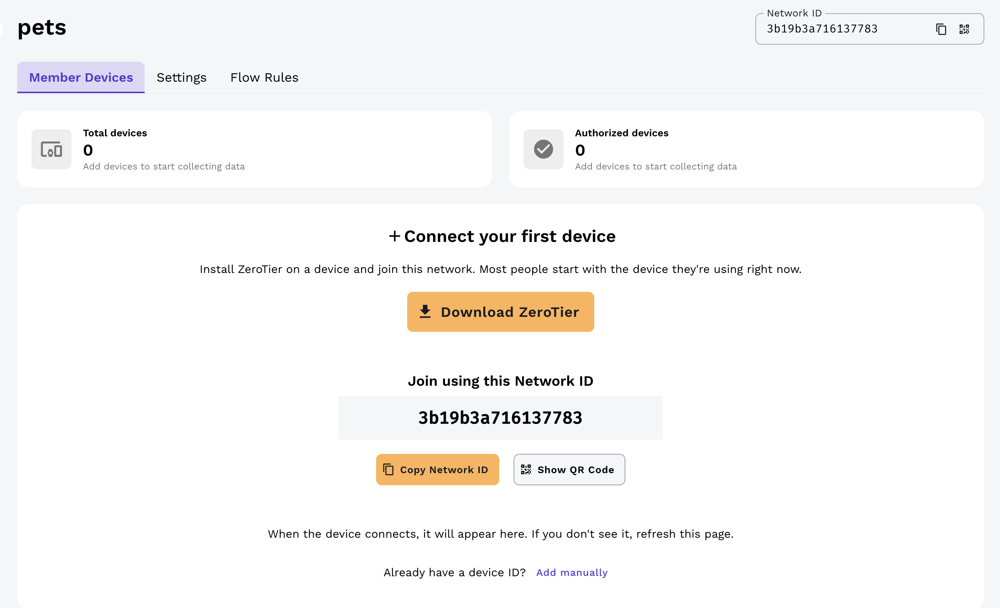
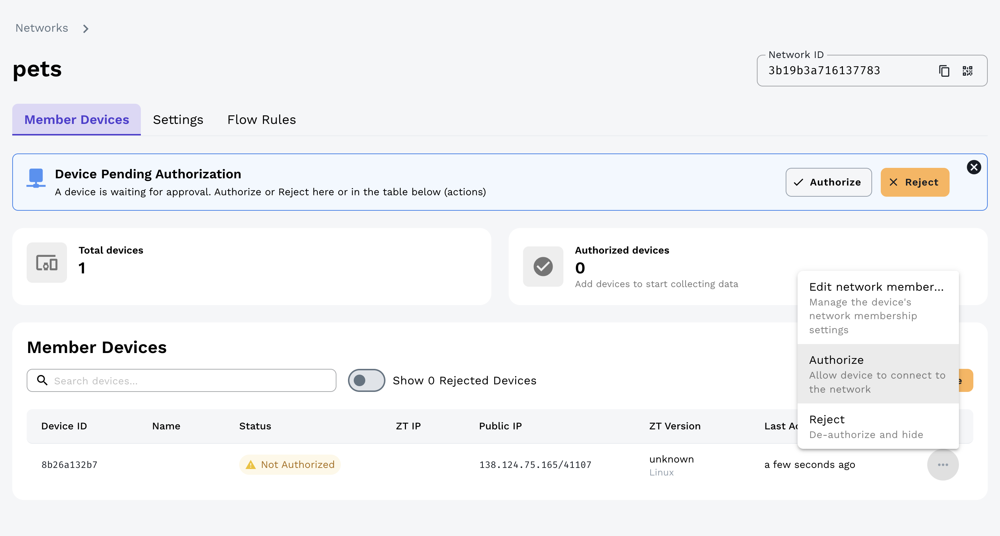
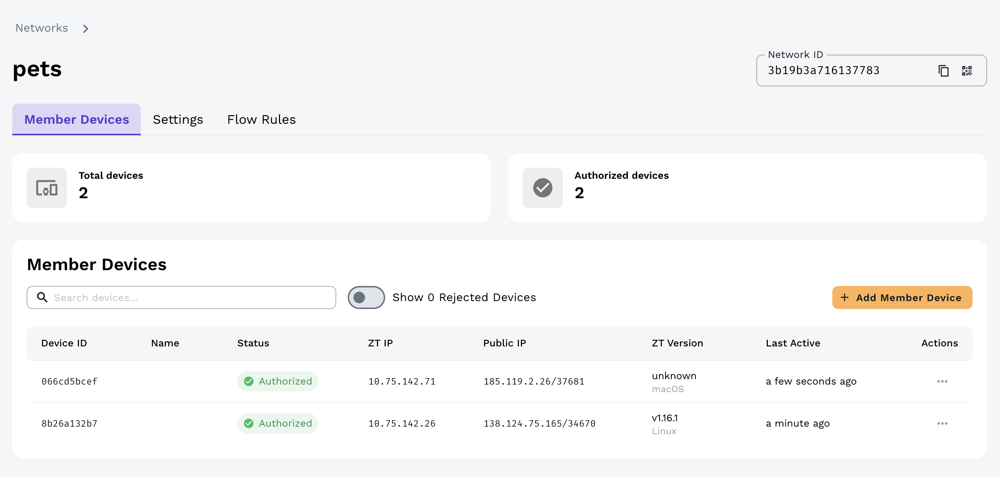
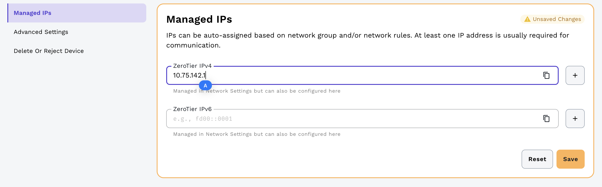

Решил я недавно поиграться с Dokploy в рамках экспериментов n8n и AI-ассистента. Ну и пока настраивал, заодно решил показать вам ZeroTier. Это сервис, который позволяет объединить устройства через интернет так, будто они находятся в одной локальной сети. 

На самом деле очень крутая штука, тем более что в рамках free-тарифа можно добавить до 10 устройств. Таким образом у нас будет крутая overlay-сеть и мы можем объединить все наши VPS, ноутбуки, телефоны. И самое главное что будет не важно что они сидят за NAT.



Вся настройка отнимет у вас минут 10 времени.

1. Регаемся на сайте https://www.zerotier.com, верифицируемся и прыгаем в личный кабинет.

2. Там создаем новую сеть. И сохраняем себе Network ID. Он понадобится чтобы к сети присоединиться. У меня это `3b19b3a716137783`.



3. Прыгаем на страницу загрузки клиентов https://www.zerotier.com/download. Копируем команду установки и ставим на VPS сервер:

```bash
curl -s https://install.zerotier.com | sudo bash
```

4. Теперь подключимся сразу к новой сети 'pets'. После выполнения получите `200 join OK`.

```
sudo zerotier-cli join 3b19b3a716137783
```

5. Переходим в админку в нашу сеть 'pets' и авторизуем клиента.



6. Теперь я добавлю локальную машинку. Качаю клиента под свою ОС чтобы оказаться в приватной сети с VPS. Там ввожу Network ID для подключения и делаю апрув в админке.



7. Zerotire нам выдаст случайный IP адрес в приватной сети. Давайте слегка это исправим. Нырнем в админке в устройство `8b26a132b7` (это VPS) и пропишем в `Managed IPs` более подходящий для сервера IP-адрес.



На этом базовая настройка завершена. Устройства будут видеть друг друга в рамках приватной сети `10.75.142.0/24`.

Но для большей безопасности и удобства (иначе зачем это всё?) надо настроить firewall. У меня стоит Dokploy, 
поэтому я хочу сделать открытыми порты 80 и 443. А всё остальное будет открыто только в сети ZeroTier. (ens3 - это внешний интерфейс на VPS, zt+ - это интерфейс ZeroTier)

8. Подключимся к VPS `10.75.142.1` – ЭТО ВАЖНО и забекапим текущие правила на всякий. 

```
iptables-save > /root/iptables.backup.$(date +%F_%H%M).rules
```

9. Делаем магию. Обратите внимание – после применения этих правил доступа к ssh по внешнему интерфейсу не будет.

```
# Сначала базовые allow (в начало)
iptables -I INPUT 1 -i zt+ -j ACCEPT
iptables -I INPUT 2 -m conntrack --ctstate ESTABLISHED,RELATED -j ACCEPT
iptables -I INPUT 3 -i lo -j ACCEPT

# Публично только 80/443 через ens3
iptables -I INPUT 4 -i ens3 -p tcp --dport 80  -j ACCEPT
iptables -I INPUT 5 -i ens3 -p tcp --dport 443 -j ACCEPT

# Всё остальное входящее — DROP
iptables -P INPUT DROP

iptables -F DOCKER-USER

# Разрешаем ответы
iptables -A DOCKER-USER -m conntrack --ctstate RELATED,ESTABLISHED -j ACCEPT

# ZeroTier полный доступ
iptables -A DOCKER-USER -i zt+ -j ACCEPT
iptables -A DOCKER-USER -o zt+ -j ACCEPT

# Контейнерам можно инициировать соединения наружу
iptables -A DOCKER-USER -i docker0 -j ACCEPT

# Снаружи (ens3) только 80/443
iptables -A DOCKER-USER -i ens3 -p tcp --dport 80 -j ACCEPT
iptables -A DOCKER-USER -i ens3 -p tcp --dport 443 -j ACCEPT

# Остальное снаружи в docker — DROP
iptables -A DOCKER-USER -i ens3 -j DROP

iptables -A DOCKER-USER -j RETURN
```

10. Установим iptables-persistent и сделаем правила персистентными, чтобы не отрыгнуло после ребута

```
sudo apt-get update 
sudo apt-get install -y iptables-persistent
sudo netfilter-persistent save
```

В итоге мы получаем приватную сеть со всеми нашими девайсами, которые видят друг друга напрямую. А cнаружи для внешнего интерфейса открыт только 80 и 443 – в моем случае это Traefik в docker. И даже если я сделаю гадость вот так (прокину порт в контейнер редиса): 

```bash
docker run -d --name my-redis -p 6379:6379 redis:latest
```

То порт 6379 будет доступен только в приватной сети:

```bash
$ nmap 138.124.75.165 -p6379 -PN
PORT     STATE SERVICE
6379/tcp filtered redis

$ nmap 10.75.142.1 -p6379
PORT     STATE SERVICE
6379/tcp open  redis
```

Это ли не величие? =) Мы с вами разобрали максимально простой кейс использовования ZeroTier, но и для построения сетей в production-окружениях. Но это уже совершенно другая история...
